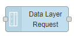

# Node-RED nodes for ctrlX AUTOMATION

This package **node-red-contrib-ctrlx-automation** contains nodes to easily connect to [ctrlX AUTOMATION](https://www.ctrlx-automation.com/) devices from [Bosch Rexroth](https://www.boschrexroth.com).

Using the nodes you can read from and write to the ctrlX Data Layer.  
The nodes can run in a Node-RED app environment on a ctrlX CORE device as well as on a third-party device which runs Node-RED.



**Important:** Please upgrade the AutomationCore System App to at least version 1.8.0 (XCR-V-0108, part of ReleaseMilestone 21.03) or newer, because the nodes are now using the new API which introduces subscription support!

## Installation

Install using the managed palette from inside Node-RED.

### In Node-RED (preferred)

* Via **Manage Palette** -> **Search** for `node-red-contrib-ctrlx-automation`

### In a shell

* go to the Node-RED user data directory, e.g.: `~/.node-red`
* run `npm install node-red-contrib-ctrlx-automation --save`

## Usage - Quick Overview

There are two new nodes which appear in the category **ctrlX AUTOMATION** in your Node-RED palette.
In addition to that, a configuration node will be added to the project as soon as the nodes are used in a flow. The configuration node contains all settings for a connection to a device and is used by other nodes which are embedded in the flow and share the same session. Besides the hostname or IP address it is also necessary to provide the user credentials for authorization of your session in the configuration node.

### Data Layer Request

This node can be triggered to execute read, write, browse, create or delete operations within the ctrlX Data Layer.


### Data Layer Subscribe

This node allows to subscribe to value changes of an item in the ctrlX Data Layer. It is an input node, which does not need to be triggered, but automatically emits a new `msg`, when the value changes. The node is useful for continuous tracking of value in the ctrlX Data Layer and in this case more efficient than the `Data Layer Request` node, because it does not need to be triggerd to poll for a value. Instead, this node automatically watches for value changes on server side and publishes new values via server sent events and low overhead for data transmission.


## Usage - Reference Manual

Besides this quick introduction, there is a [Reference Manual](./doc/REFERENCE.md) which describes the nodes in more detail. It covers all the different configuration options, error handling, troubleshouting and generals hints for usage.
For working with different nodes in the Data Layer it might also be useful to have a look at the [Data Type Overview](./doc/DATATYPES.md).

## Examples

It might be helpful to have a look at the [Examples](./doc/EXAMPLES.md) document to find various flows for different use-cases. They demonstrate the different ways how the nodes can be used. Most of the examples are also directly available from within the Node-RED editor.
They appear under the Examples section of the library import menu in Node-RED.

## Support

There is a [troubleshooting section](./doc/TROUBLESHOOTING.md) which covers common problems and solutions.

This repository is provided and maintained by [Bosch Rexroth](https://www.boschrexroth.com). Feel free to check out and be part of the [ctrlX AUTOMATION Community](https://ctrlx-automation.com/community). Get additional support, e.g. related to Bosch Rexroth Devices, Apps, SDKs and Services, or leave some ideas and feedback.

To report bugs, request changes and discuss new ideas you may also have a look at the issue tracker of this repository:
<https://github.com/boschrexroth/node-red-contrib-ctrlx-automation/issues>

## Important directions for use

### Areas of use and application

The content (e.g. source code and related documents) of this repository is intended to be used for configuration, parameterization, programming or diagnostics in combination with selected Bosch Rexroth ctrlX AUTOMATION devices.
Additionally, the specifications given in the "Areas of Use and Application" for ctrlX AUTOMATION devices used with the content of this repository do also apply.

### Unintended use

Any use of the source code and related documents of this repository in applications other than those specified above or under operating conditions other than those described in the documentation and the technical specifications is considered as "unintended". Furthermore, this software must not be used in any application areas not expressly approved by Bosch Rexroth.

## Changelog

```text
* 2020-09-29: 1.2.0 - Initial release with request node for ctrlX Data Layer.
* 2020-11-28: 1.2.2 - fix: msg.topic is not set to path if msg.topic is undefined.
* 2020-12-02: 1.2.3 - Only documentation and diagnosis improvements.
* 2020-12-14: 1.2.4 - fix: Error when request was triggered immediately after deploy.
* 2020-12-20: 1.8.0 - Initial release which adds node to subscribe to ctrlX Data Layer.
                      Support custom port after hostname. E.g. 'localhost:8443'.
* 2020-10-01: 1.8.1 - fix: automatic reconnect when device was not available on start of flow.
* 2021-02-22: 1.8.2 - Switched to ctrlX Data Layer API version v2 which is only available with AutomationCore 1.8.0 or newer.
                      Introduced new setting to request node, which allows to set payload format to return only 'value' or 'value' and 'type'.
* 2021-03-10: 1.8.3 - Internal improvements for more compliant URI encoding of http requests.
* 2021-05-07: 1.8.4 - fix: allow to make a write without arguments (msg.payload = null). E.g. for 'diagnosis/confirm/error'.
* 2021-05-25: 1.8.5 - fix: make 'BROWSE' requests to support the payload property 'value only'.
* 2021-05-28: 1.8.6 - feat: make path tree view selection in property window to automatically expand to current path.
                      fix: make subscribe node to emit an initial 'msg' after deploy, even if value does not change.
* 2021-06-29: 1.8.7 - fix: writing strings with non-ASCII symbols (e.g. 'ü') resulted in DL_TYPE_MISMATCH.
* 2021-07-04: 1.8.8 - fix: give each of the subscribe nodes his own counter to show in the status text.
                      fix: allow to make a create without arguments (msg.payload = null). E.g. for '/motion/axs/<axs_name>/cmd/reset'.
* 2021-09-20: 1.8.9 - fix: read with argument failed with error 'DL_TYPE_MISMATCH'.
* 2021-10-19: 1.8.10 - fix: support 64bit integer as BigInt to prevent rounding errors on big integer values.
* 2021-10-22: 1.8.11 - fix: prevent "Failed login attempts" after flow gets redeployed with correct credentials (Bug392030).
* 2021-10-22: 1.8.12 - fix: make subscription to properly report error and reconnect when authorization token expires (Bug405282).
* 2022-01-27: 1.8.13 - refactor: update dependency versions. No functional change.
* 2022-03-02: 1.8.14 - fix: improve diagnostics for misconfigured subscriptions. E.g. when a single node of a subscription is missing (Bug449366).
* 2022-03-14: 1.8.15 - fix: make subscribe node useable on other ports than 443 (Bug457112).
                       fix: remove an uncaught exception which was introduced with version 1.8.14 (Bug454078).
* 2022-04-26: 1.8.16 - fix: possible connection break on heavy load for commands: create, delete, write.
* 2022-05-05: 1.8.17 - feat: added support for IPv6.
* 2022-05-06: 1.8.18 - fix: possible node crash on browsing with bad credentials.
* 2022-10-16: 1.8.19 - fix: make IPv6 work on device.
                     - fix: support addresses with special characters (e.g. '^' in 'mm/s^2').
                     - docs: updated and extended the example flows.
```
  
## About

Copyright © 2020-2022 Bosch Rexroth AG. All rights reserved.

<https://www.boschrexroth.com>

Bosch Rexroth AG  
Bgm.-Dr.-Nebel-Str. 2  
97816 Lohr am Main  
GERMANY  

## Licenses

MIT License

Copyright (c) 2020-2022 Bosch Rexroth AG

Permission is hereby granted, free of charge, to any person obtaining a copy
of this software and associated documentation files (the "Software"), to deal
in the Software without restriction, including without limitation the rights
to use, copy, modify, merge, publish, distribute, sublicense, and/or sell
copies of the Software, and to permit persons to whom the Software is
furnished to do so, subject to the following conditions:

The above copyright notice and this permission notice shall be included in all
copies or substantial portions of the Software.

THE SOFTWARE IS PROVIDED "AS IS", WITHOUT WARRANTY OF ANY KIND, EXPRESS OR
IMPLIED, INCLUDING BUT NOT LIMITED TO THE WARRANTIES OF MERCHANTABILITY,
FITNESS FOR A PARTICULAR PURPOSE AND NONINFRINGEMENT. IN NO EVENT SHALL THE
AUTHORS OR COPYRIGHT HOLDERS BE LIABLE FOR ANY CLAIM, DAMAGES OR OTHER
LIABILITY, WHETHER IN AN ACTION OF CONTRACT, TORT OR OTHERWISE, ARISING FROM,
OUT OF OR IN CONNECTION WITH THE SOFTWARE OR THE USE OR OTHER DEALINGS IN THE
SOFTWARE.
