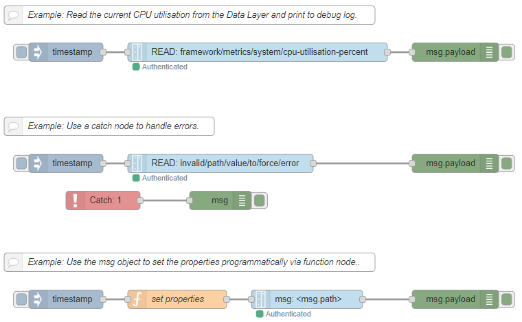

# Node-RED nodes for ctrlX AUTOMATION

This package contains nodes to easily connect to [ctrlX AUTOMATION](https://www.ctrlx-automation.com/) devices from [Bosch Rexroth](https://www.boschrexroth.com).

Using the nodes you can read and write to the ctrlX Data Layer. These nodes can be installed directly on a ctrlX CORE device as well as on a third-party device which runs Node-RED.

## Installation

Install using the managed palette from inside Node-RED.

## Usage

There are two new nodes which appear in the category 'ctrlX AUTOMATION' in your Node-RED palette.

#### Data Layer Request

This node allows read, write or browse of items in the ctrlX Data Layer. To execute the request, the node needs to be triggered by an input `msg`. The arguments can be given in the node properties or programmatically via the input `msg`.

#### Data Layer Subscribe

This node allows to subscribe to value changes of an item in the ctrlX Data Layer. It is an input node, which does not need to be triggered, but automatically emits a new `msg`, when the value changes. This node is very efficient, because it does not poll but only publish server sent events. Monitoring of the value is done on server side.

### Examples

There are multiple example flows included which demonstrate how the node can be use.
They appear under the Examples section of the library import menu in Node-RED.

## Support

This repository is provided and maintained by [Bosch Rexroth](https://www.boschrexroth.com). Feel free to check out and be part of the [ctrlX AUTOMATION Community](https://ctrlx-automation.com/community). Get additional support, e.g. related to Bosch Rexroth Devices, Apps, SDKs and Services, or leave some ideas and feedback.

To report bugs, request changes and discuss new ideas you may also have a look at the issue tracker of this repository:
<https://github.com/boschrexroth/node-red-contrib-ctrlx-automation/issues>

## Important directions for use

### Areas of use and application

The content (e.g. source code and related documents) of this repository is intended to be used for configuration, parameterization, programming or diagnostics in combination with selected Bosch Rexroth ctrlX AUTOMATION devices.
Additionally, the specifications given in the "Areas of Use and Application" for ctrlX AUTOMATION devices used with the content of this repository do also apply.

### Unintended use

Any use of the source code and related documents of this repository in applications other than those specified above or under operating conditions other than those described in the documentation and the technical specifications is considered as "unintended". Furthermore, this software must not be used in any application areas not expressly approved by Bosch Rexroth.

## Changelog

- 2020-09-29: 1.2.0 - Initial release with request node for ctrlX Data Layer
- 2020-11-28: 1.2.2 - FIX: msg.topic is not set to path if msg.topic is undefined
- 2020-12-02: 1.2.3 - Only documentation and diagnosis improvements
- 2020-12-14: 1.2.4 - FIX: Error when request was triggered immediately after deploy.
- 2020-12-20: 2.0.0 - Initial release which adds node to subscribe to ctrlX Data Layer

## About

Copyright © 2020 Bosch Rexroth AG. All rights reserved.

<https://www.boschrexroth.com>

Bosch Rexroth AG  
Bgm.-Dr.-Nebel-Str. 2  
97816 Lohr am Main  
GERMANY  

## Licenses

MIT License

Copyright (c) 2020, Bosch Rexroth AG

Permission is hereby granted, free of charge, to any person obtaining a copy
of this software and associated documentation files (the "Software"), to deal
in the Software without restriction, including without limitation the rights
to use, copy, modify, merge, publish, distribute, sublicense, and/or sell
copies of the Software, and to permit persons to whom the Software is
furnished to do so, subject to the following conditions:

The above copyright notice and this permission notice shall be included in all
copies or substantial portions of the Software.

THE SOFTWARE IS PROVIDED "AS IS", WITHOUT WARRANTY OF ANY KIND, EXPRESS OR
IMPLIED, INCLUDING BUT NOT LIMITED TO THE WARRANTIES OF MERCHANTABILITY,
FITNESS FOR A PARTICULAR PURPOSE AND NONINFRINGEMENT. IN NO EVENT SHALL THE
AUTHORS OR COPYRIGHT HOLDERS BE LIABLE FOR ANY CLAIM, DAMAGES OR OTHER
LIABILITY, WHETHER IN AN ACTION OF CONTRACT, TORT OR OTHERWISE, ARISING FROM,
OUT OF OR IN CONNECTION WITH THE SOFTWARE OR THE USE OR OTHER DEALINGS IN THE
SOFTWARE.
