# Examples

This page contains various examples for different use cases. Looking through the examples might help to better understand how to use the nodes for specific tasks. Please note that depending on the example different apps have to be present on the system.

## Table of contents

[How to import examples](#how-to-import-examples)

[General examples](#general-examples)

- [Read the current CPU utilisation on request](#read-the-current-cpu-utilisation-on-request)
- [Subscribe to the current CPU utilisation](#subscribe-to-the-current-cpu-utilisation)
- [Example: Monitor CPU utilisation in line chart](#example-monitor-cpu-utilisation-in-line-chart)
- [Catch an error in case a node is missing or the node path is invalid](#catch-an-error-in-case-a-node-is-missing-or-the-node-path-is-invalid)

[Diagnosis Logbook examples](#diagnosis-logbook-examples)

- [Confirm all errors in the diagnosis logbook](#confirm-all-errors-in-the-diagnosis-logbook)

[PLC examples](#plc-examples)

- [Read a PLC variable](#read-a-plc-variable)
- [Write a PLC variable (boolean)](#write-a-plc-variable-boolean)

[Dashboard examples for ctrlX PLC App](#dashboard-examples-for-ctrlx-plc)

- [Example: Monitor and handle a boolean PLC variable "bBoolean"](#example-monitor-and-handle-a-boolean-plc-variable-bboolean)
- [Example: Monitor and handle an integer PLC variable "iInteger"](#example-monitor-and-handle-an-integer-plc-variable-iinteger)
- [Example: Monitor and handle a real PLC variable "rReal"](#example-monitor-and-handle-a-real-plc-variable-rreal)
- [Example: Monitor and handle a string PLC variable "sString"](#example-monitor-and-handle-a-string-plc-variable-sstring)

[Dashboard examples for ctrlX MOTION App](#dashboard-examples-for-ctrlx-motion-app)

- [Example: Monitor and switch motion state](#example-monitor-and-switch-motion-state)
- [Example: Browse and show all available axes](#example-browse-and-show-all-available-axes)
- [Example: Create an axis "AxisX"](#example-create-an-axis-axisx)
- [Example: Switch and monitor power of an axis "AxisX"](#example-switch-and-monitor-power-of-an-axis-axisx)
- [Example: Monitor position of an axis "AxisX"](#example-monitor-position-of-an-axis-axisx)
- [Example: Move an axis "AxisX"](#example-move-an-axis-axisx)
- [Example: Abort an axis movement of "AxisX"](#example-abort-an-axis-movement-of-axisx)

[Dashboard examples for script interpreter and ctrlX CORE - Python Runtime App](#dashboard-examples-for-script-interpreter-and-ctrlx-core---python-runtime-app)

- [Example: Create an interpreter instance "MyInstance" for python](#example-create-an-interpreter-instance-myinstance-for-python)
- [Example: Browse and show all available interpreter instances](#example-browse-and-show-all-available-interpreter-instances)
- [Example: Monitor state of an interpreter instance "MyInstance"](#example-monitor-state-of-an-interpreter-instance-myinstance)
- [Example: Reset interpreter instance "MyInstance"](#example-reset-interpreter-instance-myinstance)
- [Example: Execute a python command in an interpreter instance "MyInstance"](#example-execute-a-python-command-in-an-interpreter-instance-myinstance)
- [Example: Execute a python file "test.py" in an interpreter instance "MyInstance"](#example-execute-a-python-file-testpy-in-an-interpreter-instance-myinstance)

## How to import examples

The example flows can either be imported via the clipboard or by importing directly in the Node-RED editor via the **Import Nodes** Dialog.

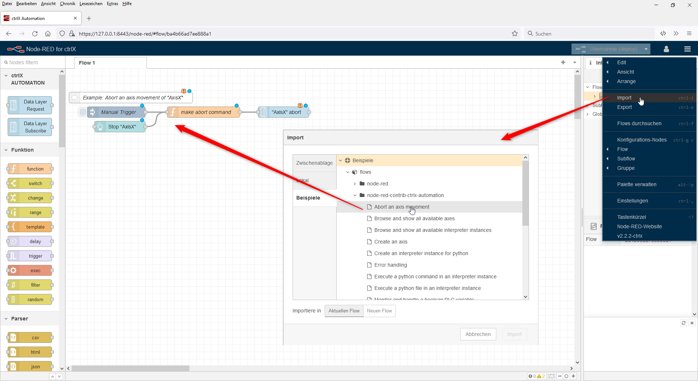

Keep in mind, that you need to insert valid credentials (username and password) for your device and adjust your hostname inside of the communication nodes.
When importing several examples after each other a message `Some of the nodes you are importing already exist in your workspace.` appears. Please choose `View nodes...` and click on `Import selected`. Otherwise you could overwrite existing settings nodes.


## General examples

### Read the current CPU utilisation on request

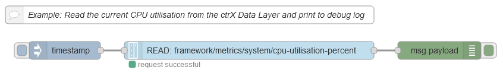

```JSON
[{"id":"765680d3.1c7788","type":"ctrlx-datalayer-request","z":"8a1df649.999ee","device":"9bdd1ac6.4db1c8","method":"READ","path":"framework/metrics/system/cpu-utilisation-percent","payloadFormat":"value","name":"","x":430,"y":140,"wires":[["9195cd7c.d74f3"]]},{"id":"a1661333.e8b348","type":"inject","z":"8a1df649.999ee","name":"","props":[{"p":"payload"},{"p":"topic","vt":"str"}],"repeat":"","crontab":"","once":false,"onceDelay":0.1,"topic":"","payload":"","payloadType":"date","x":120,"y":140,"wires":[["765680d3.1c7788"]]},{"id":"9195cd7c.d74f3","type":"debug","z":"8a1df649.999ee","name":"","active":true,"tosidebar":true,"console":false,"tostatus":false,"complete":"false","statusVal":"","statusType":"auto","x":750,"y":140,"wires":[]},{"id":"84d1b245.874028","type":"comment","z":"8a1df649.999ee","name":"Example: Read the current CPU utilisation from the ctrX Data Layer and print to debug log","info":"","x":330,"y":80,"wires":[]},{"id":"9bdd1ac6.4db1c8","type":"ctrlx-config","name":"","hostname":"localhost","debug":false}]
```

### Subscribe to the current CPU utilisation

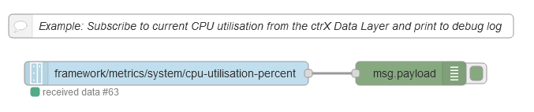

```JSON
[{"id":"872cd634.800108","type":"comment","z":"8a1df649.999ee","name":"Example: Subscribe to current CPU utilisation from the ctrX Data Layer and print to debug log","info":"","x":340,"y":240,"wires":[]},{"id":"d921bdd6.1d0b9","type":"ctrlx-datalayer-subscribe","z":"8a1df649.999ee","subscription":"6979a099.efcb18","path":"framework/metrics/system/cpu-utilisation-percent","name":"","x":220,"y":300,"wires":[["ffa838b8.e6db98"]]},{"id":"ffa838b8.e6db98","type":"debug","z":"8a1df649.999ee","name":"","active":true,"tosidebar":true,"console":false,"tostatus":false,"complete":"false","statusVal":"","statusType":"auto","x":530,"y":300,"wires":[]},{"id":"6979a099.efcb18","type":"ctrlx-config-subscription","device":"9bdd1ac6.4db1c8","name":"sub1","publishIntervalMs":""},{"id":"9bdd1ac6.4db1c8","type":"ctrlx-config","name":"","hostname":"localhost","debug":false}]
```

### Example: Monitor CPU utilisation in line chart

The following example shows how to subscribe to the current CPU utilisation and monitor the last 10 values in a line chart.

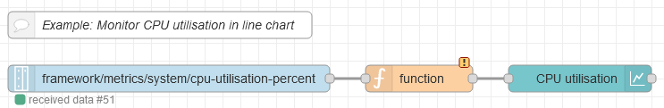
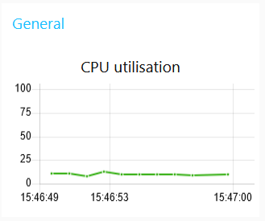

```JSON
[{"id":"beb3ea051cd65ac2","type":"ctrlx-datalayer-subscribe","z":"5480b2f5a22f3525","subscription":"632bcc2.eddf134","path":"framework/metrics/system/cpu-utilisation-percent","name":"","x":300,"y":560,"wires":[["be8fc64ed0c8ea73"]]},{"id":"dc3e7b2.6ab9388","type":"comment","z":"5480b2f5a22f3525","name":"Example: Monitor CPU utilisation in line chart","info":"","x":290,"y":520,"wires":[]},{"id":"be8fc64ed0c8ea73","type":"ui_chart","z":"5480b2f5a22f3525","name":"","group":"a4ba432c81cdab8a","order":0,"width":"0","height":"0","label":"CPU utilisation","chartType":"line","legend":"false","xformat":"auto","interpolate":"linear","nodata":"","dot":true,"ymin":"0","ymax":"100","removeOlder":1,"removeOlderPoints":"10","removeOlderUnit":"60","cutout":0,"useOneColor":false,"useUTC":false,"colors":["#3eb31e","#aec7e8","#ff7f0e","#2ca02c","#98df8a","#d62728","#ff9896","#9467bd","#c5b0d5"],"outputs":1,"useDifferentColor":false,"className":"","x":620,"y":560,"wires":[[]]},{"id":"632bcc2.eddf134","type":"ctrlx-config-subscription","device":"7b877229.678964","name":"Sub_Default","publishIntervalMs":""},{"id":"a4ba432c81cdab8a","type":"ui_group","name":"General","tab":"9cba2148.8c9148","order":2,"disp":true,"width":"6","collapse":false,"className":""},{"id":"7b877229.678964","type":"ctrlx-config","name":"localhost","hostname":"localhost","debug":false},{"id":"9cba2148.8c9148","type":"ui_tab","name":"Examples","icon":"dashboard","order":7,"disabled":false,"hidden":false}]
```

### Catch an error in case a node is missing or the node path is invalid

Errors in the nodes can be catched with the Node-RED internal `catch` node.

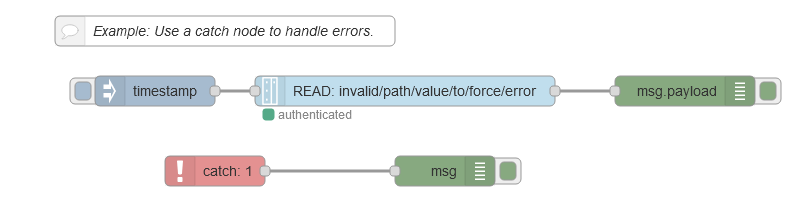

```JSON
[{"id":"3984d15c.b6a4be","type":"comment","z":"8a1df649.999ee","name":"Example: Use a catch node to handle errors.","info":"","x":230,"y":420,"wires":[]},{"id":"adcdeb72.352b88","type":"debug","z":"8a1df649.999ee","name":"","active":true,"tosidebar":true,"console":false,"tostatus":false,"complete":"false","x":690,"y":480,"wires":[]},{"id":"bf808c7e.2b56a","type":"ctrlx-datalayer-request","z":"8a1df649.999ee","device":"9bdd1ac6.4db1c8","method":"READ","path":"invalid/path/value/to/force/error","name":"","x":410,"y":480,"wires":[["adcdeb72.352b88"]]},{"id":"eda269ff.f06d88","type":"inject","z":"8a1df649.999ee","name":"","repeat":"","crontab":"","once":false,"onceDelay":0.1,"topic":"","payload":"","payloadType":"date","x":160,"y":480,"wires":[["bf808c7e.2b56a"]]},{"id":"b55ac3d1.719b1","type":"catch","z":"8a1df649.999ee","name":"","scope":["bf808c7e.2b56a"],"uncaught":false,"x":220,"y":560,"wires":[["e91439fb.0fa298"]]},{"id":"e91439fb.0fa298","type":"debug","z":"8a1df649.999ee","name":"","active":true,"tosidebar":true,"console":false,"tostatus":false,"complete":"true","targetType":"full","x":450,"y":560,"wires":[]},{"id":"9bdd1ac6.4db1c8","type":"ctrlx-config","name":"","hostname":"localhost","debug":false}]
```

## Diagnosis Logbook examples

### Confirm all errors in the diagnosis logbook

To confirm all errors in the diagnosis logbook you need to send an empty `WRITE` request to `diagnosis/confirm/error`. This can be done by setting the `payload` to null.

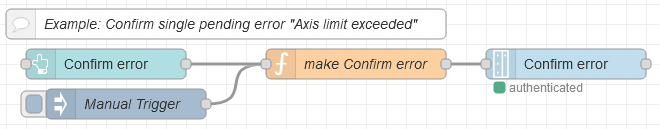

```JSON
[{"id":"b5effce.db9fd","type":"comment","z":"8a1df649.999ee","name":"Example: Confirm all diagnosis in the logbook","info":"","x":230,"y":640,"wires":[]},{"id":"477443cd.9b7bd4","type":"debug","z":"8a1df649.999ee","name":"","active":true,"tosidebar":true,"console":false,"tostatus":false,"complete":"false","x":730,"y":700,"wires":[]},{"id":"64d6212b.ba6cd","type":"ctrlx-datalayer-request","z":"8a1df649.999ee","device":"9bdd1ac6.4db1c8","method":"WRITE","path":"diagnosis/confirm/error","payloadFormat":"value_type","name":"","x":510,"y":700,"wires":[["477443cd.9b7bd4"]]},{"id":"226bf82.26e5e88","type":"inject","z":"8a1df649.999ee","name":"","repeat":"","crontab":"","once":false,"onceDelay":0.1,"topic":"","payload":"","payloadType":"date","x":160,"y":700,"wires":[["d4a0a352.ae8488"]]},{"id":"d4a0a352.ae8488","type":"function","z":"8a1df649.999ee","name":"","func":"msg.payload = null;\nreturn msg;","outputs":1,"noerr":0,"initialize":"","finalize":"","x":300,"y":700,"wires":[["64d6212b.ba6cd"]]},{"id":"9bdd1ac6.4db1c8","type":"ctrlx-config","name":"","hostname":"localhost","debug":false}]
```

## PLC examples

For reading and especially writing it might be necessary to better understand how the many types of the IEC61131-3 programming language are mapped to javascript types, which are used in Node-RED. Have a look at the [Data Type Overview](DATATYPES.md) for this.

### Read a PLC variable

The following example shows how to read a PLC variable `i` of type `INT` of a program `PLC_PRG` which has been configured to be part of the symbolic variable configuration.

  ```IEC61131-3
  PROGRAM PLC_PRG
  VAR
    i: INT;
  END_VAR
  ```


```JSON
[{"id":"7467c58b.9bd5ac","type":"ctrlx-datalayer-request","z":"a87ae0cb.f9008","device":"f1d2bfcc.083bf","method":"READ","path":"plc/app/Application/sym/PLC_PRG/i","payloadFormat":"value_type","name":"","x":470,"y":200,"wires":[["8090a7bb.b361"]]},{"id":"8090a7bb.b361","type":"debug","z":"a87ae0cb.f9008","name":"","active":true,"tosidebar":true,"console":false,"tostatus":false,"complete":"false","statusVal":"","statusType":"auto","x":750,"y":200,"wires":[]},{"id":"f830ae36.91e878","type":"inject","z":"a87ae0cb.f9008","name":"","props":[{"p":"payload"},{"p":"topic","vt":"str"}],"repeat":"","crontab":"","once":false,"onceDelay":0.1,"topic":"","payload":"","payloadType":"date","x":200,"y":200,"wires":[["7467c58b.9bd5ac"]]},{"id":"76611ca.4da74e4","type":"comment","z":"a87ae0cb.f9008","name":"Example: Read a PLC variable","info":"","x":190,"y":120,"wires":[]},{"id":"f1d2bfcc.083bf","type":"ctrlx-config","name":"","hostname":"localhost","debug":false}]
```

The request returns in `msg.payload`:

```JSON
{
  "type": "int16", 
  "value": 0
}
```

### Write a PLC variable (boolean)

The following example shows how to write a boolean PLC variable `b` of type `BOOL` which has been configured for write access via the symbolic variable configuration. Please note, that for writing PLC variable you need to specify the exact type of the PLC variable in the `msg.payload`.

```IEC61131-3
PROGRAM PLC_PRG
VAR
  b: BOOL;
END_VAR
```


```JSON
[{"id":"501f80f3.0e5068","type":"ctrlx-datalayer-request","z":"a87ae0cb.f9008","device":"f1d2bfcc.083bf","method":"WRITE","path":"plc/app/Application/sym/PLC_PRG/b","payloadFormat":"value_type","name":"","x":470,"y":400,"wires":[["37817780.db70c"]]},{"id":"37817780.db70c","type":"debug","z":"a87ae0cb.f9008","name":"","active":true,"tosidebar":true,"console":false,"tostatus":false,"complete":"false","statusVal":"","statusType":"auto","x":750,"y":400,"wires":[]},{"id":"5d059ae1.63156c","type":"inject","z":"a87ae0cb.f9008","name":"","props":[{"p":"payload"},{"p":"topic","vt":"str"}],"repeat":"","crontab":"","once":false,"onceDelay":0.1,"topic":"","payload":"{\"type\":\"bool8\",\"value\":true}","payloadType":"json","x":190,"y":400,"wires":[["501f80f3.0e5068"]]},{"id":"6466502e.8f8c","type":"comment","z":"a87ae0cb.f9008","name":"Example: Write a PLC variable (BOOL)","info":"","x":210,"y":320,"wires":[]},{"id":"f1d2bfcc.083bf","type":"ctrlx-config","name":"","hostname":"localhost","debug":false}]
```

The request returns in `msg.payload` the written value:

```JSON
{
  "type": "bool8", 
  "value": true
}
```

## Dashboard examples for ctrlX PLC

Please note that for these examples the installation of the ctrlX PLC app is expected. See [our store](https://developer.community.boschrexroth.com/t5/Store-and-How-to/ctrlX-CORE-PLC-App/ba-p/13298) and the corresponding [documentation of the ctrlX PLC app](https://docs.automation.boschrexroth.com/document/version/1.0/PLC-App_-Application-Manual/documentRoot/7239751866761051~en/).

### Example: Monitor and handle a boolean PLC variable "bBoolean"

The following example shows how to read, write and monitor a PLC variable `bBoolean` of type `BOOL` via the dashboard. A symbol configuration has to be present in the PLC project and the variable has to be configured for write access via a pragma or directly in the symbolic variable configuration. Also the variable has to be used in a program or via pragma. 
Note: A digital IO can be treated the same way.

`GVL`

```IEC61131-3
{attribute 'linkalways'}
{attribute 'symbol' := 'readwrite'}
VAR_GLOBAL
  bBoolean : BOOL;
END_VAR
```

`PLC_PRG`

```IEC61131-3
bBoolean;
```


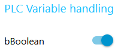

```JSON
[{"id":"c1cc8f5b.e11858","type":"ctrlx-datalayer-request","z":"4ff80d56.dd60fc","device":"7b877229.678964","method":"WRITE","path":"plc/app/Application/sym/GVL/bBoolean","payloadFormat":"value_type","name":"Write \"bBoolean\" value","x":790,"y":160,"wires":[[]]},{"id":"ec4257d3.ae58b","type":"ui_switch","z":"4ff80d56.dd60fc","name":"","label":"bBoolean ","tooltip":"","group":"938bb9af.bc8108","order":1,"width":"0","height":"0","passthru":false,"decouple":"true","topic":"","topicType":"str","style":"","onvalue":"{\"value\":true,\"type\":\"bool8\"}","onvalueType":"json","onicon":"","oncolor":"","offvalue":"{\"value\":false,\"type\":\"bool8\"}","offvalueType":"json","officon":"","offcolor":"","animate":false,"x":580,"y":160,"wires":[["c1cc8f5b.e11858"]]},{"id":"d2ca5a5e.a1144","type":"comment","z":"4ff80d56.dd60fc","name":"Example: Monitor and handle a boolean PLC variable \"bBoolean\"","info":"","x":300,"y":120,"wires":[]},{"id":"430d03bd.4a9864","type":"ctrlx-datalayer-subscribe","z":"4ff80d56.dd60fc","subscription":"632bcc2.eddf134","path":"plc/app/Application/sym/GVL/bBoolean","name":"Read \"bBoolean\" value","x":200,"y":160,"wires":[["d399bf94.d6f75"]]},{"id":"d399bf94.d6f75","type":"function","z":"4ff80d56.dd60fc","name":"make value","func":"var newMsg = {}\nnewMsg.payload = {\"type\":\"bool8\",\"value\":msg.payload}\nreturn newMsg;","outputs":1,"noerr":0,"initialize":"","finalize":"","libs":[],"x":410,"y":160,"wires":[["ec4257d3.ae58b"]]},{"id":"7b877229.678964","type":"ctrlx-config","name":"localhost","hostname":"localhost","debug":false},{"id":"938bb9af.bc8108","type":"ui_group","name":"PLC Variable handling","tab":"9cba2148.8c9148","order":1,"disp":true,"width":"4","collapse":false},{"id":"632bcc2.eddf134","type":"ctrlx-config-subscription","device":"7b877229.678964","name":"Sub_Default","publishIntervalMs":""},{"id":"9cba2148.8c9148","type":"ui_tab","name":"Examples","icon":"dashboard","order":7,"disabled":false,"hidden":false}]
```

### Example: Monitor and handle an integer PLC variable "iInteger"

The following example shows how to read, write and monitor a PLC variable `iInteger` of type `INT` via the dashboard. A symbol configuration has to be present in the PLC project and the variable has to be configured for write access via a pragma or directly in the symbolic variable configuration. Also the variable has to be used in a program or via pragma.

`GVL`

```IEC61131-3
{attribute 'linkalways'}
{attribute 'symbol' := 'readwrite'}
VAR_GLOBAL
  iInteger : BOOL;
END_VAR
```

`PLC_PRG`

```IEC61131-3
iInteger;
```


```JSON
[{"id":"6afd3c5c.85174c","type":"ctrlx-datalayer-request","z":"4ff80d56.dd60fc","device":"7b877229.678964","method":"WRITE","path":"plc/app/Application/sym/GVL/iInteger","payloadFormat":"value_type","name":"Write \"iInteger\" value","x":780,"y":300,"wires":[[]]},{"id":"699499c0.a19078","type":"ui_text_input","z":"4ff80d56.dd60fc","name":"","label":"iInteger","tooltip":"","group":"938bb9af.bc8108","order":1,"width":0,"height":0,"passthru":false,"mode":"number","delay":"0","topic":"topic","topicType":"msg","x":400,"y":300,"wires":[["dad913ff.7d0c6"]]},{"id":"dad913ff.7d0c6","type":"function","z":"4ff80d56.dd60fc","name":"make value","func":"var newMsg = {}\nnewMsg.payload = {\"type\":\"int16\",\"value\":msg.payload}\nreturn newMsg;","outputs":1,"noerr":0,"initialize":"","finalize":"","x":570,"y":300,"wires":[["6afd3c5c.85174c"]]},{"id":"f24564a9.ceb668","type":"ctrlx-datalayer-subscribe","z":"4ff80d56.dd60fc","subscription":"632bcc2.eddf134","path":"plc/app/Application/sym/GVL/iInteger","name":"Read \"iInteger\" value","x":200,"y":300,"wires":[["699499c0.a19078"]]},{"id":"1da5cb6a.45e5cd","type":"comment","z":"4ff80d56.dd60fc","name":"Example: Monitor and handle an integer PLC variable \"iInteger\"","info":"","x":300,"y":260,"wires":[]},{"id":"7b877229.678964","type":"ctrlx-config","name":"localhost","hostname":"localhost","debug":false},{"id":"938bb9af.bc8108","type":"ui_group","name":"PLC Variable handling","tab":"9cba2148.8c9148","order":1,"disp":true,"width":"4","collapse":false},{"id":"632bcc2.eddf134","type":"ctrlx-config-subscription","device":"7b877229.678964","name":"Sub_Default","publishIntervalMs":""},{"id":"9cba2148.8c9148","type":"ui_tab","name":"Examples","icon":"dashboard","order":7,"disabled":false,"hidden":false}]
```

### Example: Monitor and handle a real PLC variable "rReal"

The following example shows how to read, write and monitor a PLC variable `rReal` of type `REAL` via the dashboard. A symbol configuration has to be present in the PLC project and the variable has to be configured for write access via a pragma or directly in the symbolic variable configuration. Also the variable has to be used in a program or via pragma.

`GVL`

```IEC61131-3
{attribute 'linkalways'}
{attribute 'symbol' := 'readwrite'}
VAR_GLOBAL
  rReal : BOOL;
END_VAR
```

`PLC_PRG`

```IEC61131-3
rReal;
```


```JSON
[{"id":"2c89b6ef.36830a","type":"ctrlx-datalayer-request","z":"4ff80d56.dd60fc","device":"7b877229.678964","method":"WRITE","path":"plc/app/Application/sym/GVL/rReal","payloadFormat":"value_type","name":"Write \"rReal\" value","x":970,"y":440,"wires":[[]]},{"id":"370f99d.1a78366","type":"ui_text_input","z":"4ff80d56.dd60fc","name":"","label":"rReal","tooltip":"","group":"938bb9af.bc8108","order":1,"width":0,"height":0,"passthru":false,"mode":"number","delay":"0","topic":"topic","topicType":"msg","x":610,"y":440,"wires":[["4f0d75c5.219fc4"]]},{"id":"4f0d75c5.219fc4","type":"function","z":"4ff80d56.dd60fc","name":"make value","func":"var newMsg = {}\nif (msg.payload.value != null){\n    //newMsg.payload = {\"type\":\"float\",\"value\":Number(msg.payload.value)}\n    newMsg.payload = {\"type\":\"float\",\"value\":msg.payload.value}\n}\nelse {\n    //newMsg.payload = {\"type\":\"float\",\"value\":Number(msg.payload)}\n    newMsg.payload = {\"type\":\"float\",\"value\":msg.payload}\n}\nreturn newMsg;","outputs":1,"noerr":0,"initialize":"","finalize":"","x":770,"y":440,"wires":[["2c89b6ef.36830a"]]},{"id":"5bd100f5.b21dd8","type":"ctrlx-datalayer-subscribe","z":"4ff80d56.dd60fc","subscription":"632bcc2.eddf134","path":"plc/app/Application/sym/GVL/rReal","name":"Read \"rReal\" value","x":190,"y":440,"wires":[["17614aa4.d713dd"]]},{"id":"f479d2d0.e553c","type":"comment","z":"4ff80d56.dd60fc","name":"Example: Monitor and handle a real PLC variable \"rReal\"","info":"","x":290,"y":400,"wires":[]},{"id":"17614aa4.d713dd","type":"function","z":"4ff80d56.dd60fc","name":"make value fixed(5)","func":"//msg.test = msg.payload.toFixed(5);\nmsg.payload = Number(msg.payload.toFixed(5));\nreturn msg","outputs":1,"noerr":0,"initialize":"","finalize":"","x":420,"y":440,"wires":[["370f99d.1a78366"]]},{"id":"7b877229.678964","type":"ctrlx-config","name":"localhost","hostname":"localhost","debug":false},{"id":"938bb9af.bc8108","type":"ui_group","name":"PLC Variable handling","tab":"9cba2148.8c9148","order":1,"disp":true,"width":"4","collapse":false},{"id":"632bcc2.eddf134","type":"ctrlx-config-subscription","device":"7b877229.678964","name":"Sub_Default","publishIntervalMs":""},{"id":"9cba2148.8c9148","type":"ui_tab","name":"Examples","icon":"dashboard","order":7,"disabled":false,"hidden":false}]
```

### Example: Monitor and handle a string PLC variable "sString"

The following example shows how to read, write and monitor a PLC variable `sString` of type `STRING` via the dashboard. A symbol configuration has to be present in the PLC project and the variable has to be configured for write access via a pragma or directly in the symbolic variable configuration. Also the variable has to be used in a program or via pragma.

`GVL`

```IEC61131-3
{attribute 'linkalways'}
{attribute 'symbol' := 'readwrite'}
VAR_GLOBAL
  sString : BOOL;
END_VAR
```

`PLC_PRG`

```IEC61131-3
sString;
```

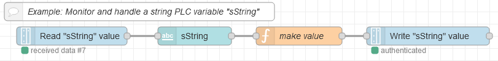


```JSON
[{"id":"52f3b28.7154acc","type":"ctrlx-datalayer-request","z":"4ff80d56.dd60fc","device":"7b877229.678964","method":"WRITE","path":"plc/app/Application/sym/GVL/sString","payloadFormat":"value_type","name":"Write \"sString\" value","x":780,"y":580,"wires":[[]]},{"id":"a84a6218.d8fa38","type":"ui_text_input","z":"4ff80d56.dd60fc","name":"","label":"sString","tooltip":"","group":"938bb9af.bc8108","order":1,"width":0,"height":0,"passthru":false,"mode":"text","delay":"0","topic":"topic","topicType":"msg","x":400,"y":580,"wires":[["b77fcdb1.bb59e"]]},{"id":"b77fcdb1.bb59e","type":"function","z":"4ff80d56.dd60fc","name":"make value","func":"var newMsg = {}\nnewMsg.payload = {\"type\":\"string\",\"value\":msg.payload}\nreturn newMsg;","outputs":1,"noerr":0,"initialize":"","finalize":"","x":570,"y":580,"wires":[["52f3b28.7154acc"]]},{"id":"7fd8a2ba.130acc","type":"ctrlx-datalayer-subscribe","z":"4ff80d56.dd60fc","subscription":"632bcc2.eddf134","path":"plc/app/Application/sym/GVL/sString","name":"Read \"sString\" value","x":200,"y":580,"wires":[["a84a6218.d8fa38"]]},{"id":"efa71414.90e038","type":"comment","z":"4ff80d56.dd60fc","name":"Example: Monitor and handle a string PLC variable \"sString\"","info":"","x":310,"y":540,"wires":[]},{"id":"7b877229.678964","type":"ctrlx-config","name":"localhost","hostname":"localhost","debug":false},{"id":"938bb9af.bc8108","type":"ui_group","name":"PLC Variable handling","tab":"9cba2148.8c9148","order":1,"disp":true,"width":"4","collapse":false},{"id":"632bcc2.eddf134","type":"ctrlx-config-subscription","device":"7b877229.678964","name":"Sub_Default","publishIntervalMs":""},{"id":"9cba2148.8c9148","type":"ui_tab","name":"Examples","icon":"dashboard","order":7,"disabled":false,"hidden":false}]
```

## Dashboard examples for ctrlX MOTION app

Please note that for these examples the installation of the ctrlX MOTION app is expected. See [our store](https://developer.community.boschrexroth.com/t5/Store-and-How-to/ctrlX-CORE-Motion-App/ba-p/13294) and the corresponding [documentation of the ctrlX MOTION app](https://docs.automation.boschrexroth.com/document/version/1.0/R911403791_01_Motion_App_-1_-en_US/documentRoot/7249282556584996~en/).

### Example: Monitor and switch motion state

The following example shows how to switch and monitor the state of the ctrlX MOTION.

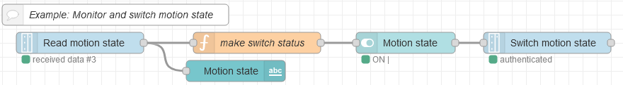
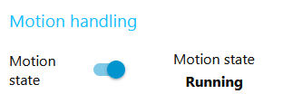

```JSON
[{"id":"ffc99584.58bbd","type":"comment","z":"4ff80d56.dd60fc","name":"Example: Monitor and switch motion state","info":"","x":240,"y":780,"wires":[]},{"id":"cac2d7f4.22c55","type":"ctrlx-datalayer-request","z":"4ff80d56.dd60fc","device":"7b877229.678964","method":"CREATE","path":"motion/cmd/opstate","payloadFormat":"value_type","name":"Switch motion state","x":850,"y":820,"wires":[[]]},{"id":"60511613.ec7a08","type":"ui_switch","z":"4ff80d56.dd60fc","name":"","label":"Motion state","tooltip":"","group":"372098c9.3029b8","order":1,"width":"3","height":"1","passthru":false,"decouple":"true","topic":"","topicType":"str","style":"","onvalue":"{\"value\":\"Booting\",\"type\":\"string\"}","onvalueType":"json","onicon":"","oncolor":"","offvalue":"{\"value\":\"Configuration\",\"type\":\"string\"}","offvalueType":"json","officon":"","offcolor":"","animate":false,"x":650,"y":820,"wires":[["cac2d7f4.22c55"]]},{"id":"3f74d73d.b1514","type":"ctrlx-datalayer-subscribe","z":"4ff80d56.dd60fc","subscription":"632bcc2.eddf134","path":"motion/state/opstate","name":"Read motion state","x":190,"y":820,"wires":[["9c708078.0c74f","ecb0f768.8af99"]]},{"id":"9c708078.0c74f","type":"ui_text","z":"4ff80d56.dd60fc","group":"372098c9.3029b8","order":2,"width":"3","height":"1","name":"","label":"Motion state","format":"{{msg.payload}}","layout":"col-center","x":410,"y":860,"wires":[]},{"id":"ecb0f768.8af99","type":"function","z":"4ff80d56.dd60fc","name":"make switch status","func":"var newMsg = {};\nif(msg.payload == \"Running\"){\n newMsg.payload = {\"value\":\"Booting\",\"type\":\"string\"}\n}\nelse {\n newMsg.payload = {\"value\":\"Configuration\",\"type\":\"string\"} \n}\nreturn newMsg;","outputs":1,"noerr":0,"initialize":"","finalize":"","x":440,"y":820,"wires":[["60511613.ec7a08"]]},{"id":"7b877229.678964","type":"ctrlx-config","name":"localhost","hostname":"localhost","debug":false},{"id":"372098c9.3029b8","type":"ui_group","name":"Motion handling","tab":"9cba2148.8c9148","order":2,"disp":true,"width":"6","collapse":false},{"id":"632bcc2.eddf134","type":"ctrlx-config-subscription","device":"7b877229.678964","name":"Sub_Default","publishIntervalMs":""},{"id":"9cba2148.8c9148","type":"ui_tab","name":"Examples","icon":"dashboard","order":7,"disabled":false,"hidden":false}]
```

### Example: Browse and show all available axes

The following example shows how to browse and show all available axes of the ctrlX MOTION.

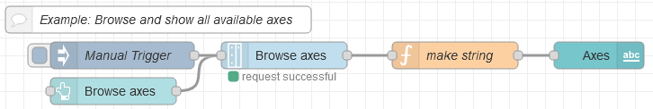


```JSON
[{"id":"a264954e.592108","type":"ctrlx-datalayer-request","z":"4ff80d56.dd60fc","device":"7b877229.678964","method":"BROWSE","path":"motion/axs","payloadFormat":"value_type","name":"Browse axes","x":390,"y":980,"wires":[["1500c19c.aef4ce"]]},{"id":"c426d34b.1596e8","type":"ui_button","z":"4ff80d56.dd60fc","name":"","group":"372098c9.3029b8","order":3,"width":"3","height":"1","passthru":false,"label":"Browse axes","tooltip":"","color":"","bgcolor":"","icon":"","payload":"","payloadType":"str","topic":"topic","topicType":"msg","x":200,"y":1020,"wires":[["a264954e.592108"]]},{"id":"916c8ea.af493f","type":"inject","z":"4ff80d56.dd60fc","name":"Manual Trigger","props":[{"p":"payload"},{"p":"topic","vt":"str"}],"repeat":"","crontab":"","once":true,"onceDelay":0.1,"topic":"","payload":"","payloadType":"date","x":210,"y":980,"wires":[["a264954e.592108"]]},{"id":"1500c19c.aef4ce","type":"function","z":"4ff80d56.dd60fc","name":"make string","func":"var newMsg = {};\nnewMsg.payload = \"\";\nif (msg.payload.value == null){\n    newMsg.payload = \"could not read\";\n}\nelse if(msg.payload.value.length > 0){\n    for (var i = 0; i < msg.payload.value.length; i++) {\n        if(i==0){\n            newMsg.payload += msg.payload.value[i];\n        }\n        else{\n            newMsg.payload += \", \" + msg.payload.value[i];\n        }\n    }\n}\nelse{\n    newMsg.payload = \"no axes found\"\n}\nreturn newMsg;\n","outputs":1,"noerr":0,"initialize":"","finalize":"","libs":[],"x":580,"y":980,"wires":[["737187dc.883be8"]]},{"id":"737187dc.883be8","type":"ui_text","z":"4ff80d56.dd60fc","group":"372098c9.3029b8","order":5,"width":"0","height":"0","name":"","label":"Axes","format":"{{msg.payload}}","layout":"col-center","x":730,"y":980,"wires":[]},{"id":"3c4502dc.7928ce","type":"comment","z":"4ff80d56.dd60fc","name":"Example: Browse and show all available axes","info":"","x":250,"y":940,"wires":[]},{"id":"7b877229.678964","type":"ctrlx-config","name":"localhost","hostname":"localhost","debug":false},{"id":"372098c9.3029b8","type":"ui_group","name":"Motion handling","tab":"9cba2148.8c9148","order":2,"disp":true,"width":"6","collapse":false},{"id":"9cba2148.8c9148","type":"ui_tab","name":"Examples","icon":"dashboard","order":7,"disabled":false,"hidden":false}]
```

### Example: Create an axis "AxisX"

The following example shows how to create a motion object of the type axis with the name `AxisX` in the ctrlX MOTION. The state of the ctrlX MOTION has to be `Configuration`.


```JSON
[{"id":"359e6180.4b2b4e","type":"function","z":"4ff80d56.dd60fc","name":"make create command","func":"var newMsg = {};\nnewMsg.payload = {\"type\":\"string\",\"value\":\"AxisX\"}\nreturn newMsg;","outputs":1,"noerr":0,"initialize":"","finalize":"","x":450,"y":1140,"wires":[["166a0be8.1525fc"]]},{"id":"166a0be8.1525fc","type":"ctrlx-datalayer-request","z":"4ff80d56.dd60fc","device":"7b877229.678964","method":"CREATE","path":"motion/axs","payloadFormat":"value_type","name":"Create \"AxisX\"","x":680,"y":1140,"wires":[[]]},{"id":"2228f62a.ade41a","type":"comment","z":"4ff80d56.dd60fc","name":"Example: Create an axis \"AxisX\"","info":"","x":210,"y":1100,"wires":[]},{"id":"586a2197.7b6c98","type":"ui_button","z":"4ff80d56.dd60fc","name":"","group":"372098c9.3029b8","order":4,"width":"3","height":"1","passthru":false,"label":"Create \"AxisX\"","tooltip":"","color":"","bgcolor":"","icon":"","payload":"","payloadType":"str","topic":"topic","topicType":"msg","x":220,"y":1180,"wires":[["359e6180.4b2b4e"]]},{"id":"34651a40.a492fe","type":"inject","z":"4ff80d56.dd60fc","name":"Manual Trigger","props":[{"p":"payload"},{"p":"topic","vt":"str"}],"repeat":"","crontab":"","once":false,"onceDelay":0.1,"topic":"","payload":"","payloadType":"date","x":210,"y":1140,"wires":[["359e6180.4b2b4e"]]},{"id":"7b877229.678964","type":"ctrlx-config","name":"localhost","hostname":"localhost","debug":false},{"id":"372098c9.3029b8","type":"ui_group","name":"Motion handling","tab":"9cba2148.8c9148","order":2,"disp":true,"width":"6","collapse":false},{"id":"9cba2148.8c9148","type":"ui_tab","name":"Examples","icon":"dashboard","order":7,"disabled":false,"hidden":false}]
```

### Example: Switch and monitor power of an axis "AxisX"

The following example shows how to switch and monitor the power state of a motion axis `AxisX` in the ctrlX MOTION. The corresponding motion object has to be present and the state of the ctrlX MOTION has to be `Running`.

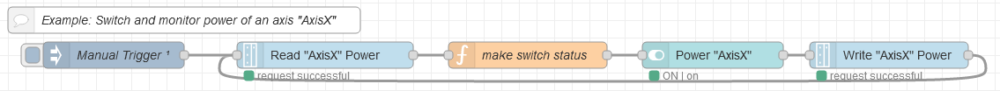


```JSON
[{"id":"7598c8e9.423f28","type":"comment","z":"4ff80d56.dd60fc","name":"Example: Switch and monitor power of an axis \"AxisX\"","info":"","x":280,"y":1380,"wires":[]},{"id":"f3001db9.f1ac5","type":"ctrlx-datalayer-request","z":"4ff80d56.dd60fc","device":"7b877229.678964","method":"CREATE","path":"motion/axs/AxisX/cmd/power","payloadFormat":"value_type","name":"Write \"AxisX\" Power","x":1080,"y":1420,"wires":[["ec10e282.671738"]]},{"id":"f790e337.3bfc98","type":"ui_switch","z":"4ff80d56.dd60fc","name":"","label":"Power \"AxisX\"","tooltip":"","group":"eb7620ae.6f5d","order":1,"width":"4","height":"1","passthru":false,"decouple":"true","topic":"","topicType":"str","style":"","onvalue":"{\"value\":true,\"type\":\"bool8\"}","onvalueType":"json","onicon":"","oncolor":"","offvalue":"{\"value\":false,\"type\":\"bool8\"}","offvalueType":"json","officon":"","offcolor":"","animate":false,"x":880,"y":1420,"wires":[["f3001db9.f1ac5"]]},{"id":"ec10e282.671738","type":"ctrlx-datalayer-request","z":"4ff80d56.dd60fc","device":"7b877229.678964","method":"READ","path":"motion/axs/AxisX/state/opstate/plcopen","payloadFormat":"value_type","name":"Read \"AxisX\" Power","x":440,"y":1420,"wires":[["be2d941e.9651c8"]]},{"id":"be2d941e.9651c8","type":"function","z":"4ff80d56.dd60fc","name":"make switch status","func":"var newMsg = {};\nif(msg.payload.value == \"OUTDATED\"){\n newMsg.payload = {\"type\":\"bool8\",\"value\":false} \n}\nelse if(msg.payload.value == \"DISABLED\") {\n newMsg.payload = {\"type\":\"bool8\",\"value\":false}\n} \nelse if(msg.payload.value == \"COORDINATED_MOTION_DISABLED\") {\n newMsg.payload = {\"type\":\"bool8\",\"value\":false} \n}\nelse if(msg.payload.value == \"ERRORSTOP\") {\n newMsg.payload = {\"type\":\"bool8\",\"value\":false} \n}\nelse {\n newMsg.payload = {\"type\":\"bool8\",\"value\":true} \n}\nreturn newMsg;","outputs":1,"noerr":0,"initialize":"","finalize":"","x":670,"y":1420,"wires":[["f790e337.3bfc98"]]},{"id":"bb714120.4807d","type":"inject","z":"4ff80d56.dd60fc","name":"Manual Trigger","props":[{"p":"payload"},{"p":"topic","vt":"str"}],"repeat":"","crontab":"","once":true,"onceDelay":0.1,"topic":"","payload":"","payloadType":"date","x":200,"y":1420,"wires":[["ec10e282.671738"]]},{"id":"7b877229.678964","type":"ctrlx-config","name":"localhost","hostname":"localhost","debug":false},{"id":"eb7620ae.6f5d","type":"ui_group","name":"Axes handling","tab":"9cba2148.8c9148","order":3,"disp":true,"width":"5","collapse":false},{"id":"9cba2148.8c9148","type":"ui_tab","name":"Examples","icon":"dashboard","order":7,"disabled":false,"hidden":false}]
```

### Example: Monitor position of an axis "AxisX"

The following example shows how to monitor the interpolated position of a motion axis `AxisX` in the ctrlX MOTION. The corresponding motion object has to be present and the state of the ctrlX MOTION has to be `Running`.


```JSON
[{"id":"657f7c1a.cf6cec","type":"ctrlx-datalayer-subscribe","z":"4ff80d56.dd60fc","subscription":"632bcc2.eddf134","path":"motion/axs/AxisX/state/values/ipo/pos/mm","name":"Read \"AxisX\" pos","x":160,"y":1560,"wires":[["1cfdc1d6.d4e5de"]]},{"id":"85fa0533.8ab3d8","type":"comment","z":"4ff80d56.dd60fc","name":"Example: Monitor position of an axis \"AxisX\"","info":"","x":240,"y":1520,"wires":[]},{"id":"122d92a4.f6a56d","type":"ui_text","z":"4ff80d56.dd60fc","group":"eb7620ae.6f5d","order":2,"width":"3","height":"1","name":"","label":"Position \"AxisX\"","format":"{{msg.payload}}","layout":"col-center","x":620,"y":1560,"wires":[]},{"id":"1cfdc1d6.d4e5de","type":"function","z":"4ff80d56.dd60fc","name":"make value fixed(2)","func":"var newMsg = {};\nnewMsg.payload = msg.payload.toFixed(2);\nreturn newMsg;","outputs":1,"noerr":0,"initialize":"","finalize":"","x":390,"y":1560,"wires":[["122d92a4.f6a56d"]]},{"id":"632bcc2.eddf134","type":"ctrlx-config-subscription","device":"7b877229.678964","name":"Sub_Default","publishIntervalMs":""},{"id":"eb7620ae.6f5d","type":"ui_group","name":"Axes handling","tab":"9cba2148.8c9148","order":3,"disp":true,"width":"5","collapse":false},{"id":"7b877229.678964","type":"ctrlx-config","name":"localhost","hostname":"localhost","debug":false},{"id":"9cba2148.8c9148","type":"ui_tab","name":"Examples","icon":"dashboard","order":7,"disabled":false,"hidden":false}]
```

### Example: Move an axis "AxisX"

The following example shows how to move a motion axis `AxisX` in the ctrlX MOTION to position = 10 with velocity, acceleration, deceleration = 10 and jerk = 0. The state of the ctrlX MOTION has to be `Running`. The corresponding motion object has to be present and its state has to be `STANDSTILL` (powered on, [see state machine documentation](https://docs.automation.boschrexroth.com/document/version/1.0/R911403791_01_Motion_App_-1_-en_US/chapter/metadata.boschrexroth.de~iiDC~Topic-ad91cfe627c8cf7c0a347e880bebcac6-3-en-US~en/?sel=IwelHYQFhAGNogEwC5YBpQUfUNXBRA%3D%3D)).

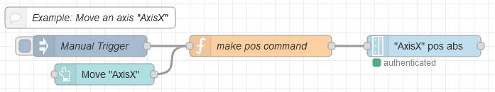


```JSON
[{"id":"ef2f6f42.26f6b8","type":"function","z":"4ff80d56.dd60fc","name":"make pos command","func":"var newMsg = {};\nnewMsg.payload = {\n      \"type\":\"object\",\n      \"value\":{\n\t    \"axsPos\":\"10\",\"buffered\":false,\"lim\":{\"vel\":\"10\",\"acc\":\"10\",\"dec\":\"10\",\"jrkAcc\":\"0\",\"jrkDec\":\"0\"}\n\t    }\n     }\nreturn newMsg;","outputs":1,"noerr":0,"initialize":"","finalize":"","x":440,"y":1680,"wires":[["c27d8d3a.aba638"]]},{"id":"c27d8d3a.aba638","type":"ctrlx-datalayer-request","z":"4ff80d56.dd60fc","device":"7b877229.678964","method":"CREATE","path":"motion/axs/AxisX/cmd/pos-abs","payloadFormat":"value_type","name":"\"AxisX\" pos abs","x":670,"y":1680,"wires":[[]]},{"id":"569584de.0946e4","type":"comment","z":"4ff80d56.dd60fc","name":"Example: Move an axis \"AxisX\"","info":"","x":200,"y":1640,"wires":[]},{"id":"fcc3bed0.080f48","type":"ui_button","z":"4ff80d56.dd60fc","name":"","group":"eb7620ae.6f5d","order":3,"width":"2","height":"1","passthru":false,"label":"Move \"AxisX\"","tooltip":"","color":"","bgcolor":"","icon":"","payload":"","payloadType":"str","topic":"topic","topicType":"msg","x":220,"y":1720,"wires":[["ef2f6f42.26f6b8"]]},{"id":"14a61d63.0cf1ab","type":"inject","z":"4ff80d56.dd60fc","name":"Manual Trigger","props":[{"p":"payload"},{"p":"topic","vt":"str"}],"repeat":"","crontab":"","once":false,"onceDelay":0.1,"topic":"","payload":"","payloadType":"date","x":200,"y":1680,"wires":[["ef2f6f42.26f6b8"]]},{"id":"7b877229.678964","type":"ctrlx-config","name":"localhost","hostname":"localhost","debug":false},{"id":"eb7620ae.6f5d","type":"ui_group","name":"Axes handling","tab":"9cba2148.8c9148","order":3,"disp":true,"width":"5","collapse":false},{"id":"9cba2148.8c9148","type":"ui_tab","name":"Examples","icon":"dashboard","order":7,"disabled":false,"hidden":false}]
```

### Example: Abort an axis movement of "AxisX"

The following example shows how to abort an movement of a motion axis `AxisX` in the ctrlX MOTION with deceleration = 10 and jerk = 0. The state of the ctrlX MOTION has to be `Running`. The corresponding motion object has to be present and its state has to be `DISCRETE_MOTION`.


```JSON
[{"id":"79e751dd.c8402","type":"function","z":"4ff80d56.dd60fc","name":"make abort command","func":"var newMsg = {};\nnewMsg.payload = {\n      \"type\":\"object\",\n      \"value\":{\"dec\":\"10\",\"jrkDec\":\"0\"}\n     }\nreturn newMsg;","outputs":1,"noerr":0,"initialize":"","finalize":"","libs":[],"x":440,"y":1840,"wires":[["7cb11da0.1916bc"]]},{"id":"7cb11da0.1916bc","type":"ctrlx-datalayer-request","z":"4ff80d56.dd60fc","device":"7b877229.678964","method":"CREATE","path":"motion/axs/AxisX/cmd/abort","payloadFormat":"value_type","name":"\"AxisX\" abort","x":660,"y":1840,"wires":[[]]},{"id":"dc3e7b2.6ab9388","type":"comment","z":"4ff80d56.dd60fc","name":"Example: Abort an axis movement of \"AxisX\"","info":"","x":240,"y":1800,"wires":[]},{"id":"a11e7b1a.b3a8d","type":"ui_button","z":"4ff80d56.dd60fc","name":"","group":"eb7620ae.6f5d","order":3,"width":"2","height":"1","passthru":false,"label":"Stop \"AxisX\"","tooltip":"","color":"","bgcolor":"","icon":"","payload":"","payloadType":"str","topic":"topic","topicType":"msg","x":210,"y":1880,"wires":[["79e751dd.c8402"]]},{"id":"690b0e68.ffc46","type":"inject","z":"4ff80d56.dd60fc","name":"Manual Trigger","props":[{"p":"payload"},{"p":"topic","vt":"str"}],"repeat":"","crontab":"","once":false,"onceDelay":0.1,"topic":"","payload":"","payloadType":"date","x":200,"y":1840,"wires":[["79e751dd.c8402"]]},{"id":"7b877229.678964","type":"ctrlx-config","name":"localhost","hostname":"localhost","debug":false},{"id":"eb7620ae.6f5d","type":"ui_group","name":"Axes handling","tab":"9cba2148.8c9148","order":3,"disp":true,"width":"5","collapse":false},{"id":"9cba2148.8c9148","type":"ui_tab","name":"Examples","icon":"dashboard","order":7,"disabled":false,"hidden":false}]
```

## Dashboard examples for script interpreter and ctrlX CORE - Python Runtime App

Please note that for these examples the installation of the `ctrlX CORE - Python Runtime App` is expected. See [our store](https://developer.community.boschrexroth.com/t5/Store-and-How-to/ctrlX-CORE-Python-Runtime-App/ba-p/15901) and the corresponding [documentation of the "Script parser/interpreter (Python)"](https://docs.automation.boschrexroth.com/document/version/1.0/R911403767_ctrlX-CORE_-Base_-1_-en_US/chapter/metadata.boschrexroth.de~iiDC~Topic-0e3a24c48bafe9140a347e880b4e0362-2-en-US~en/?sel=IwegDCAs49BMAuMAaUFoXSRBmSQ%3D).

### Example: Create an interpreter instance "MyInstance" for python

The following example shows how to create an interpreter instance `MyInstance` for executing python code/scripts.


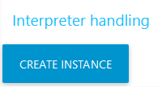

```JSON
[{"id":"41a67c09.9532e4","type":"comment","z":"4ff80d56.dd60fc","name":"Example: Create an interpreter instance \"MyInstance\" for python","info":"","x":310,"y":1960,"wires":[]},{"id":"32d49076.f8923","type":"function","z":"4ff80d56.dd60fc","name":"make create command","func":"var newMsg = {};\nnewMsg.payload = {\n      \"type\":\"object\",\n      \"value\":{\n\t    \"name\":\"MyInstance\",\"language\":\"python\"\n        }\n     }\nreturn newMsg;","outputs":1,"noerr":0,"initialize":"","finalize":"","libs":[],"x":420,"y":2000,"wires":[["b3d753e.4376c3"]]},{"id":"b3d753e.4376c3","type":"ctrlx-datalayer-request","z":"4ff80d56.dd60fc","device":"7b877229.678964","method":"CREATE","path":"script/instances","payloadFormat":"value_type","name":"Create Instance \"MyInstance\"","x":690,"y":2000,"wires":[[]]},{"id":"3cf2344c.df7184","type":"inject","z":"4ff80d56.dd60fc","name":"Manual Trigger","props":[{"p":"payload"},{"p":"topic","vt":"str"}],"repeat":"","crontab":"","once":false,"onceDelay":0.1,"topic":"","payload":"","payloadType":"date","x":180,"y":2040,"wires":[["32d49076.f8923"]]},{"id":"18c49496.2cf273","type":"ui_button","z":"4ff80d56.dd60fc","name":"","group":"f675e9d2.c9935","order":1,"width":"3","height":"1","passthru":false,"label":"Create Instance","tooltip":"","color":"","bgcolor":"","icon":"","payload":"","payloadType":"str","topic":"topic","topicType":"msg","x":180,"y":2000,"wires":[["32d49076.f8923"]]},{"id":"7b877229.678964","type":"ctrlx-config","name":"localhost","hostname":"localhost","debug":false},{"id":"f675e9d2.c9935","type":"ui_group","name":"Interpreter handling","tab":"9cba2148.8c9148","order":4,"disp":true,"width":"4","collapse":false},{"id":"9cba2148.8c9148","type":"ui_tab","name":"Examples","icon":"dashboard","order":7,"disabled":false,"hidden":false}]
```

### Example: Browse and show all available interpreter instances

The following example shows how to browse and show all available instances of the ctrlX script manager.


```JSON
[{"id":"54d27d.03212584","type":"ctrlx-datalayer-request","z":"4ff80d56.dd60fc","device":"7b877229.678964","method":"BROWSE","path":"script/instances","payloadFormat":"value_type","name":"Browse instances","x":430,"y":2160,"wires":[["474a1b6.70f72e4"]]},{"id":"5346646a.c4a73c","type":"ui_button","z":"4ff80d56.dd60fc","name":"","group":"f675e9d2.c9935","order":2,"width":"3","height":"1","passthru":false,"label":"Browse instances","tooltip":"","color":"","bgcolor":"","icon":"","payload":"","payloadType":"str","topic":"topic","topicType":"msg","x":200,"y":2200,"wires":[["54d27d.03212584"]]},{"id":"90a22cfc.a01b18","type":"inject","z":"4ff80d56.dd60fc","name":"Manual Trigger","props":[{"p":"payload"},{"p":"topic","vt":"str"}],"repeat":"","crontab":"","once":true,"onceDelay":0.1,"topic":"","payload":"","payloadType":"date","x":190,"y":2160,"wires":[["54d27d.03212584"]]},{"id":"474a1b6.70f72e4","type":"function","z":"4ff80d56.dd60fc","name":"make string","func":"var newMsg = {};\nnewMsg.payload = \"\";\nif (msg.payload.value == null){\n    newMsg.payload = \"could not read\";\n}\nelse if(msg.payload.value.length > 0){\n    for (var i = 0; i < msg.payload.value.length; i++) {\n        if(i==0){\n            newMsg.payload += msg.payload.value[i];\n        }\n        else{\n            newMsg.payload += \", \" + msg.payload.value[i];\n        }\n    }\n}\nelse{\n    newMsg.payload = \"no instances found\"\n}\nreturn newMsg;\n","outputs":1,"noerr":0,"initialize":"","finalize":"","libs":[],"x":630,"y":2160,"wires":[["f1db1731.1867c"]]},{"id":"f1db1731.1867c","type":"ui_text","z":"4ff80d56.dd60fc","group":"f675e9d2.c9935","order":3,"width":"0","height":"0","name":"","label":"Instances","format":"{{msg.payload}}","layout":"col-center","x":800,"y":2160,"wires":[]},{"id":"4881365b.cb4c1","type":"comment","z":"4ff80d56.dd60fc","name":"Example: Browse and show all available interpreter instances","info":"","x":250,"y":2120,"wires":[]},{"id":"7b877229.678964","type":"ctrlx-config","name":"localhost","hostname":"localhost","debug":false},{"id":"f675e9d2.c9935","type":"ui_group","name":"Interpreter handling","tab":"9cba2148.8c9148","order":4,"disp":true,"width":"4","collapse":false},{"id":"9cba2148.8c9148","type":"ui_tab","name":"Examples","icon":"dashboard","order":7,"disabled":false,"hidden":false}]
```

### Example: Monitor state of an interpreter instance "MyInstance"

The following example shows how to monitor the state of an instances `MyInstance` of the ctrlX script manager ([see state machine](https://docs.automation.boschrexroth.com/document/version/1.0/R911403767_ctrlX-CORE_-Base_-1_-en_US/chapter/metadata.boschrexroth.de~iiDC~Topic-0e3a24c48bafe9140a347e880b4e0362-2-en-US~en/?sel=AwegjCAs6tqyATALmAGlBaYHyk5RAdiA)).

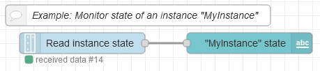
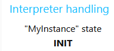

```JSON
[{"id":"9b9e6fbd.7416e8","type":"comment","z":"4ff80d56.dd60fc","name":"Example: Monitor state of an interpreter instance \"MyInstance\"","info":"","x":250,"y":2280,"wires":[]},{"id":"59b3f37.f33bf0c","type":"ctrlx-datalayer-subscribe","z":"4ff80d56.dd60fc","subscription":"632bcc2.eddf134","path":"script/instances/MyInstance/state/opstate","name":"Read instance state","x":170,"y":2320,"wires":[["4d250434.d9cf1c"]]},{"id":"4d250434.d9cf1c","type":"ui_text","z":"4ff80d56.dd60fc","group":"f675e9d2.c9935","order":4,"width":"4","height":"1","name":"","label":"\"MyInstance\" state","format":"{{msg.payload}}","layout":"col-center","x":410,"y":2320,"wires":[]},{"id":"632bcc2.eddf134","type":"ctrlx-config-subscription","device":"7b877229.678964","name":"Sub_Default","publishIntervalMs":""},{"id":"f675e9d2.c9935","type":"ui_group","name":"Interpreter handling","tab":"9cba2148.8c9148","order":4,"disp":true,"width":"4","collapse":false},{"id":"7b877229.678964","type":"ctrlx-config","name":"localhost","hostname":"localhost","debug":false},{"id":"9cba2148.8c9148","type":"ui_tab","name":"Examples","icon":"dashboard","order":7,"disabled":false,"hidden":false}]
```

### Example: Reset interpreter instance "MyInstance"

The following example shows how to reset a script interpreter instance `MyInstance`. The corresponding instance has to be present and in state `ERROR`. 


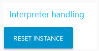

```JSON
[{"id":"79e751dd.c8402","type":"function","z":"5480b2f5a22f3525","name":"make reset command","func":"var newMsg = {};\nreturn newMsg;","outputs":1,"noerr":0,"initialize":"","finalize":"","libs":[],"x":660,"y":220,"wires":[["7cb11da0.1916bc"]]},{"id":"7cb11da0.1916bc","type":"ctrlx-datalayer-request","z":"5480b2f5a22f3525","device":"7b877229.678964","method":"CREATE","path":"script/instances/MyInstance/cmd/reset","payloadFormat":"value_type","name":"Reset \"MyInstance\"","x":900,"y":220,"wires":[[]]},{"id":"a11e7b1a.b3a8d","type":"ui_button","z":"5480b2f5a22f3525","name":"","group":"f675e9d2.c9935","order":3,"width":"3","height":"1","passthru":false,"label":"Reset instance","tooltip":"","color":"","bgcolor":"","className":"","icon":"","payload":"","payloadType":"str","topic":"topic","topicType":"msg","x":420,"y":220,"wires":[["79e751dd.c8402"]]},{"id":"690b0e68.ffc46","type":"inject","z":"5480b2f5a22f3525","name":"Manual Trigger","props":[{"p":"payload"},{"p":"topic","vt":"str"}],"repeat":"","crontab":"","once":false,"onceDelay":0.1,"topic":"","payload":"","payloadType":"date","x":420,"y":260,"wires":[["79e751dd.c8402"]]},{"id":"dc3e7b2.6ab9388","type":"comment","z":"5480b2f5a22f3525","name":"Example: Reset interpreter instance \"MyInstance\"","info":"","x":500,"y":180,"wires":[]},{"id":"7b877229.678964","type":"ctrlx-config","name":"localhost","hostname":"localhost","debug":false},{"id":"f675e9d2.c9935","type":"ui_group","name":"Interpreter handling","tab":"9cba2148.8c9148","order":4,"disp":true,"width":"4","collapse":false},{"id":"9cba2148.8c9148","type":"ui_tab","name":"Examples","icon":"dashboard","order":7,"disabled":false,"hidden":false}]
```

### Example: Execute a python command in an interpreter instance "MyInstance"

The following example shows how to execute a python command script in n script interpreter instance `MyInstance`. The corresponding instance has to be present and in state `INIT` or `READY` ([see state machine](https://docs.automation.boschrexroth.com/document/version/1.0/R911403767_ctrlX-CORE_-Base_-1_-en_US/chapter/metadata.boschrexroth.de~iiDC~Topic-0e3a24c48bafe9140a347e880b4e0362-2-en-US~en/?sel=AwegjCAs6tqyATALmAGlBaYHyk5RAdiA)).

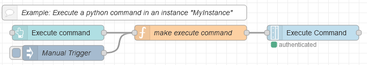
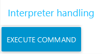

```JSON
[{"id":"e414e92c.da574","type":"function","z":"4ff80d56.dd60fc","name":"make execute command","func":"var newMsg = {};\nnewMsg.payload = {\n  \"type\":\"object\",\n  \"value\":{\n    \"name\": \"import time; time.sleep(25)\",\n    \"param\": []\n  }\n}\nreturn newMsg;","outputs":1,"noerr":0,"initialize":"","finalize":"","libs":[],"x":450,"y":2160,"wires":[["e0470a61.af156"]]},{"id":"1ca4bac8.ef2ea5","type":"inject","z":"4ff80d56.dd60fc","name":"Manual Trigger","props":[{"p":"payload"},{"p":"topic","vt":"str"}],"repeat":"","crontab":"","once":false,"onceDelay":0.1,"topic":"","payload":"","payloadType":"date","x":200,"y":2200,"wires":[["e414e92c.da574"]]},{"id":"e0470a61.af156","type":"ctrlx-datalayer-request","z":"4ff80d56.dd60fc","device":"7b877229.678964","method":"CREATE","path":"script/instances/MyInstance/cmd/string","payloadFormat":"value_type","name":"Execute Command","x":690,"y":2160,"wires":[[]]},{"id":"4f058c35.13bd84","type":"comment","z":"4ff80d56.dd60fc","name":"Example: Execute a python command in an interpreter instance \"MyInstance\"","info":"","x":320,"y":2120,"wires":[]},{"id":"a4823a8f.8706a8","type":"ui_button","z":"4ff80d56.dd60fc","name":"","group":"f675e9d2.c9935","order":1,"width":"3","height":"1","passthru":false,"label":"Execute command","tooltip":"","color":"","bgcolor":"","icon":"","payload":"","payloadType":"str","topic":"topic","topicType":"msg","x":190,"y":2160,"wires":[["e414e92c.da574"]]},{"id":"7b877229.678964","type":"ctrlx-config","name":"localhost","hostname":"localhost","debug":false},{"id":"f675e9d2.c9935","type":"ui_group","name":"Interpreter handling","tab":"9cba2148.8c9148","order":4,"disp":true,"width":"4","collapse":false},{"id":"9cba2148.8c9148","type":"ui_tab","name":"Examples","icon":"dashboard","order":7,"disabled":false,"hidden":false}]
```

### Example: Execute a python file "test.py" in an interpreter instance "MyInstance"

The following example shows how to execute a python script file in a script interpreter instance `MyInstance`. The corresponding instance has to be present and in state `INIT` or `READY`. The file `test.py` has to be present in the root folder of the active configuration.

Content of `test.py`:

```python
import time
while True:
    time.sleep(1)
    pass
```


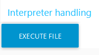

```JSON
[{"id":"9df4d3fd.3d9218","type":"function","z":"4ff80d56.dd60fc","name":"make file execute command","func":"var newMsg = {};\nnewMsg.payload = {\n    \"type\":\"object\",\n    \"value\":{\n        \"name\":\"activeConfiguration/test.py\" //File test.py expected at root of the active configuration\n        }\n    }\nreturn newMsg;","outputs":1,"noerr":0,"initialize":"","finalize":"","libs":[],"x":440,"y":2320,"wires":[["374d357d.cb126a"]]},{"id":"d4d2cc18.9e9c1","type":"inject","z":"4ff80d56.dd60fc","name":"Manual Trigger","props":[{"p":"payload"},{"p":"topic","vt":"str"}],"repeat":"","crontab":"","once":false,"onceDelay":0.1,"topic":"","payload":"","payloadType":"date","x":180,"y":2360,"wires":[["9df4d3fd.3d9218"]]},{"id":"374d357d.cb126a","type":"ctrlx-datalayer-request","z":"4ff80d56.dd60fc","device":"7b877229.678964","method":"CREATE","path":"script/instances/MyInstance/cmd/file","payloadFormat":"value_type","name":"Execute File \"test.py\"","x":700,"y":2320,"wires":[[]]},{"id":"c0963556.392e7","type":"comment","z":"4ff80d56.dd60fc","name":"Example: Execute a python file \"test.py\" in an interpreter instance \"MyInstance\"","info":"","x":320,"y":2280,"wires":[]},{"id":"9df3a70d.0d6f68","type":"ui_button","z":"4ff80d56.dd60fc","name":"","group":"f675e9d2.c9935","order":1,"width":"3","height":"1","passthru":false,"label":"Execute file","tooltip":"","color":"","bgcolor":"","icon":"","payload":"","payloadType":"str","topic":"topic","topicType":"msg","x":190,"y":2320,"wires":[["9df4d3fd.3d9218"]]},{"id":"7b877229.678964","type":"ctrlx-config","name":"localhost","hostname":"localhost","debug":false},{"id":"f675e9d2.c9935","type":"ui_group","name":"Interpreter handling","tab":"9cba2148.8c9148","order":4,"disp":true,"width":"4","collapse":false},{"id":"9cba2148.8c9148","type":"ui_tab","name":"Examples","icon":"dashboard","order":7,"disabled":false,"hidden":false}]
```
