# Examples

This page contains various examples for different use cases. Looking through the examples might help to better understand how to use the nodes for specific tasks. Please note that depending on the example, different apps have to be present on the system.

## Table of contents

[How to import examples](#how-to-import-examples)

[General examples](#general-examples)

- [Set request properties via msg](#set-request-properties-via-msg)
- [Get web token from authentication server](#get-web-token-from-authentication-server)
- [Read the current CPU utilisation on request](#read-the-current-cpu-utilisation-on-request)
- [Subscribe to the current CPU utilisation](#subscribe-to-the-current-cpu-utilisation)
- [Monitor CPU utilisation in line chart](#monitor-cpu-utilisation-in-line-chart-on-dashboard)
- [Use a catch node to handle errors](#use-a-catch-node-to-handle-errors)
- [Subscribe and unsubscribe to a node dynamically](#subscribe-and-unsubscribe-to-a-node-dynamically)

[Diagnosis and Logbook examples](#diagnosis-and-logbook-examples)

- [Read all pending diagnosis and show on dashboard](#read-all-pending-diagnosis-an-show-on-dashboard)
- [Confirm all pending errors in the system diagnosis](#confirm-all-pending-errors-in-the-system-diagnosis)
- [Confirm single pending error in the system diagnosis](#confirm-single-pending-error-in-the-system-diagnosis)
- [Read main diagnosis text and show on dashboard](#read-main-diagnosis-text-and-show-on-dashboard)
- [Read detailed diagnostic text and show on dashboard](#read-detailed-diagnostic-text-and-show-on-dashboard)

[PLC examples](#plc-examples)

- [Read a PLC variable (integer)](#read-a-plc-variable-integer)
- [Write a PLC variable (boolean)](#write-a-plc-variable-boolean)

[ctrlX OS - PLC App dashboard examples](#ctrlx-os---plc-app-dashboard-examples) 

- [Monitor and handle a boolean PLC variable `bBoolean`]( #monitor-and-handle-a-boolean-plc-variable-bboolean)
- [Monitor and handle an integer PLC variable `iInteger`]( #monitor-and-handle-an-integer-plc-variable-iinteger)
- [Monitor and handle a real PLC variable `rReal`]( #monitor-and-handle-a-real-plc-variable-rreal)
- [Monitor and handle a string PLC variable `sString`]( #monitor-and-handle-a-string-plc-variable-sstring)
- [Monitor and handle a struct PLC variable `strStruct`]( #monitor-and-handle-a-struct-plc-variable-strstruct)

[ctrlX OS - MOTION App dashboard examples](#ctrlx-os---motion-app-dashboard-examples)

- [Monitor and switch motion state]( #monitor-and-switch-motion-state)
- [Browse and show all available axes]( #browse-and-show-all-available-axes)
- [Create an axis `AxisX`]( #create-an-axis-axisx)
- [Switch and monitor power of an axis `AxisX`]( #switch-and-monitor-power-of-an-axis-axisx)
- [Monitor position of an axis `AxisX`]( #monitor-position-of-an-axis-axisx)
- [Absolute positioning of an axis `AxisX`]( #absolute-positioning-of-an-axis-axisx)
- [Abort an axis movement of an axis `AxisX`]( #abort-movement-of-an-axis-axisx)
- [Reset an error of an axis `AxisX`](#reset-an-error-of-an-axis-axisx)
- [Group axes to a kinematic `Robot`]( #group-axes-to-a-kinematic-robot)
- [Monitor and switch enable state of a kinematic `Robot`](#monitor-and-switch-enable-state-of-a-kinematic-robot)
- [Move linear absolute of a kinematic `Robot`]( #move-linear-absolute-of-a-kinematic-robot)
- [Abort movement of a kinematic `Robot`]( #abort-movement-of-a-kinematic-robot)
- [Reset error of a kinematic `Robot`]( #reset-error-of-a-kinematic-robot)

[Script interpreter and ctrlX OS - Python Runtime App dashboard examples](#script-interpreter-and-ctrlx-os---python-runtime-app-dashboard-examples)

- [Create an interpreter instance `MyInstance` for python]( #create-an-interpreter-instance-myinstance-for-python)
- [Browse and show all available interpreter instances]( #browse-and-show-all-available-interpreter-instances)
- [Monitor state of an interpreter instance `MyInstance`]( #monitor-state-of-an-interpreter-instance-myinstance)
- [Reset interpreter instance `MyInstance`]( #reset-interpreter-instance-myinstance)
- [Execute a python command in an interpreter instance `MyInstance`]( #execute-a-python-command-in-an-interpreter-instance-myinstance)
- [Execute a python file `test.py` in an interpreter instance `MyInstance`]( #execute-a-python-file-testpy-in-an-interpreter-instance-myinstance)
- [Abort an interpreter instance `MyInstance`](#abort-an-interpreter-instance-myinstance)

[ctrlX OS - EtherCat Master App dashboard examples](#ctrlx-os---ethercat-master-app-dashboard-examples)

- [Monitor and switch state of an EtherCat master instance `ethercatmaster`](#monitor-and-switch-state-of-an-ethercat-master-instance-ethercatmaster)

## How to import examples

The example flows can either be imported via the clipboard or by importing directly in the Node-RED editor via the dialog **Import -> Import Nodes -> Examples -> node-red-contrib-ctrlx-automation**.

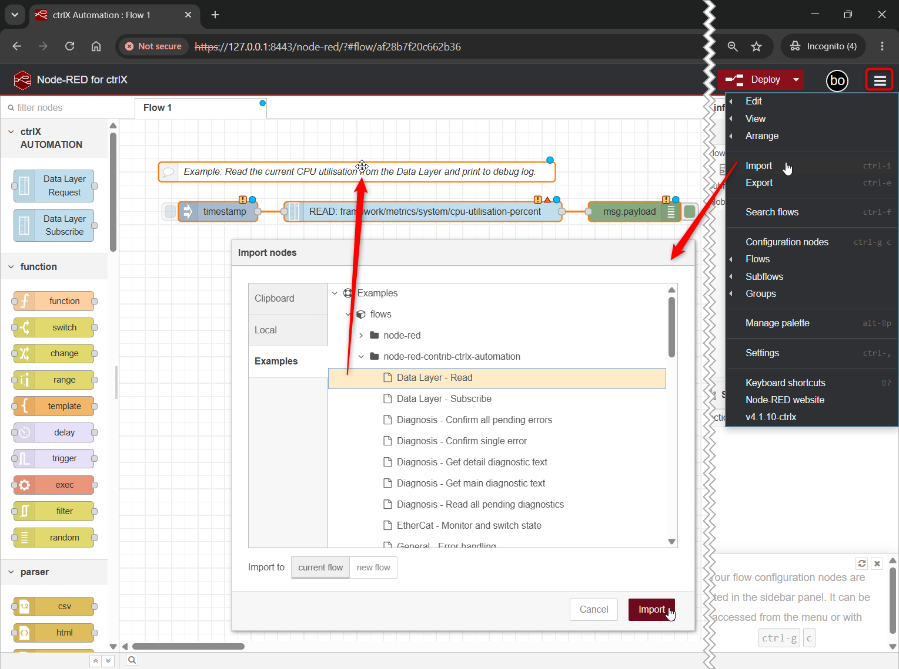

**Keep in mind, that you need to insert valid credentials (username and password)** for your device and adjust your hostname inside of the communication nodes.
When importing several examples after each other a message `Some of the nodes you are importing already exist in your workspace.` appears. Please choose `View nodes...` and click on `Import selected`. Otherwise you could overwrite existing settings nodes.

## General examples

### Set request properties via msg

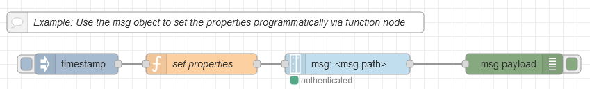

```JSON
[{"id":"7d8c9ee.2e8246","type":"comment","z":"b7f42922c8391768","name":"Example: Use the msg object to set the properties programmatically via function node","info":"","x":570,"y":100,"wires":[]},{"id":"c558ee94.94a69","type":"debug","z":"b7f42922c8391768","name":"","active":true,"tosidebar":true,"console":false,"tostatus":false,"complete":"false","x":1000,"y":160,"wires":[]},{"id":"b21cb94.37f9648","type":"ctrlx-datalayer-request","z":"b7f42922c8391768","device":"7b877229.678964","method":"msg","path":"","name":"","x":760,"y":160,"wires":[["c558ee94.94a69"]]},{"id":"6a8a874a.7d0058","type":"inject","z":"b7f42922c8391768","name":"","repeat":"","crontab":"","once":false,"onceDelay":0.1,"topic":"","payload":"","payloadType":"date","x":370,"y":160,"wires":[["19b7a2d1.6a030d"]]},{"id":"19b7a2d1.6a030d","type":"function","z":"b7f42922c8391768","name":"set properties","func":"msg.method = 'READ';\nmsg.path = 'framework/metrics/system/cpu-utilisation-percent';\n\nreturn msg;","outputs":1,"noerr":0,"x":550,"y":160,"wires":[["b21cb94.37f9648"]]},{"id":"7b877229.678964","type":"ctrlx-config","name":"localhost","hostname":"localhost","debug":false}]
```

### Get web token from authentication server

The following example shows how to get a web token from ctrlX OSs authentication server. The username and password has to be adapted in the `make header` function. This can be used to access ctrlX OS REST API.
In standard setting, the token get invalid after 8h and needs to be renewed. This can be done by e.g. adding an interval to the inject node, that is smaller than the tokens expiration time. 
Beware that each login generates a new valid token. Use logout to clear this token, otherwise they will pile up.

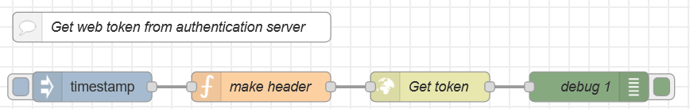

```JSON
[{"id":"af22af4db424ebc6","type":"function","z":"b7f42922c8391768","name":"make header","func":"var newMsg = {};\nnewMsg.header = {};\nnewMsg.header[\"Content-Type\"] = \"application/json\"\nnewMsg.payload =\n    { name: \"boschrexroth\", password: \"boschrexroth\" }\nnewMsg.url = \"https://localhost/identity-manager/api/v2/auth/token\";\nreturn newMsg;\n","outputs":1,"noerr":0,"initialize":"","finalize":"","libs":[],"x":330,"y":140,"wires":[["0a76057a199ca617"]]},{"id":"0a76057a199ca617","type":"http request","z":"b7f42922c8391768","name":"Get token","method":"POST","ret":"obj","paytoqs":"ignore","url":"","tls":"","persist":false,"proxy":"","insecureHTTPParser":false,"authType":"","senderr":false,"headers":[],"x":500,"y":140,"wires":[["ee4def3e07376b8d"]]},{"id":"ee4def3e07376b8d","type":"debug","z":"b7f42922c8391768","name":"debug 1","active":true,"tosidebar":true,"console":false,"tostatus":false,"complete":"payload","targetType":"msg","statusVal":"","statusType":"auto","x":660,"y":140,"wires":[]},{"id":"c485adb93723e929","type":"inject","z":"b7f42922c8391768","name":"","props":[{"p":"payload"},{"p":"topic","vt":"str"}],"repeat":"","crontab":"","once":false,"onceDelay":0.1,"topic":"","payload":"","payloadType":"date","x":160,"y":140,"wires":[["af22af4db424ebc6"]]},{"id":"056e75fc0e45614d","type":"comment","z":"b7f42922c8391768","name":"Get web token from authentication server","info":"","x":240,"y":80,"wires":[]}]
```

### Read the current CPU utilisation on request

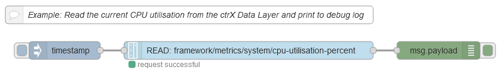

```JSON
[{"id":"765680d3.1c7788","type":"ctrlx-datalayer-request","z":"b7f42922c8391768","device":"7b877229.678964","method":"READ","path":"framework/metrics/system/cpu-utilisation-percent","payloadFormat":"value","name":"","x":690,"y":280,"wires":[["9195cd7c.d74f3"]]},{"id":"a1661333.e8b348","type":"inject","z":"b7f42922c8391768","name":"","props":[{"p":"payload"},{"p":"topic","vt":"str"}],"repeat":"","crontab":"","once":false,"onceDelay":0.1,"topic":"","payload":"","payloadType":"date","x":380,"y":280,"wires":[["765680d3.1c7788"]]},{"id":"9195cd7c.d74f3","type":"debug","z":"b7f42922c8391768","name":"","active":true,"tosidebar":true,"console":false,"tostatus":false,"complete":"false","statusVal":"","statusType":"auto","x":1010,"y":280,"wires":[]},{"id":"84d1b245.874028","type":"comment","z":"b7f42922c8391768","name":"Example: Read the current CPU utilisation from the ctrX Data Layer and print to debug log","info":"","x":590,"y":220,"wires":[]},{"id":"7b877229.678964","type":"ctrlx-config","name":"localhost","hostname":"localhost","debug":false}]
```

### Subscribe to the current CPU utilisation

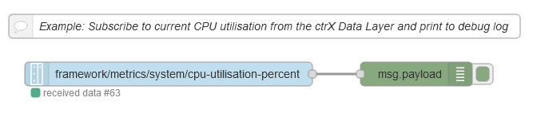

```JSON
[{"id":"872cd634.800108","type":"comment","z":"b7f42922c8391768","name":"Example: Subscribe to current CPU utilisation from the ctrX Data Layer and print to debug log","info":"","x":580,"y":340,"wires":[]},{"id":"d921bdd6.1d0b9","type":"ctrlx-datalayer-subscribe","z":"b7f42922c8391768","subscription":"632bcc2.eddf134","path":"framework/metrics/system/cpu-utilisation-percent","name":"","x":460,"y":400,"wires":[["ffa838b8.e6db98"]]},{"id":"ffa838b8.e6db98","type":"debug","z":"b7f42922c8391768","name":"","active":true,"tosidebar":true,"console":false,"tostatus":false,"complete":"false","statusVal":"","statusType":"auto","x":770,"y":400,"wires":[]},{"id":"632bcc2.eddf134","type":"ctrlx-config-subscription","device":"7b877229.678964","name":"Sub_Default","publishIntervalMs":""},{"id":"7b877229.678964","type":"ctrlx-config","name":"localhost","hostname":"localhost","debug":false}]
```

### Monitor CPU utilisation in line chart on dashboard

The following example shows how to subscribe to the current CPU utilisation and monitor the last 10 values in a line chart.

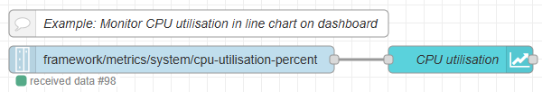
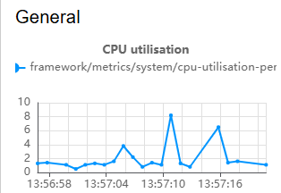

Dashboard 1.0:
```JSON
[{"id":"beb3ea051cd65ac2","type":"ctrlx-datalayer-subscribe","z":"b7f42922c8391768","subscription":"632bcc2.eddf134","path":"framework/metrics/system/cpu-utilisation-percent","name":"","x":440,"y":480,"wires":[["be8fc64ed0c8ea73"]]},{"id":"dc3e7b2.6ab9388","type":"comment","z":"b7f42922c8391768","name":"Example: Monitor CPU utilisation in line chart","info":"","x":430,"y":440,"wires":[]},{"id":"be8fc64ed0c8ea73","type":"ui_chart","z":"b7f42922c8391768","name":"","group":"a4ba432c81cdab8a","order":0,"width":"0","height":"0","label":"CPU utilisation","chartType":"line","legend":"false","xformat":"auto","interpolate":"linear","nodata":"","dot":true,"ymin":"0","ymax":"100","removeOlder":1,"removeOlderPoints":"10","removeOlderUnit":"60","cutout":0,"useOneColor":false,"useUTC":false,"colors":["#3eb31e","#aec7e8","#ff7f0e","#2ca02c","#98df8a","#d62728","#ff9896","#9467bd","#c5b0d5"],"outputs":1,"useDifferentColor":false,"className":"","x":760,"y":480,"wires":[[]]},{"id":"632bcc2.eddf134","type":"ctrlx-config-subscription","device":"7b877229.678964","name":"Sub_Default","publishIntervalMs":""},{"id":"a4ba432c81cdab8a","type":"ui_group","name":"General","tab":"9cba2148.8c9148","order":2,"disp":true,"width":"6","collapse":false,"className":""},{"id":"7b877229.678964","type":"ctrlx-config","name":"localhost","hostname":"localhost","debug":false},{"id":"9cba2148.8c9148","type":"ui_tab","name":"Examples","icon":"dashboard","order":7,"disabled":false,"hidden":false}]
```
Dashboard 2.0:
```JSON
[{"id":"beb3ea051cd65ac2","type":"ctrlx-datalayer-subscribe","z":"af28b7f20c662b36","subscription":"632bcc2.eddf134","path":"framework/metrics/system/cpu-utilisation-percent","name":"","inputs":0,"x":240,"y":120,"wires":[["6618a50ec7f21479"]]},{"id":"dc3e7b2.6ab9388","type":"comment","z":"af28b7f20c662b36","name":"Example: Monitor CPU utilisation in line chart on dashboard","info":"","x":270,"y":80,"wires":[]},{"id":"6618a50ec7f21479","type":"ui-chart","z":"af28b7f20c662b36","group":"56724e9fd9043cb8","name":"","label":"CPU utilisation","order":1,"chartType":"line","category":"topic","categoryType":"msg","xAxisLabel":"","xAxisProperty":"","xAxisPropertyType":"timestamp","xAxisType":"time","xAxisFormat":"","xAxisFormatType":"auto","xmin":"","xmax":"","yAxisLabel":"","yAxisProperty":"payload","yAxisPropertyType":"msg","ymin":"","ymax":"","bins":10,"action":"append","stackSeries":false,"pointShape":"circle","pointRadius":4,"showLegend":true,"removeOlder":1,"removeOlderUnit":"60","removeOlderPoints":"20","colors":["#0095ff","#ff0000","#ff7f0e","#2ca02c","#a347e1","#d62728","#ff9896","#9467bd","#c5b0d5"],"textColor":["#666666"],"textColorDefault":true,"gridColor":["#e5e5e5"],"gridColorDefault":true,"width":"2","height":"3","className":"","interpolation":"linear","x":540,"y":120,"wires":[[]]},{"id":"632bcc2.eddf134","type":"ctrlx-config-subscription","device":"7b877229.678964","name":"Sub_Default","publishIntervalMs":"","samplingInterval":"","errorInterval":"","keepaliveInterval":"","queueSize":"","deadbandValue":""},{"id":"56724e9fd9043cb8","type":"ui-group","name":"General","page":"30e3bb10109e324b","width":6,"height":1,"order":2,"showTitle":true,"className":"","visible":"true","disabled":"false","groupType":"default"},{"id":"7b877229.678964","type":"ctrlx-config","name":"localhost","hostname":"localhost","debug":false},{"id":"30e3bb10109e324b","type":"ui-page","name":"Page 1","ui":"ae50776f3a63db0e","path":"/page1","icon":"home","layout":"grid","theme":"a204995a5a44f2b2","breakpoints":[{"name":"Default","px":0,"cols":3},{"name":"Tablet","px":576,"cols":6},{"name":"Small Desktop","px":768,"cols":9},{"name":"Desktop","px":1024,"cols":12}],"order":1,"className":"","visible":true,"disabled":false},{"id":"ae50776f3a63db0e","type":"ui-base","name":"My Dashboard","path":"/dashboard","appIcon":"","includeClientData":true,"acceptsClientConfig":["ui-notification","ui-control"],"showPathInSidebar":false,"headerContent":"page","navigationStyle":"default","titleBarStyle":"default","showReconnectNotification":true,"notificationDisplayTime":1,"showDisconnectNotification":true,"allowInstall":false},{"id":"a204995a5a44f2b2","type":"ui-theme","name":"Default Theme","colors":{"surface":"#ffffff","primary":"#0094CE","bgPage":"#eeeeee","groupBg":"#ffffff","groupOutline":"#cccccc"},"sizes":{"density":"default","pagePadding":"12px","groupGap":"12px","groupBorderRadius":"4px","widgetGap":"12px"}},{"id":"e51044ae9e5099a3","type":"global-config","env":[],"modules":{"node-red-contrib-ctrlx-automation":"1.9.8","@flowfuse/node-red-dashboard":"1.30.2"}}]
```

### Use a catch node to handle errors

Beware that errors in the nodes e.g. node is missing or node path is invalid needs to be catched with the Node-RED internal `catch` node.

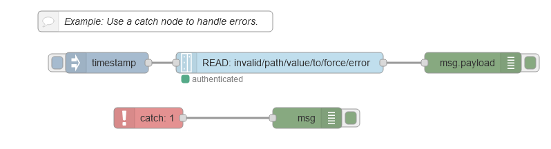

```JSON
[{"id":"3984d15c.b6a4be","type":"comment","z":"b7f42922c8391768","name":"Example: Use a catch node to handle errors.","info":"","x":430,"y":540,"wires":[]},{"id":"adcdeb72.352b88","type":"debug","z":"b7f42922c8391768","name":"","active":true,"tosidebar":true,"console":false,"tostatus":false,"complete":"false","x":890,"y":600,"wires":[]},{"id":"bf808c7e.2b56a","type":"ctrlx-datalayer-request","z":"b7f42922c8391768","device":"7b877229.678964","method":"READ","path":"invalid/path/value/to/force/error","name":"","x":610,"y":600,"wires":[["adcdeb72.352b88"]]},{"id":"eda269ff.f06d88","type":"inject","z":"b7f42922c8391768","name":"","repeat":"","crontab":"","once":false,"onceDelay":0.1,"topic":"","payload":"","payloadType":"date","x":360,"y":600,"wires":[["bf808c7e.2b56a"]]},{"id":"b55ac3d1.719b1","type":"catch","z":"b7f42922c8391768","name":"","scope":["bf808c7e.2b56a"],"uncaught":false,"x":420,"y":680,"wires":[["e91439fb.0fa298"]]},{"id":"e91439fb.0fa298","type":"debug","z":"b7f42922c8391768","name":"","active":true,"tosidebar":true,"console":false,"tostatus":false,"complete":"true","targetType":"full","x":650,"y":680,"wires":[]},{"id":"7b877229.678964","type":"ctrlx-config","name":"localhost","hostname":"localhost","debug":false}]
```

### Subscribe and unsubscribe to a node dynamically

The path of a subscribe node can be set dynamically at runtime.

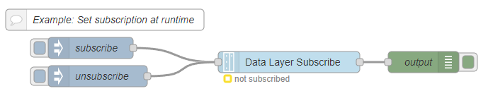

```JSON
[{"id":"8c92f714677c9a4a","type":"ctrlx-datalayer-subscribe","z":"e54f652072ad4b5b","subscription":"21664f4efd3d1a9d","path":"","name":"","inputs":1,"x":560,"y":100,"wires":[["ef08e241e0ed21b0"]]},{"id":"792d1c9b693276d8","type":"inject","z":"e54f652072ad4b5b","name":"subscribe","props":[{"p":"action","v":"subscribe","vt":"str"},{"p":"path","v":"framework/metrics/system/cpu-utilisation-percent","vt":"str"}],"repeat":"","crontab":"","once":false,"onceDelay":0.1,"topic":"","x":140,"y":80,"wires":[["8c92f714677c9a4a"]]},{"id":"7a9058067ce9881e","type":"inject","z":"e54f652072ad4b5b","name":"unsubscribe","props":[{"p":"action","v":"unsubscribe","vt":"str"}],"repeat":"","crontab":"","once":false,"onceDelay":0.1,"topic":"","x":150,"y":120,"wires":[["8c92f714677c9a4a"]]},{"id":"ef08e241e0ed21b0","type":"debug","z":"e54f652072ad4b5b","name":"output","active":true,"tosidebar":true,"console":false,"tostatus":false,"complete":"payload","targetType":"msg","statusVal":"","statusType":"auto","x":750,"y":100,"wires":[]},{"id":"e53d299d117f8483","type":"comment","z":"e54f652072ad4b5b","name":"Example: Set subscription at runtime","info":"","x":160,"y":40,"wires":[]},{"id":"21664f4efd3d1a9d","type":"ctrlx-config-subscription","device":"bfebf08a.52a46","name":"sub","publishIntervalMs":"100","publishIntervalUnits":"milliseconds","samplingInterval":"","samplingIntervalUnits":"seconds","errorInterval":"","errorIntervalUnits":"seconds","keepaliveInterval":"","keepaliveIntervalUnits":"minutes","queueSize":"","queueBehaviour":"DiscardOldest","deadbandValue":""},{"id":"bfebf08a.52a46","type":"ctrlx-config","name":"localhost","hostname":"192.168.17.190","debug":true}]
```

## Diagnosis and Logbook examples

### Read all pending diagnosis an show on dashboard

This example shows how to read all pending diagnosis via a subscription and show them on the dashboard.

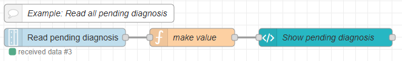
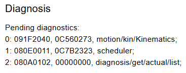

Dashboard 1.0
```JSON
[{"id":"af0c0102e0191bc8","type":"ctrlx-datalayer-subscribe","z":"bf7a3579c5656113","subscription":"632bcc2.eddf134","path":"diagnosis/get/actual/list","name":"Read pending diagnostics","x":310,"y":480,"wires":[["367e1ba061c76fec"]]},{"id":"367e1ba061c76fec","type":"function","z":"bf7a3579c5656113","name":"make value","func":"var newMsg = {}\nvar myArray = msg.payload.listDiagnosisIdentificationWithTimestamp\nnewMsg.payload = \"Pending diagnostics:<br>\"\nfor (let index = 0; index < (myArray.length -1); ++index) {\n    newMsg.payload += index + \": \" \n    + myArray[index].diagnosisIdentification.mainDiagnosisNumber \n    + \", \" + myArray[index].diagnosisIdentification.detailedDiagnosisNumber \n    + \", \" + myArray[index].diagnosisIdentification.entity + \";<br>\"\n}\nreturn newMsg;","outputs":1,"noerr":0,"initialize":"","finalize":"","libs":[],"x":510,"y":480,"wires":[["8eac940b52bde5ae"]]},{"id":"8eac940b52bde5ae","type":"ui_template","z":"bf7a3579c5656113","group":"cd7a7d59d153b666","name":"Show pending diagnostics","order":4,"width":"6","height":"2","format":"<div ng-bind-html=\"msg.payload\"></div>","storeOutMessages":true,"fwdInMessages":true,"resendOnRefresh":true,"templateScope":"local","className":"","x":720,"y":480,"wires":[[]]},{"id":"308321925688e5da","type":"comment","z":"bf7a3579c5656113","name":"Example: Get main diagnosis text","info":"","x":330,"y":440,"wires":[]},{"id":"632bcc2.eddf134","type":"ctrlx-config-subscription","device":"7b877229.678964","name":"Sub_Default","publishIntervalMs":""},{"id":"cd7a7d59d153b666","type":"ui_group","name":"Diagnosis","tab":"9cba2148.8c9148","order":9,"disp":true,"width":"6","collapse":false,"className":""},{"id":"7b877229.678964","type":"ctrlx-config","name":"localhost","hostname":"localhost","debug":false},{"id":"9cba2148.8c9148","type":"ui_tab","name":"Examples","icon":"dashboard","order":7,"disabled":false,"hidden":false}]
```

Dashboard 2.0
```JSON
[{"id":"af0c0102e0191bc8","type":"ctrlx-datalayer-subscribe","z":"af28b7f20c662b36","subscription":"632bcc2.eddf134","path":"diagnosis/get/actual/list","name":"Read pending diagnosis","inputs":0,"x":180,"y":740,"wires":[["367e1ba061c76fec"]]},{"id":"367e1ba061c76fec","type":"function","z":"af28b7f20c662b36","name":"make value","func":"var newMsg = {}\nvar myArray = msg.payload.listDiagnosisIdentificationWithTimestamp\nflow.set(\"test\", myArray)\nnewMsg.payload = \"Pending diagnostics:<br>\"\nfor (let index = 0; index < (myArray.length); ++index) {\n    flow.set(\"test\" + index, myArray[index].diagnosisIdentification.mainDiagnosisNumber)\n    newMsg.payload += index + \": \" \n    + myArray[index].diagnosisIdentification.mainDiagnosisNumber \n    + \", \" + myArray[index].diagnosisIdentification.detailedDiagnosisNumber \n    + \", \" + myArray[index].diagnosisIdentification.entity + \";<br>\"\n}\nreturn newMsg;","outputs":1,"timeout":"","noerr":0,"initialize":"","finalize":"","libs":[],"x":390,"y":740,"wires":[["9a652ecea041e817"]]},{"id":"308321925688e5da","type":"comment","z":"af28b7f20c662b36","name":"Example: Read all pending diagnosis","info":"","x":220,"y":700,"wires":[]},{"id":"9a652ecea041e817","type":"ui-template","z":"af28b7f20c662b36","group":"474844b4a79ce8c2","page":"","ui":"","name":"Show pending diagnosis","order":0,"width":0,"height":0,"head":"","format":"<template>\n    <div v-html=\"msg?.payload\" style=\"line-height: 1.5; font-size: 1.1em;\"></div>\n</template>\n","storeOutMessages":true,"passthru":true,"resendOnRefresh":true,"templateScope":"local","className":"","x":610,"y":740,"wires":[[]]},{"id":"632bcc2.eddf134","type":"ctrlx-config-subscription","device":"7b877229.678964","name":"Sub_Default","publishIntervalMs":"","samplingInterval":"","errorInterval":"","keepaliveInterval":"","queueSize":"","deadbandValue":""},{"id":"474844b4a79ce8c2","type":"ui-group","name":"Diagnosis","page":"30e3bb10109e324b","width":"6","height":"1","order":1,"showTitle":true,"className":"","visible":"true","disabled":"false","groupType":"default"},{"id":"7b877229.678964","type":"ctrlx-config","name":"localhost","hostname":"localhost","debug":false},{"id":"30e3bb10109e324b","type":"ui-page","name":"Page 1","ui":"ae50776f3a63db0e","path":"/page1","icon":"home","layout":"grid","theme":"a204995a5a44f2b2","breakpoints":[{"name":"Default","px":0,"cols":3},{"name":"Tablet","px":576,"cols":6},{"name":"Small Desktop","px":768,"cols":9},{"name":"Desktop","px":1024,"cols":12}],"order":1,"className":"","visible":true,"disabled":false},{"id":"ae50776f3a63db0e","type":"ui-base","name":"My Dashboard","path":"/dashboard","appIcon":"","includeClientData":true,"acceptsClientConfig":["ui-notification","ui-control"],"showPathInSidebar":false,"headerContent":"page","navigationStyle":"default","titleBarStyle":"default","showReconnectNotification":true,"notificationDisplayTime":1,"showDisconnectNotification":true,"allowInstall":false},{"id":"a204995a5a44f2b2","type":"ui-theme","name":"Default Theme","colors":{"surface":"#ffffff","primary":"#0094CE","bgPage":"#eeeeee","groupBg":"#ffffff","groupOutline":"#cccccc"},"sizes":{"density":"default","pagePadding":"12px","groupGap":"12px","groupBorderRadius":"4px","widgetGap":"12px"}},{"id":"24fe9ea53f8d2dde","type":"global-config","env":[],"modules":{"node-red-contrib-ctrlx-automation":"1.9.8","@flowfuse/node-red-dashboard":"1.30.2"}}]
```

### Confirm all pending errors in the system diagnosis

This Example shows how to confirm all pending errors in the system diagnostic. An empty `WRITE` request needs to be send to `diagnosis/confirm/all-errors`. This can be done by setting the `payload` to `null`.

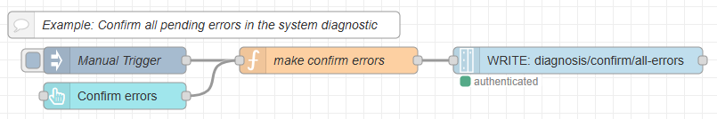
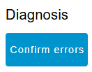

Dashboard 1.0
```JSON
[{"id":"b5effce.db9fd","type":"comment","z":"ec52577b3db3c043","name":"Example: Confirm all pending errors in the system diagnostic","info":"","x":440,"y":700,"wires":[]},{"id":"64d6212b.ba6cd","type":"ctrlx-datalayer-request","z":"ec52577b3db3c043","device":"7b877229.678964","method":"WRITE","path":"diagnosis/confirm/all-errors","payloadFormat":"value_type","name":"","x":870,"y":740,"wires":[[]]},{"id":"226bf82.26e5e88","type":"inject","z":"ec52577b3db3c043","name":"Manual Trigger","props":[{"p":"payload"},{"p":"topic","vt":"str"}],"repeat":"","crontab":"","once":false,"onceDelay":0.1,"topic":"","payload":"","payloadType":"date","x":340,"y":740,"wires":[["efa89bd3d50d6f25"]]},{"id":"8d40fd0bb68b143c","type":"ui_button","z":"ec52577b3db3c043","name":"","group":"cd7a7d59d153b666","order":1,"width":"3","height":"1","passthru":false,"label":"Confirm errors","tooltip":"","color":"","bgcolor":"","className":"","icon":"","payload":"","payloadType":"str","topic":"topic","topicType":"msg","x":320,"y":780,"wires":[["efa89bd3d50d6f25"]]},{"id":"efa89bd3d50d6f25","type":"function","z":"ec52577b3db3c043","name":"make confirm errors","func":"msg.payload = null;\nreturn msg;","outputs":1,"noerr":0,"initialize":"","finalize":"","libs":[],"x":580,"y":740,"wires":[["64d6212b.ba6cd"]]},{"id":"7b877229.678964","type":"ctrlx-config","name":"localhost","hostname":"localhost","debug":false},{"id":"cd7a7d59d153b666","type":"ui_group","name":"Diagnosis","tab":"9cba2148.8c9148","order":9,"disp":true,"width":"6","collapse":false,"className":""},{"id":"9cba2148.8c9148","type":"ui_tab","name":"Examples","icon":"dashboard","order":7,"disabled":false,"hidden":false}]
```

Dashboard 2.0
```JSON
[{"id":"b5effce.db9fd","type":"comment","z":"af28b7f20c662b36","name":"Example: Confirm all pending errors in the system diagnostic","info":"","x":280,"y":220,"wires":[]},{"id":"64d6212b.ba6cd","type":"ctrlx-datalayer-request","z":"af28b7f20c662b36","device":"7b877229.678964","method":"WRITE","path":"diagnosis/confirm/all-errors","payloadFormat":"value_type","name":"","pendingWarnLevel":"","pendingErrorLevel":"","x":700,"y":260,"wires":[[]]},{"id":"226bf82.26e5e88","type":"inject","z":"af28b7f20c662b36","name":"Manual Trigger","props":[{"p":"payload"},{"p":"topic","vt":"str"}],"repeat":"","crontab":"","once":false,"onceDelay":0.1,"topic":"","payload":"","payloadType":"date","x":180,"y":260,"wires":[["efa89bd3d50d6f25"]]},{"id":"efa89bd3d50d6f25","type":"function","z":"af28b7f20c662b36","name":"make confirm errors","func":"msg.payload = null;\nreturn msg;","outputs":1,"noerr":0,"initialize":"","finalize":"","libs":[],"x":420,"y":260,"wires":[["64d6212b.ba6cd"]]},{"id":"46fc5de18ed9a999","type":"ui-button","z":"af28b7f20c662b36","group":"474844b4a79ce8c2","name":"","label":"Confirm errors","order":4,"width":"1","height":"1","emulateClick":false,"tooltip":"","color":"","bgcolor":"","className":"","icon":"","iconPosition":"left","payload":"","payloadType":"str","topic":"topic","topicType":"msg","buttonColor":"","textColor":"","iconColor":"","enableClick":true,"enablePointerdown":false,"pointerdownPayload":"","pointerdownPayloadType":"str","enablePointerup":false,"pointerupPayload":"","pointerupPayloadType":"str","x":180,"y":300,"wires":[["efa89bd3d50d6f25"]]},{"id":"7b877229.678964","type":"ctrlx-config","name":"localhost","hostname":"localhost","debug":false},{"id":"474844b4a79ce8c2","type":"ui-group","name":"Diagnosis","page":"30e3bb10109e324b","width":"6","height":"1","order":1,"showTitle":true,"className":"","visible":"true","disabled":"false","groupType":"default"},{"id":"30e3bb10109e324b","type":"ui-page","name":"Page 1","ui":"ae50776f3a63db0e","path":"/page1","icon":"home","layout":"grid","theme":"a204995a5a44f2b2","breakpoints":[{"name":"Default","px":0,"cols":3},{"name":"Tablet","px":576,"cols":6},{"name":"Small Desktop","px":768,"cols":9},{"name":"Desktop","px":1024,"cols":12}],"order":1,"className":"","visible":true,"disabled":false},{"id":"ae50776f3a63db0e","type":"ui-base","name":"My Dashboard","path":"/dashboard","appIcon":"","includeClientData":true,"acceptsClientConfig":["ui-notification","ui-control"],"showPathInSidebar":false,"headerContent":"page","navigationStyle":"default","titleBarStyle":"default","showReconnectNotification":true,"notificationDisplayTime":1,"showDisconnectNotification":true,"allowInstall":false},{"id":"a204995a5a44f2b2","type":"ui-theme","name":"Default Theme","colors":{"surface":"#ffffff","primary":"#0094CE","bgPage":"#eeeeee","groupBg":"#ffffff","groupOutline":"#cccccc"},"sizes":{"density":"default","pagePadding":"12px","groupGap":"12px","groupBorderRadius":"4px","widgetGap":"12px"}},{"id":"119ed3f2949d0a01","type":"global-config","env":[],"modules":{"node-red-contrib-ctrlx-automation":"1.9.8","@flowfuse/node-red-dashboard":"1.30.2"}}]
```

### Confirm single pending error in the system diagnosis

This Example shows how to confirm the single pending error in the system diagnosis. Following error is expected to present in the pending diagnosis:

```
Main diagnosis number : "091F2006"
Main diagnosis text : "Axis limit exceeded"
Detailed diagnosis number : "0C560107"
Detailed diagnosis text : "TargetPos max limit exceeded"
Entity : "motion/axs/AxisX" 
```

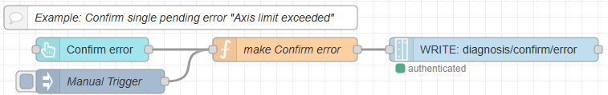
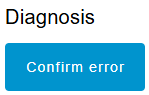

Dashboard 1.0
```JSON
[{"id":"9c0aca12bc2a9640","type":"function","z":"ec52577b3db3c043","name":"make Confirm error","func":"var newMsg = {};\nnewMsg.payload = { \n  \"type\": \"object\", \n  \"value\": { \n    \"mainDiagnosisNumber\": \"091F2006\", \n    \"detailedDiagnosisNumber\": \"0C560107\", \n    \"entity\": \"motion/axs/AxisX\" \n  } \n}\nreturn newMsg;\n\n","outputs":1,"noerr":0,"initialize":"","finalize":"","libs":[],"x":570,"y":440,"wires":[["a8efc66b4b7461ef"]]},{"id":"bfe0636f9fe41f01","type":"inject","z":"ec52577b3db3c043","name":"Manual Trigger","props":[{"p":"payload"},{"p":"topic","vt":"str"}],"repeat":"","crontab":"","once":false,"onceDelay":0.1,"topic":"","payload":"","payloadType":"date","x":340,"y":480,"wires":[["9c0aca12bc2a9640"]]},{"id":"a8efc66b4b7461ef","type":"ctrlx-datalayer-request","z":"ec52577b3db3c043","device":"7b877229.678964","method":"WRITE","path":"diagnosis/confirm/error","payloadFormat":"value_type","name":"Confirm error","x":780,"y":440,"wires":[[]]},{"id":"3edc488be0bb09aa","type":"comment","z":"ec52577b3db3c043","name":"Example: Confirm single pending error \"Axis limit exceeded\"","info":"","x":440,"y":400,"wires":[]},{"id":"9add50cbdef40e90","type":"ui_button","z":"ec52577b3db3c043","name":"","group":"cd7a7d59d153b666","order":1,"width":"3","height":"1","passthru":false,"label":"Confirm error","tooltip":"","color":"","bgcolor":"","className":"","icon":"","payload":"","payloadType":"str","topic":"topic","topicType":"msg","x":320,"y":440,"wires":[["9c0aca12bc2a9640"]]},{"id":"7b877229.678964","type":"ctrlx-config","name":"localhost","hostname":"localhost","debug":false},{"id":"cd7a7d59d153b666","type":"ui_group","name":"Diagnosis","tab":"9cba2148.8c9148","order":9,"disp":true,"width":"6","collapse":false,"className":""},{"id":"9cba2148.8c9148","type":"ui_tab","name":"Examples","icon":"dashboard","order":7,"disabled":false,"hidden":false}]
```
Dashboard 2.0
```JSON
[{"id":"9c0aca12bc2a9640","type":"function","z":"af28b7f20c662b36","name":"make Confirm error","func":"var newMsg = {};\nnewMsg.payload = { \n  \"type\": \"object\", \n  \"value\": { \n    \"mainDiagnosisNumber\": \"091F2006\", \n    \"detailedDiagnosisNumber\": \"0C560107\", \n    \"entity\": \"motion/axs/AxisX\" \n  } \n}\nreturn newMsg;\n\n","outputs":1,"timeout":"","noerr":0,"initialize":"","finalize":"","libs":[],"x":410,"y":420,"wires":[["a8efc66b4b7461ef"]]},{"id":"bfe0636f9fe41f01","type":"inject","z":"af28b7f20c662b36","name":"Manual Trigger","props":[{"p":"payload"},{"p":"topic","vt":"str"}],"repeat":"","crontab":"","once":false,"onceDelay":0.1,"topic":"","payload":"","payloadType":"date","x":180,"y":460,"wires":[["9c0aca12bc2a9640"]]},{"id":"a8efc66b4b7461ef","type":"ctrlx-datalayer-request","z":"af28b7f20c662b36","device":"7b877229.678964","method":"WRITE","path":"diagnosis/confirm/error","payloadFormat":"value_type","name":"","pendingWarnLevel":"","pendingErrorLevel":"","x":670,"y":420,"wires":[[]]},{"id":"3edc488be0bb09aa","type":"comment","z":"af28b7f20c662b36","name":"Example: Confirm single pending error \"Axis limit exceeded\"","info":"","x":280,"y":380,"wires":[]},{"id":"cedf10372fe4a00c","type":"ui-button","z":"af28b7f20c662b36","group":"474844b4a79ce8c2","name":"","label":"Confirm error","order":1,"width":"1","height":"1","emulateClick":false,"tooltip":"","color":"","bgcolor":"","className":"","icon":"","iconPosition":"left","payload":"","payloadType":"str","topic":"topic","topicType":"msg","buttonColor":"","textColor":"","iconColor":"","enableClick":true,"enablePointerdown":false,"pointerdownPayload":"","pointerdownPayloadType":"str","enablePointerup":false,"pointerupPayload":"","pointerupPayloadType":"str","x":170,"y":420,"wires":[["9c0aca12bc2a9640"]]},{"id":"7b877229.678964","type":"ctrlx-config","name":"localhost","hostname":"localhost","debug":false},{"id":"474844b4a79ce8c2","type":"ui-group","name":"Diagnosis","page":"30e3bb10109e324b","width":"6","height":"1","order":1,"showTitle":true,"className":"","visible":"true","disabled":"false","groupType":"default"},{"id":"30e3bb10109e324b","type":"ui-page","name":"Page 1","ui":"ae50776f3a63db0e","path":"/page1","icon":"home","layout":"grid","theme":"a204995a5a44f2b2","breakpoints":[{"name":"Default","px":0,"cols":3},{"name":"Tablet","px":576,"cols":6},{"name":"Small Desktop","px":768,"cols":9},{"name":"Desktop","px":1024,"cols":12}],"order":1,"className":"","visible":true,"disabled":false},{"id":"ae50776f3a63db0e","type":"ui-base","name":"My Dashboard","path":"/dashboard","appIcon":"","includeClientData":true,"acceptsClientConfig":["ui-notification","ui-control"],"showPathInSidebar":false,"headerContent":"page","navigationStyle":"default","titleBarStyle":"default","showReconnectNotification":true,"notificationDisplayTime":1,"showDisconnectNotification":true,"allowInstall":false},{"id":"a204995a5a44f2b2","type":"ui-theme","name":"Default Theme","colors":{"surface":"#ffffff","primary":"#0094CE","bgPage":"#eeeeee","groupBg":"#ffffff","groupOutline":"#cccccc"},"sizes":{"density":"default","pagePadding":"12px","groupGap":"12px","groupBorderRadius":"4px","widgetGap":"12px"}},{"id":"b537797446d0701b","type":"global-config","env":[],"modules":{"node-red-contrib-ctrlx-automation":"1.9.8","@flowfuse/node-red-dashboard":"1.30.2"}}]
```

### Read main diagnosis text and show on dashboard

This Example shows how to get the diagnosis text from the main diagnosis number `091F2006`.

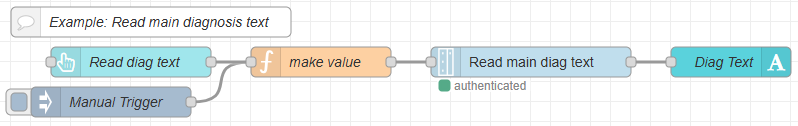
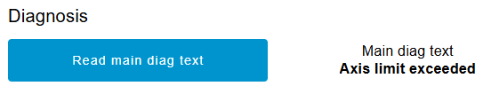

Dashboard 1.0
```JSON
[{"id":"24e389ee88bbd972","type":"ctrlx-datalayer-request","z":"bf7a3579c5656113","device":"7b877229.678964","method":"READ","path":"","payloadFormat":"value_type","name":"Read main diag text","x":560,"y":640,"wires":[["9cfc3279057259fe"]]},{"id":"96de7236184e1636","type":"function","z":"bf7a3579c5656113","name":"make value","func":"var newMsg = {}\nvar myMainDiagNumber = \"091F2006\"\nnewMsg.path = \"diagnosis/get/text/main?data={ \\\"type\\\": \\\"object\\\", \\\"value\\\": { \\\"mainDiagnosisNumber\\\": \\\"\" + myMainDiagNumber + \"\\\" } }\"\nreturn newMsg;","outputs":1,"noerr":0,"initialize":"","finalize":"","libs":[],"x":370,"y":640,"wires":[["24e389ee88bbd972"]]},{"id":"e45d515b6c331225","type":"comment","z":"bf7a3579c5656113","name":"Example: Get main diagnosis text","info":"","x":170,"y":600,"wires":[]},{"id":"3331e124823b565a","type":"inject","z":"bf7a3579c5656113","name":"Manual Trigger","props":[{"p":"payload"},{"p":"topic","vt":"str"}],"repeat":"","crontab":"","once":false,"onceDelay":0.1,"topic":"","payload":"","payloadType":"date","x":160,"y":680,"wires":[["96de7236184e1636"]]},{"id":"efcdc0eecbd37d40","type":"ui_button","z":"bf7a3579c5656113","name":"","group":"cd7a7d59d153b666","order":1,"width":"3","height":"1","passthru":false,"label":"Read main diag text","tooltip":"","color":"","bgcolor":"","className":"","icon":"","payload":"","payloadType":"str","topic":"topic","topicType":"msg","x":160,"y":640,"wires":[["96de7236184e1636"]]},{"id":"9cfc3279057259fe","type":"ui_text","z":"bf7a3579c5656113","group":"cd7a7d59d153b666","order":2,"width":"6","height":"2","name":"","label":"Main diag text","format":"{{msg.payload.value}}","layout":"col-center","className":"","x":760,"y":640,"wires":[]},{"id":"7b877229.678964","type":"ctrlx-config","name":"localhost","hostname":"localhost","debug":false},{"id":"cd7a7d59d153b666","type":"ui_group","name":"Diagnosis","tab":"9cba2148.8c9148","order":9,"disp":true,"width":"6","collapse":false,"className":""},{"id":"9cba2148.8c9148","type":"ui_tab","name":"Examples","icon":"dashboard","order":7,"disabled":false,"hidden":false}]
```

Dashboard 2.0
```JSON
[{"id":"24e389ee88bbd972","type":"ctrlx-datalayer-request","z":"af28b7f20c662b36","device":"7b877229.678964","method":"READ","path":"","payloadFormat":"value_type","name":"Read main diag text","pendingWarnLevel":"","pendingErrorLevel":"","x":580,"y":680,"wires":[["993a2db553a73b55"]]},{"id":"96de7236184e1636","type":"function","z":"af28b7f20c662b36","name":"make value","func":"var newMsg = {}\nvar myMainDiagNumber = \"091F2006\"\nnewMsg.path = \"diagnosis/get/text/main?data={ \\\"type\\\": \\\"object\\\", \\\"value\\\": { \\\"mainDiagnosisNumber\\\": \\\"\" + myMainDiagNumber + \"\\\" } }\"\nreturn newMsg;","outputs":1,"timeout":"","noerr":0,"initialize":"","finalize":"","libs":[],"x":370,"y":680,"wires":[["24e389ee88bbd972"]]},{"id":"e45d515b6c331225","type":"comment","z":"af28b7f20c662b36","name":"Example: Read main diagnosis text","info":"","x":200,"y":640,"wires":[]},{"id":"3331e124823b565a","type":"inject","z":"af28b7f20c662b36","name":"Manual Trigger","props":[{"p":"payload"},{"p":"topic","vt":"str"}],"repeat":"","crontab":"","once":true,"onceDelay":0.1,"topic":"","payload":"","payloadType":"date","x":160,"y":720,"wires":[["96de7236184e1636"]]},{"id":"15248ca0c992be57","type":"ui-button","z":"af28b7f20c662b36","group":"474844b4a79ce8c2","name":"","label":"Read main diag text","order":2,"width":"2","height":"1","emulateClick":false,"tooltip":"","color":"","bgcolor":"","className":"","icon":"","iconPosition":"left","payload":"","payloadType":"str","topic":"topic","topicType":"msg","buttonColor":"","textColor":"","iconColor":"","enableClick":true,"enablePointerdown":false,"pointerdownPayload":"","pointerdownPayloadType":"str","enablePointerup":false,"pointerupPayload":"","pointerupPayloadType":"str","x":160,"y":680,"wires":[["96de7236184e1636"]]},{"id":"993a2db553a73b55","type":"ui-text","z":"af28b7f20c662b36","group":"474844b4a79ce8c2","order":3,"width":"2","height":"1","name":"","label":"Main diag text","format":"{{msg.payload}}","layout":"col-center","style":false,"font":"","fontSize":16,"color":"#717171","wrapText":false,"className":"","value":"payload.value","valueType":"msg","x":800,"y":680,"wires":[]},{"id":"7b877229.678964","type":"ctrlx-config","name":"localhost","hostname":"localhost","debug":false},{"id":"474844b4a79ce8c2","type":"ui-group","name":"Diagnosis","page":"30e3bb10109e324b","width":"6","height":"1","order":1,"showTitle":true,"className":"","visible":"true","disabled":"false","groupType":"default"},{"id":"30e3bb10109e324b","type":"ui-page","name":"Page 1","ui":"ae50776f3a63db0e","path":"/page1","icon":"home","layout":"grid","theme":"a204995a5a44f2b2","breakpoints":[{"name":"Default","px":0,"cols":3},{"name":"Tablet","px":576,"cols":6},{"name":"Small Desktop","px":768,"cols":9},{"name":"Desktop","px":1024,"cols":12}],"order":1,"className":"","visible":true,"disabled":false},{"id":"ae50776f3a63db0e","type":"ui-base","name":"My Dashboard","path":"/dashboard","appIcon":"","includeClientData":true,"acceptsClientConfig":["ui-notification","ui-control"],"showPathInSidebar":false,"headerContent":"page","navigationStyle":"default","titleBarStyle":"default","showReconnectNotification":true,"notificationDisplayTime":1,"showDisconnectNotification":true,"allowInstall":false},{"id":"a204995a5a44f2b2","type":"ui-theme","name":"Default Theme","colors":{"surface":"#ffffff","primary":"#0094CE","bgPage":"#eeeeee","groupBg":"#ffffff","groupOutline":"#cccccc"},"sizes":{"density":"default","pagePadding":"12px","groupGap":"12px","groupBorderRadius":"4px","widgetGap":"12px"}},{"id":"9dd27ff72d0f0c82","type":"global-config","env":[],"modules":{"node-red-contrib-ctrlx-automation":"1.9.8","@flowfuse/node-red-dashboard":"1.30.2"}}]
```

### Read detailed diagnostic text and show on dashboard

This Example shows how to read the detailed diagnostic text from the detailed diagnostic number `0C560107` in combination with the related main diagnostic number `091F2006`.

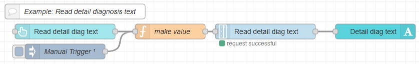
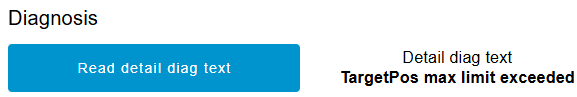

Dashboard 1.0
```JSON
[{"id":"24e389ee88bbd972","type":"ctrlx-datalayer-request","z":"bf7a3579c5656113","device":"7b877229.678964","method":"READ","path":"","payloadFormat":"value_type","name":"Read detail diag text","x":560,"y":640,"wires":[["9cfc3279057259fe"]]},{"id":"96de7236184e1636","type":"function","z":"bf7a3579c5656113","name":"make value","func":"var newMsg = {}\nvar myMainDiagNumber = \"091F2006\"\nvar myDetailDiagNumber = \"0C560107\"\nnewMsg.path = \"diagnosis/get/text/detailed?data={ \\\"type\\\": \\\"object\\\", \\\"value\\\": { \\\"detailedDiagnosisNumber\\\": \\\"\" + myDetailDiagNumber + \"\\\", \\\"relatedMainDiagnosisNumber\\\": \\\"\" + myMainDiagNumber + \"\\\" } }\"\nreturn newMsg;","outputs":1,"noerr":0,"initialize":"","finalize":"","libs":[],"x":370,"y":640,"wires":[["24e389ee88bbd972"]]},{"id":"e45d515b6c331225","type":"comment","z":"bf7a3579c5656113","name":"Example: Get detail diagnosis text","info":"","x":180,"y":600,"wires":[]},{"id":"3331e124823b565a","type":"inject","z":"bf7a3579c5656113","name":"Manual Trigger","props":[{"p":"payload"},{"p":"topic","vt":"str"}],"repeat":"","crontab":"","once":false,"onceDelay":0.1,"topic":"","payload":"","payloadType":"date","x":160,"y":680,"wires":[["96de7236184e1636"]]},{"id":"efcdc0eecbd37d40","type":"ui_button","z":"bf7a3579c5656113","name":"","group":"cd7a7d59d153b666","order":1,"width":"3","height":"1","passthru":false,"label":"Read detail diag text","tooltip":"","color":"","bgcolor":"","className":"","icon":"","payload":"","payloadType":"str","topic":"topic","topicType":"msg","x":160,"y":640,"wires":[["96de7236184e1636"]]},{"id":"9cfc3279057259fe","type":"ui_text","z":"bf7a3579c5656113","group":"cd7a7d59d153b666","order":2,"width":"6","height":"2","name":"","label":"Detail diag text","format":"{{msg.payload.value}}","layout":"col-center","className":"","x":760,"y":640,"wires":[]},{"id":"7b877229.678964","type":"ctrlx-config","name":"localhost","hostname":"localhost","debug":false},{"id":"cd7a7d59d153b666","type":"ui_group","name":"Diagnosis","tab":"9cba2148.8c9148","order":9,"disp":true,"width":"6","collapse":false,"className":""},{"id":"9cba2148.8c9148","type":"ui_tab","name":"Examples","icon":"dashboard","order":7,"disabled":false,"hidden":false}]
```
Dashboard 2.0
```JSON
[{"id":"3d16258f0436150f","type":"ctrlx-datalayer-request","z":"af28b7f20c662b36","device":"7b877229.678964","method":"READ","path":"","payloadFormat":"value_type","name":"Read detail diag text","pendingWarnLevel":"","pendingErrorLevel":"","x":580,"y":840,"wires":[["efe0793fc88d477f"]]},{"id":"a309b53d40119643","type":"function","z":"af28b7f20c662b36","name":"make value","func":"var newMsg = {}\nvar myMainDiagNumber = \"091F2006\"\nvar myDetailDiagNumber = \"0C560107\"\nnewMsg.path = \"diagnosis/get/text/detailed?data={ \\\"type\\\": \\\"object\\\", \\\"value\\\": { \\\"detailedDiagnosisNumber\\\": \\\"\" + myDetailDiagNumber + \"\\\", \\\"relatedMainDiagnosisNumber\\\": \\\"\" + myMainDiagNumber + \"\\\" } }\"\nreturn newMsg;","outputs":1,"noerr":0,"initialize":"","finalize":"","libs":[],"x":390,"y":840,"wires":[["3d16258f0436150f"]]},{"id":"4ce7ab4ff85509cf","type":"comment","z":"af28b7f20c662b36","name":"Example: Read detail diagnosis text","info":"","x":200,"y":800,"wires":[]},{"id":"859dda7dd5a05077","type":"inject","z":"af28b7f20c662b36","name":"Manual Trigger","props":[{"p":"payload"},{"p":"topic","vt":"str"}],"repeat":"","crontab":"","once":true,"onceDelay":0.1,"topic":"","payload":"","payloadType":"date","x":180,"y":880,"wires":[["a309b53d40119643"]]},{"id":"ece75703d4640db0","type":"ui-button","z":"af28b7f20c662b36","group":"474844b4a79ce8c2","name":"","label":"Read detail diag text","order":2,"width":"2","height":"1","emulateClick":false,"tooltip":"","color":"","bgcolor":"","className":"","icon":"","iconPosition":"left","payload":"","payloadType":"str","topic":"topic","topicType":"msg","buttonColor":"","textColor":"","iconColor":"","enableClick":true,"enablePointerdown":false,"pointerdownPayload":"","pointerdownPayloadType":"str","enablePointerup":false,"pointerupPayload":"","pointerupPayloadType":"str","x":180,"y":840,"wires":[["a309b53d40119643"]]},{"id":"efe0793fc88d477f","type":"ui-text","z":"af28b7f20c662b36","group":"474844b4a79ce8c2","order":3,"width":"2","height":"1","name":"","label":"Detail diag text","format":"{{msg.payload}}","layout":"col-center","style":false,"font":"","fontSize":16,"color":"#717171","wrapText":false,"className":"","value":"payload.value","valueType":"msg","x":800,"y":840,"wires":[]},{"id":"7b877229.678964","type":"ctrlx-config","name":"localhost","hostname":"localhost","debug":false},{"id":"474844b4a79ce8c2","type":"ui-group","name":"Diagnosis","page":"30e3bb10109e324b","width":"6","height":"1","order":1,"showTitle":true,"className":"","visible":"true","disabled":"false","groupType":"default"},{"id":"30e3bb10109e324b","type":"ui-page","name":"Page 1","ui":"ae50776f3a63db0e","path":"/page1","icon":"home","layout":"grid","theme":"a204995a5a44f2b2","breakpoints":[{"name":"Default","px":0,"cols":3},{"name":"Tablet","px":576,"cols":6},{"name":"Small Desktop","px":768,"cols":9},{"name":"Desktop","px":1024,"cols":12}],"order":1,"className":"","visible":true,"disabled":false},{"id":"ae50776f3a63db0e","type":"ui-base","name":"My Dashboard","path":"/dashboard","appIcon":"","includeClientData":true,"acceptsClientConfig":["ui-notification","ui-control"],"showPathInSidebar":false,"headerContent":"page","navigationStyle":"default","titleBarStyle":"default","showReconnectNotification":true,"notificationDisplayTime":1,"showDisconnectNotification":true,"allowInstall":false},{"id":"a204995a5a44f2b2","type":"ui-theme","name":"Default Theme","colors":{"surface":"#ffffff","primary":"#0094CE","bgPage":"#eeeeee","groupBg":"#ffffff","groupOutline":"#cccccc"},"sizes":{"density":"default","pagePadding":"12px","groupGap":"12px","groupBorderRadius":"4px","widgetGap":"12px"}},{"id":"523ad5d4257c4d2a","type":"global-config","env":[],"modules":{"node-red-contrib-ctrlx-automation":"1.9.8","@flowfuse/node-red-dashboard":"1.30.2"}}]
```

## PLC examples

For reading and especially writing it might be necessary to better understand, how the many data types of the IEC61131-3 programming language are mapped to javascript types, which are used in Node-RED. Have a look at the [Data Type Overview](DATATYPES.md) for this.

### Read a PLC variable (integer)

The following example shows how to read a PLC variable `i` of type `INT` of a program `PLC_PRG` which has been configured to be part of the symbolic variable configuration.

  ```IEC61131-3
  PROGRAM PLC_PRG
  VAR
    i: INT;
  END_VAR
  ```

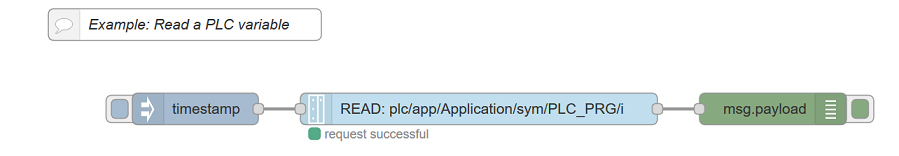

```JSON
[{"id":"7467c58b.9bd5ac","type":"ctrlx-datalayer-request","z":"b7f42922c8391768","device":"7b877229.678964","method":"READ","path":"plc/app/Application/sym/PLC_PRG/i","payloadFormat":"value_type","name":"","x":670,"y":920,"wires":[["8090a7bb.b361"]]},{"id":"8090a7bb.b361","type":"debug","z":"b7f42922c8391768","name":"","active":true,"tosidebar":true,"console":false,"tostatus":false,"complete":"false","statusVal":"","statusType":"auto","x":950,"y":920,"wires":[]},{"id":"f830ae36.91e878","type":"inject","z":"b7f42922c8391768","name":"","props":[{"p":"payload"},{"p":"topic","vt":"str"}],"repeat":"","crontab":"","once":false,"onceDelay":0.1,"topic":"","payload":"","payloadType":"date","x":400,"y":920,"wires":[["7467c58b.9bd5ac"]]},{"id":"76611ca.4da74e4","type":"comment","z":"b7f42922c8391768","name":"Example: Read a PLC variable","info":"","x":390,"y":840,"wires":[]},{"id":"7b877229.678964","type":"ctrlx-config","name":"localhost","hostname":"localhost","debug":false}]
```

The request returns in `msg.payload`:

```JSON
{
  "type": "int16", 
  "value": 0
}
```

### Write a PLC variable (boolean)

The following example shows how to write a boolean PLC variable `b` of type `BOOL` which has been configured for write access via the symbolic variable configuration. Please note, that for writing PLC variable you need to specify the exact type of the PLC variable in the `msg.payload`.

```IEC61131-3
PROGRAM PLC_PRG
VAR
  b: BOOL;
END_VAR
```

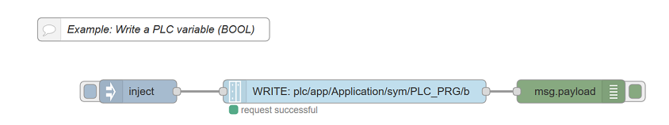

```JSON
[{"id":"501f80f3.0e5068","type":"ctrlx-datalayer-request","z":"b7f42922c8391768","device":"7b877229.678964","method":"WRITE","path":"plc/app/Application/sym/PLC_PRG/b","payloadFormat":"value_type","name":"","x":670,"y":1060,"wires":[["37817780.db70c"]]},{"id":"37817780.db70c","type":"debug","z":"b7f42922c8391768","name":"","active":true,"tosidebar":true,"console":false,"tostatus":false,"complete":"false","statusVal":"","statusType":"auto","x":950,"y":1060,"wires":[]},{"id":"5d059ae1.63156c","type":"inject","z":"b7f42922c8391768","name":"","props":[{"p":"payload"},{"p":"topic","vt":"str"}],"repeat":"","crontab":"","once":false,"onceDelay":0.1,"topic":"","payload":"{\"type\":\"bool8\",\"value\":true}","payloadType":"json","x":390,"y":1060,"wires":[["501f80f3.0e5068"]]},{"id":"6466502e.8f8c","type":"comment","z":"b7f42922c8391768","name":"Example: Write a PLC variable (BOOL)","info":"","x":410,"y":980,"wires":[]},{"id":"7b877229.678964","type":"ctrlx-config","name":"localhost","hostname":"localhost","debug":false}]
```

The request returns in `msg.payload` the written value:

```JSON
{
  "type": "bool8", 
  "value": true
}
```

## ctrlX OS - PLC App dashboard examples

Prerequisite: `ctrlX OS - PLC App` is installed. See [our ctrlX OS Store](https://community.boschrexroth.com/ctrlx-os-store-apps-oc2pqqwn/post/ctrlx-os---plc-aOZcdG2bmV0fNRE) and the corresponding [documentation of the ctrlX OS - PLC App](https://docs.automation.boschrexroth.com/iirds/cdp-metadata.boschrexroth.de~iiDC~Product-ctrlX-PLC-App/).

### Monitor and handle a boolean PLC variable `bBoolean`

The following example shows how to read, write and monitor a PLC variable `bBoolean` of type `BOOL` via the dashboard. A symbol configuration has to be present in the PLC project and the variable has to be configured for write access via a pragma or directly in the symbolic variable configuration. Also the variable has to be used in a program or via pragma. 
Note: A digital IO can be treated the same way.

`GVL`

```IEC61131-3
{attribute 'linkalways'}
{attribute 'symbol' := 'readwrite'}
VAR_GLOBAL
  bBoolean : BOOL;
END_VAR
```

`PLC_PRG`

```IEC61131-3
bBoolean;
```

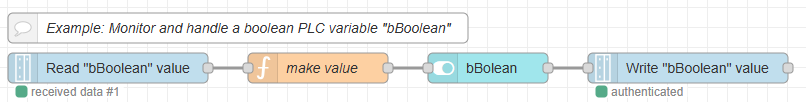
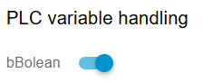

Dashboard 1.0
```JSON
[{"id":"c1cc8f5b.e11858","type":"ctrlx-datalayer-request","z":"4ff80d56.dd60fc","device":"7b877229.678964","method":"WRITE","path":"plc/app/Application/sym/GVL/bBoolean","payloadFormat":"value_type","name":"Write \"bBoolean\" value","x":790,"y":160,"wires":[[]]},{"id":"ec4257d3.ae58b","type":"ui_switch","z":"4ff80d56.dd60fc","name":"","label":"bBoolean ","tooltip":"","group":"938bb9af.bc8108","order":1,"width":"0","height":"0","passthru":false,"decouple":"true","topic":"","topicType":"str","style":"","onvalue":"{\"value\":true,\"type\":\"bool8\"}","onvalueType":"json","onicon":"","oncolor":"","offvalue":"{\"value\":false,\"type\":\"bool8\"}","offvalueType":"json","officon":"","offcolor":"","animate":false,"x":580,"y":160,"wires":[["c1cc8f5b.e11858"]]},{"id":"d2ca5a5e.a1144","type":"comment","z":"4ff80d56.dd60fc","name":"Example: Monitor and handle a boolean PLC variable \"bBoolean\"","info":"","x":300,"y":120,"wires":[]},{"id":"430d03bd.4a9864","type":"ctrlx-datalayer-subscribe","z":"4ff80d56.dd60fc","subscription":"632bcc2.eddf134","path":"plc/app/Application/sym/GVL/bBoolean","name":"Read \"bBoolean\" value","x":200,"y":160,"wires":[["d399bf94.d6f75"]]},{"id":"d399bf94.d6f75","type":"function","z":"4ff80d56.dd60fc","name":"make value","func":"var newMsg = {}\nnewMsg.payload = {\"type\":\"bool8\",\"value\":msg.payload}\nreturn newMsg;","outputs":1,"noerr":0,"initialize":"","finalize":"","libs":[],"x":410,"y":160,"wires":[["ec4257d3.ae58b"]]},{"id":"7b877229.678964","type":"ctrlx-config","name":"localhost","hostname":"localhost","debug":false},{"id":"938bb9af.bc8108","type":"ui_group","name":"PLC Variable handling","tab":"9cba2148.8c9148","order":1,"disp":true,"width":"4","collapse":false},{"id":"632bcc2.eddf134","type":"ctrlx-config-subscription","device":"7b877229.678964","name":"Sub_Default","publishIntervalMs":""},{"id":"9cba2148.8c9148","type":"ui_tab","name":"Examples","icon":"dashboard","order":7,"disabled":false,"hidden":false}]
```

Dashboard 2.0
```JSON
[{"id":"c1cc8f5b.e11858","type":"ctrlx-datalayer-request","z":"af28b7f20c662b36","device":"7b877229.678964","method":"WRITE","path":"plc/app/Application/sym/GVL/bBoolean","payloadFormat":"value_type","name":"Write \"bBoolean\" value","pendingWarnLevel":"","pendingErrorLevel":"","x":740,"y":1020,"wires":[[]]},{"id":"d2ca5a5e.a1144","type":"comment","z":"af28b7f20c662b36","name":"Example: Monitor and handle a boolean PLC variable \"bBoolean\"","info":"","x":290,"y":980,"wires":[]},{"id":"430d03bd.4a9864","type":"ctrlx-datalayer-subscribe","z":"af28b7f20c662b36","subscription":"632bcc2.eddf134","path":"plc/app/Application/sym/GVL/bBoolean","name":"Read \"bBoolean\" value","inputs":0,"x":160,"y":1020,"wires":[["d399bf94.d6f75"]]},{"id":"d399bf94.d6f75","type":"function","z":"af28b7f20c662b36","name":"make value","func":"var newMsg = {}\nnewMsg.payload = {\"type\":\"bool8\",\"value\":msg.payload}\nreturn newMsg;","outputs":1,"timeout":"","noerr":0,"initialize":"","finalize":"","libs":[],"x":370,"y":1020,"wires":[["ef83ceeb10b7e4a5"]]},{"id":"ef83ceeb10b7e4a5","type":"ui-switch","z":"af28b7f20c662b36","name":"","label":"bBolean","group":"1b28f1fbf61ee8d3","order":0,"width":"1","height":"1","passthru":false,"decouple":true,"topic":"topic","topicType":"msg","style":"","className":"","layout":"row-spread","clickableArea":"switch","onvalue":"{\"type\":\"bool8\", \"value\":true}","onvalueType":"json","onicon":"","oncolor":"","offvalue":"{\"type\":\"bool8\", \"value\":false}","offvalueType":"json","officon":"","offcolor":"","x":540,"y":1020,"wires":[["c1cc8f5b.e11858"]]},{"id":"7b877229.678964","type":"ctrlx-config","name":"localhost","hostname":"localhost","debug":false},{"id":"632bcc2.eddf134","type":"ctrlx-config-subscription","device":"7b877229.678964","name":"Sub_Default","publishIntervalMs":"","samplingInterval":"","errorInterval":"","keepaliveInterval":"","queueSize":"","deadbandValue":""},{"id":"1b28f1fbf61ee8d3","type":"ui-group","name":"PLC variable handling","page":"30e3bb10109e324b","width":6,"height":1,"order":-1,"showTitle":true,"className":"","visible":"true","disabled":"false","groupType":"default"},{"id":"30e3bb10109e324b","type":"ui-page","name":"Page 1","ui":"ae50776f3a63db0e","path":"/page1","icon":"home","layout":"grid","theme":"a204995a5a44f2b2","breakpoints":[{"name":"Default","px":0,"cols":3},{"name":"Tablet","px":576,"cols":6},{"name":"Small Desktop","px":768,"cols":9},{"name":"Desktop","px":1024,"cols":12}],"order":1,"className":"","visible":true,"disabled":false},{"id":"ae50776f3a63db0e","type":"ui-base","name":"My Dashboard","path":"/dashboard","appIcon":"","includeClientData":true,"acceptsClientConfig":["ui-notification","ui-control"],"showPathInSidebar":false,"headerContent":"page","navigationStyle":"default","titleBarStyle":"default","showReconnectNotification":true,"notificationDisplayTime":1,"showDisconnectNotification":true,"allowInstall":false},{"id":"a204995a5a44f2b2","type":"ui-theme","name":"Default Theme","colors":{"surface":"#ffffff","primary":"#0094CE","bgPage":"#eeeeee","groupBg":"#ffffff","groupOutline":"#cccccc"},"sizes":{"density":"default","pagePadding":"12px","groupGap":"12px","groupBorderRadius":"4px","widgetGap":"12px"}},{"id":"42a5b5027f278091","type":"global-config","env":[],"modules":{"node-red-contrib-ctrlx-automation":"1.9.8","@flowfuse/node-red-dashboard":"1.30.2"}}]
```

### Monitor and handle an integer PLC variable `iInteger`

The following example shows how to read, write and monitor a PLC variable `iInteger` of type `INT` via the dashboard. A symbol configuration has to be present in the PLC project and the variable has to be configured for write access via a pragma or directly in the symbolic variable configuration. Also the variable has to be used in a program or via pragma.

`GVL`

```IEC61131-3
{attribute 'linkalways'}
{attribute 'symbol' := 'readwrite'}
VAR_GLOBAL
  iInteger : INT;
END_VAR
```

`PLC_PRG`

```IEC61131-3
iInteger;
```

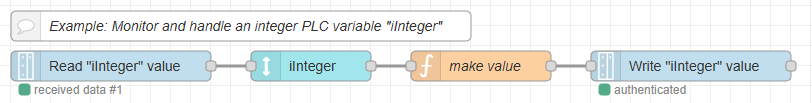
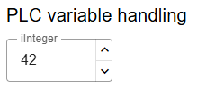

Dashboard 1.0
```JSON
[{"id":"6afd3c5c.85174c","type":"ctrlx-datalayer-request","z":"4ff80d56.dd60fc","device":"7b877229.678964","method":"WRITE","path":"plc/app/Application/sym/GVL/iInteger","payloadFormat":"value_type","name":"Write \"iInteger\" value","x":780,"y":300,"wires":[[]]},{"id":"699499c0.a19078","type":"ui_text_input","z":"4ff80d56.dd60fc","name":"","label":"iInteger","tooltip":"","group":"938bb9af.bc8108","order":1,"width":0,"height":0,"passthru":false,"mode":"number","delay":"0","topic":"topic","topicType":"msg","x":400,"y":300,"wires":[["dad913ff.7d0c6"]]},{"id":"dad913ff.7d0c6","type":"function","z":"4ff80d56.dd60fc","name":"make value","func":"var newMsg = {}\nnewMsg.payload = {\"type\":\"int16\",\"value\":msg.payload}\nreturn newMsg;","outputs":1,"noerr":0,"initialize":"","finalize":"","x":570,"y":300,"wires":[["6afd3c5c.85174c"]]},{"id":"f24564a9.ceb668","type":"ctrlx-datalayer-subscribe","z":"4ff80d56.dd60fc","subscription":"632bcc2.eddf134","path":"plc/app/Application/sym/GVL/iInteger","name":"Read \"iInteger\" value","x":200,"y":300,"wires":[["699499c0.a19078"]]},{"id":"1da5cb6a.45e5cd","type":"comment","z":"4ff80d56.dd60fc","name":"Example: Monitor and handle an integer PLC variable \"iInteger\"","info":"","x":300,"y":260,"wires":[]},{"id":"7b877229.678964","type":"ctrlx-config","name":"localhost","hostname":"localhost","debug":false},{"id":"938bb9af.bc8108","type":"ui_group","name":"PLC Variable handling","tab":"9cba2148.8c9148","order":1,"disp":true,"width":"4","collapse":false},{"id":"632bcc2.eddf134","type":"ctrlx-config-subscription","device":"7b877229.678964","name":"Sub_Default","publishIntervalMs":""},{"id":"9cba2148.8c9148","type":"ui_tab","name":"Examples","icon":"dashboard","order":7,"disabled":false,"hidden":false}]
```

Dashboard 2.0
```JSON
[{"id":"6afd3c5c.85174c","type":"ctrlx-datalayer-request","z":"af28b7f20c662b36","device":"7b877229.678964","method":"WRITE","path":"plc/app/Application/sym/GVL/iInteger","payloadFormat":"value_type","name":"Write \"iInteger\" value","pendingWarnLevel":"","pendingErrorLevel":"","x":780,"y":1200,"wires":[[]]},{"id":"dad913ff.7d0c6","type":"function","z":"af28b7f20c662b36","name":"make value","func":"var newMsg = {}\nnewMsg.payload = {\"type\":\"int16\",\"value\":msg.payload}\nreturn newMsg;","outputs":1,"timeout":"","noerr":0,"initialize":"","finalize":"","libs":[],"x":570,"y":1200,"wires":[["6afd3c5c.85174c"]]},{"id":"f24564a9.ceb668","type":"ctrlx-datalayer-subscribe","z":"af28b7f20c662b36","subscription":"632bcc2.eddf134","path":"plc/app/Application/sym/GVL/iInteger","name":"Read \"iInteger\" value","inputs":0,"x":200,"y":1200,"wires":[["1a9096f298857516"]]},{"id":"1da5cb6a.45e5cd","type":"comment","z":"af28b7f20c662b36","name":"Example: Monitor and handle an integer PLC variable \"iInteger\"","info":"","x":330,"y":1160,"wires":[]},{"id":"1a9096f298857516","type":"ui-number-input","z":"af28b7f20c662b36","group":"1b28f1fbf61ee8d3","name":"","label":"iInteger","order":0,"width":"1","height":"1","topic":"topic","topicType":"msg","min":0,"max":"32767","step":1,"tooltip":"","delay":300,"passthru":false,"sendOnDelay":false,"sendOnBlur":false,"sendOnEnter":true,"className":"","clearable":false,"icon":"","iconPosition":"left","iconInnerPosition":"inside","spinner":"stacked","x":400,"y":1200,"wires":[["dad913ff.7d0c6"]]},{"id":"7b877229.678964","type":"ctrlx-config","name":"localhost","hostname":"localhost","debug":false},{"id":"632bcc2.eddf134","type":"ctrlx-config-subscription","device":"7b877229.678964","name":"Sub_Default","publishIntervalMs":"","samplingInterval":"","errorInterval":"","keepaliveInterval":"","queueSize":"","deadbandValue":""},{"id":"1b28f1fbf61ee8d3","type":"ui-group","name":"PLC variable handling","page":"30e3bb10109e324b","width":6,"height":1,"order":-1,"showTitle":true,"className":"","visible":"true","disabled":"false","groupType":"default"},{"id":"30e3bb10109e324b","type":"ui-page","name":"Page 1","ui":"ae50776f3a63db0e","path":"/page1","icon":"home","layout":"grid","theme":"a204995a5a44f2b2","breakpoints":[{"name":"Default","px":0,"cols":3},{"name":"Tablet","px":576,"cols":6},{"name":"Small Desktop","px":768,"cols":9},{"name":"Desktop","px":1024,"cols":12}],"order":1,"className":"","visible":true,"disabled":false},{"id":"ae50776f3a63db0e","type":"ui-base","name":"My Dashboard","path":"/dashboard","appIcon":"","includeClientData":true,"acceptsClientConfig":["ui-notification","ui-control"],"showPathInSidebar":false,"headerContent":"page","navigationStyle":"default","titleBarStyle":"default","showReconnectNotification":true,"notificationDisplayTime":1,"showDisconnectNotification":true,"allowInstall":false},{"id":"a204995a5a44f2b2","type":"ui-theme","name":"Default Theme","colors":{"surface":"#ffffff","primary":"#0094CE","bgPage":"#eeeeee","groupBg":"#ffffff","groupOutline":"#cccccc"},"sizes":{"density":"default","pagePadding":"12px","groupGap":"12px","groupBorderRadius":"4px","widgetGap":"12px"}},{"id":"447b96d795e81db9","type":"global-config","env":[],"modules":{"node-red-contrib-ctrlx-automation":"1.9.8","@flowfuse/node-red-dashboard":"1.30.2"}}]
```

### Monitor and handle a real PLC variable `rReal`

The following example shows how to read, write and monitor a PLC variable `rReal` of type `REAL` via the dashboard. A symbol configuration has to be present in the PLC project and the variable has to be configured for write access via a pragma or directly in the symbolic variable configuration. Also the variable has to be used in a program or via pragma.

`GVL`

```IEC61131-3
{attribute 'linkalways'}
{attribute 'symbol' := 'readwrite'}
VAR_GLOBAL
  rReal : REAL;
END_VAR
```

`PLC_PRG`

```IEC61131-3
rReal;
```

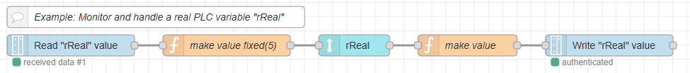
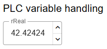

Dashboard 1.0
```JSON
[{"id":"2c89b6ef.36830a","type":"ctrlx-datalayer-request","z":"4ff80d56.dd60fc","device":"7b877229.678964","method":"WRITE","path":"plc/app/Application/sym/GVL/rReal","payloadFormat":"value_type","name":"Write \"rReal\" value","x":970,"y":440,"wires":[[]]},{"id":"370f99d.1a78366","type":"ui_text_input","z":"4ff80d56.dd60fc","name":"","label":"rReal","tooltip":"","group":"938bb9af.bc8108","order":1,"width":0,"height":0,"passthru":false,"mode":"number","delay":"0","topic":"topic","topicType":"msg","x":610,"y":440,"wires":[["4f0d75c5.219fc4"]]},{"id":"4f0d75c5.219fc4","type":"function","z":"4ff80d56.dd60fc","name":"make value","func":"var newMsg = {}\nif (msg.payload.value != null){\n    //newMsg.payload = {\"type\":\"float\",\"value\":Number(msg.payload.value)}\n    newMsg.payload = {\"type\":\"float\",\"value\":msg.payload.value}\n}\nelse {\n    //newMsg.payload = {\"type\":\"float\",\"value\":Number(msg.payload)}\n    newMsg.payload = {\"type\":\"float\",\"value\":msg.payload}\n}\nreturn newMsg;","outputs":1,"noerr":0,"initialize":"","finalize":"","x":770,"y":440,"wires":[["2c89b6ef.36830a"]]},{"id":"5bd100f5.b21dd8","type":"ctrlx-datalayer-subscribe","z":"4ff80d56.dd60fc","subscription":"632bcc2.eddf134","path":"plc/app/Application/sym/GVL/rReal","name":"Read \"rReal\" value","x":190,"y":440,"wires":[["17614aa4.d713dd"]]},{"id":"f479d2d0.e553c","type":"comment","z":"4ff80d56.dd60fc","name":"Example: Monitor and handle a real PLC variable \"rReal\"","info":"","x":290,"y":400,"wires":[]},{"id":"17614aa4.d713dd","type":"function","z":"4ff80d56.dd60fc","name":"make value fixed(5)","func":"//msg.test = msg.payload.toFixed(5);\nmsg.payload = Number(msg.payload.toFixed(5));\nreturn msg","outputs":1,"noerr":0,"initialize":"","finalize":"","x":420,"y":440,"wires":[["370f99d.1a78366"]]},{"id":"7b877229.678964","type":"ctrlx-config","name":"localhost","hostname":"localhost","debug":false},{"id":"938bb9af.bc8108","type":"ui_group","name":"PLC Variable handling","tab":"9cba2148.8c9148","order":1,"disp":true,"width":"4","collapse":false},{"id":"632bcc2.eddf134","type":"ctrlx-config-subscription","device":"7b877229.678964","name":"Sub_Default","publishIntervalMs":""},{"id":"9cba2148.8c9148","type":"ui_tab","name":"Examples","icon":"dashboard","order":7,"disabled":false,"hidden":false}]
```

Dashboard 2.0
```JSON
[{"id":"2c89b6ef.36830a","type":"ctrlx-datalayer-request","z":"af28b7f20c662b36","device":"7b877229.678964","method":"WRITE","path":"plc/app/Application/sym/GVL/rReal","payloadFormat":"value_type","name":"Write \"rReal\" value","pendingWarnLevel":"","pendingErrorLevel":"","x":910,"y":1120,"wires":[[]]},{"id":"4f0d75c5.219fc4","type":"function","z":"af28b7f20c662b36","name":"make value","func":"var newMsg = {}\nif (msg.payload.value != null){\n    //newMsg.payload = {\"type\":\"float\",\"value\":Number(msg.payload.value)}\n    newMsg.payload = {\"type\":\"float\",\"value\":msg.payload.value}\n}\nelse {\n    //newMsg.payload = {\"type\":\"float\",\"value\":Number(msg.payload)}\n    newMsg.payload = {\"type\":\"float\",\"value\":msg.payload}\n}\nreturn newMsg;","outputs":1,"timeout":"","noerr":0,"initialize":"","finalize":"","libs":[],"x":710,"y":1120,"wires":[["2c89b6ef.36830a"]]},{"id":"5bd100f5.b21dd8","type":"ctrlx-datalayer-subscribe","z":"af28b7f20c662b36","subscription":"632bcc2.eddf134","path":"plc/app/Application/sym/GVL/rReal","name":"Read \"rReal\" value","inputs":0,"x":150,"y":1120,"wires":[["17614aa4.d713dd"]]},{"id":"f479d2d0.e553c","type":"comment","z":"af28b7f20c662b36","name":"Example: Monitor and handle a real PLC variable \"rReal\"","info":"","x":270,"y":1080,"wires":[]},{"id":"17614aa4.d713dd","type":"function","z":"af28b7f20c662b36","name":"make value fixed(5)","func":"//msg.test = msg.payload.toFixed(5);\nmsg.payload = Number(msg.payload.toFixed(5));\nreturn msg","outputs":1,"noerr":0,"initialize":"","finalize":"","x":370,"y":1120,"wires":[["736fb17b6c307697"]]},{"id":"736fb17b6c307697","type":"ui-number-input","z":"af28b7f20c662b36","group":"1b28f1fbf61ee8d3","name":"","label":"rReal","order":0,"width":"1","height":"1","topic":"topic","topicType":"msg","min":0,"max":"999","step":"0.00001","tooltip":"","delay":300,"passthru":false,"sendOnDelay":false,"sendOnBlur":true,"sendOnEnter":true,"className":"","clearable":false,"icon":"","iconPosition":"left","iconInnerPosition":"inside","spinner":"stacked","x":550,"y":1120,"wires":[["4f0d75c5.219fc4"]]},{"id":"7b877229.678964","type":"ctrlx-config","name":"localhost","hostname":"localhost","debug":false},{"id":"632bcc2.eddf134","type":"ctrlx-config-subscription","device":"7b877229.678964","name":"Sub_Default","publishIntervalMs":"","samplingInterval":"","errorInterval":"","keepaliveInterval":"","queueSize":"","deadbandValue":""},{"id":"1b28f1fbf61ee8d3","type":"ui-group","name":"PLC variable handling","page":"30e3bb10109e324b","width":6,"height":1,"order":-1,"showTitle":true,"className":"","visible":"true","disabled":"false","groupType":"default"},{"id":"30e3bb10109e324b","type":"ui-page","name":"Page 1","ui":"ae50776f3a63db0e","path":"/page1","icon":"home","layout":"grid","theme":"a204995a5a44f2b2","breakpoints":[{"name":"Default","px":0,"cols":3},{"name":"Tablet","px":576,"cols":6},{"name":"Small Desktop","px":768,"cols":9},{"name":"Desktop","px":1024,"cols":12}],"order":1,"className":"","visible":true,"disabled":false},{"id":"ae50776f3a63db0e","type":"ui-base","name":"My Dashboard","path":"/dashboard","appIcon":"","includeClientData":true,"acceptsClientConfig":["ui-notification","ui-control"],"showPathInSidebar":false,"headerContent":"page","navigationStyle":"default","titleBarStyle":"default","showReconnectNotification":true,"notificationDisplayTime":1,"showDisconnectNotification":true,"allowInstall":false},{"id":"a204995a5a44f2b2","type":"ui-theme","name":"Default Theme","colors":{"surface":"#ffffff","primary":"#0094CE","bgPage":"#eeeeee","groupBg":"#ffffff","groupOutline":"#cccccc"},"sizes":{"density":"default","pagePadding":"12px","groupGap":"12px","groupBorderRadius":"4px","widgetGap":"12px"}},{"id":"fac0ea031cd2e369","type":"global-config","env":[],"modules":{"node-red-contrib-ctrlx-automation":"1.9.8","@flowfuse/node-red-dashboard":"1.30.2"}}]
```

### Monitor and handle a string PLC variable `sString`

The following example shows how to read, write and monitor a PLC variable `sString` of type `STRING` via the dashboard. A symbol configuration has to be present in the PLC project and the variable has to be configured for write access via a pragma or directly in the symbolic variable configuration. Also the variable has to be used in a program or via pragma.

`GVL`

```IEC61131-3
{attribute 'linkalways'}
{attribute 'symbol' := 'readwrite'}
VAR_GLOBAL
  sString : STRING;
END_VAR
```

`PLC_PRG`

```IEC61131-3
sString;
```

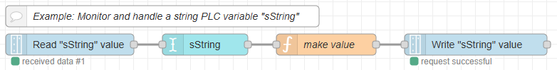
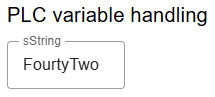

Dashboard 1.0
```JSON
[{"id":"52f3b28.7154acc","type":"ctrlx-datalayer-request","z":"4ff80d56.dd60fc","device":"7b877229.678964","method":"WRITE","path":"plc/app/Application/sym/GVL/sString","payloadFormat":"value_type","name":"Write \"sString\" value","x":780,"y":580,"wires":[[]]},{"id":"a84a6218.d8fa38","type":"ui_text_input","z":"4ff80d56.dd60fc","name":"","label":"sString","tooltip":"","group":"938bb9af.bc8108","order":1,"width":0,"height":0,"passthru":false,"mode":"text","delay":"0","topic":"topic","topicType":"msg","x":400,"y":580,"wires":[["b77fcdb1.bb59e"]]},{"id":"b77fcdb1.bb59e","type":"function","z":"4ff80d56.dd60fc","name":"make value","func":"var newMsg = {}\nnewMsg.payload = {\"type\":\"string\",\"value\":msg.payload}\nreturn newMsg;","outputs":1,"noerr":0,"initialize":"","finalize":"","x":570,"y":580,"wires":[["52f3b28.7154acc"]]},{"id":"7fd8a2ba.130acc","type":"ctrlx-datalayer-subscribe","z":"4ff80d56.dd60fc","subscription":"632bcc2.eddf134","path":"plc/app/Application/sym/GVL/sString","name":"Read \"sString\" value","x":200,"y":580,"wires":[["a84a6218.d8fa38"]]},{"id":"efa71414.90e038","type":"comment","z":"4ff80d56.dd60fc","name":"Example: Monitor and handle a string PLC variable \"sString\"","info":"","x":310,"y":540,"wires":[]},{"id":"7b877229.678964","type":"ctrlx-config","name":"localhost","hostname":"localhost","debug":false},{"id":"938bb9af.bc8108","type":"ui_group","name":"PLC Variable handling","tab":"9cba2148.8c9148","order":1,"disp":true,"width":"4","collapse":false},{"id":"632bcc2.eddf134","type":"ctrlx-config-subscription","device":"7b877229.678964","name":"Sub_Default","publishIntervalMs":""},{"id":"9cba2148.8c9148","type":"ui_tab","name":"Examples","icon":"dashboard","order":7,"disabled":false,"hidden":false}]
```

Dashboard 2.0
```JSON
[{"id":"52f3b28.7154acc","type":"ctrlx-datalayer-request","z":"af28b7f20c662b36","device":"7b877229.678964","method":"WRITE","path":"plc/app/Application/sym/GVL/sString","payloadFormat":"value_type","name":"Write \"sString\" value","pendingWarnLevel":"","pendingErrorLevel":"","x":720,"y":1220,"wires":[[]]},{"id":"b77fcdb1.bb59e","type":"function","z":"af28b7f20c662b36","name":"make value","func":"var newMsg = {}\nnewMsg.payload = {\"type\":\"string\",\"value\":msg.payload}\nreturn newMsg;","outputs":1,"timeout":"","noerr":0,"initialize":"","finalize":"","libs":[],"x":510,"y":1220,"wires":[["52f3b28.7154acc"]]},{"id":"7fd8a2ba.130acc","type":"ctrlx-datalayer-subscribe","z":"af28b7f20c662b36","subscription":"632bcc2.eddf134","path":"plc/app/Application/sym/GVL/sString","name":"Read \"sString\" value","inputs":0,"x":150,"y":1220,"wires":[["e7ada3126a2d3c24"]]},{"id":"efa71414.90e038","type":"comment","z":"af28b7f20c662b36","name":"Example: Monitor and handle a string PLC variable \"sString\"","info":"","x":280,"y":1180,"wires":[]},{"id":"e7ada3126a2d3c24","type":"ui-text-input","z":"af28b7f20c662b36","group":"1b28f1fbf61ee8d3","name":"","label":"sString","order":0,"width":"1","height":"1","topic":"topic","topicType":"msg","mode":"text","tooltip":"","delay":300,"passthru":true,"sendOnDelay":false,"sendOnBlur":true,"sendOnEnter":true,"className":"","clearable":false,"sendOnClear":false,"icon":"","iconPosition":"left","iconInnerPosition":"inside","x":340,"y":1220,"wires":[["b77fcdb1.bb59e"]]},{"id":"7b877229.678964","type":"ctrlx-config","name":"localhost","hostname":"localhost","debug":false},{"id":"632bcc2.eddf134","type":"ctrlx-config-subscription","device":"7b877229.678964","name":"Sub_Default","publishIntervalMs":"","samplingInterval":"","errorInterval":"","keepaliveInterval":"","queueSize":"","deadbandValue":""},{"id":"1b28f1fbf61ee8d3","type":"ui-group","name":"PLC variable handling","page":"30e3bb10109e324b","width":6,"height":1,"order":-1,"showTitle":true,"className":"","visible":"true","disabled":"false","groupType":"default"},{"id":"30e3bb10109e324b","type":"ui-page","name":"Page 1","ui":"ae50776f3a63db0e","path":"/page1","icon":"home","layout":"grid","theme":"a204995a5a44f2b2","breakpoints":[{"name":"Default","px":0,"cols":3},{"name":"Tablet","px":576,"cols":6},{"name":"Small Desktop","px":768,"cols":9},{"name":"Desktop","px":1024,"cols":12}],"order":1,"className":"","visible":true,"disabled":false},{"id":"ae50776f3a63db0e","type":"ui-base","name":"My Dashboard","path":"/dashboard","appIcon":"","includeClientData":true,"acceptsClientConfig":["ui-notification","ui-control"],"showPathInSidebar":false,"headerContent":"page","navigationStyle":"default","titleBarStyle":"default","showReconnectNotification":true,"notificationDisplayTime":1,"showDisconnectNotification":true,"allowInstall":false},{"id":"a204995a5a44f2b2","type":"ui-theme","name":"Default Theme","colors":{"surface":"#ffffff","primary":"#0094CE","bgPage":"#eeeeee","groupBg":"#ffffff","groupOutline":"#cccccc"},"sizes":{"density":"default","pagePadding":"12px","groupGap":"12px","groupBorderRadius":"4px","widgetGap":"12px"}},{"id":"0a5a2370b2b53530","type":"global-config","env":[],"modules":{"node-red-contrib-ctrlx-automation":"1.9.8","@flowfuse/node-red-dashboard":"1.30.2"}}]
```

### Monitor and handle a struct PLC variable `strStruct`

The following example shows how to read, write and monitor a PLC variable `strStruct` of type `DUT`(struct) via the dashboard. The struct type definition needs to added to the PLC project, a symbol configuration has to be present and the variable has to be configured for write access via a pragma or directly in the symbolic variable configuration. Also the variable has to be used in a program or via pragma.

`DUT`

```IEC61131-3
TYPE DUT :
	STRUCT
		bBool : BOOL := TRUE;
		iInt : INT := 123;
	END_STRUCT
END_TYPE
```

`GVL`

```IEC61131-3
{attribute 'linkalways'}
{attribute 'symbol' := 'readwrite'}
VAR_GLOBAL
  strStruct : DUT;
END_VAR
```

`PLC_PRG`

```IEC61131-3
strStruct;
```

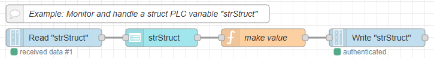
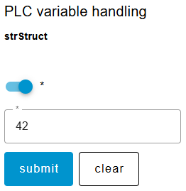

Dashboard 1.0
```JSON
[{"id":"6f5d6bbd194918ae","type":"ui_form","z":"38bcc9961503333d","name":"","label":"Input form","group":"938bb9af.bc8108","order":1,"width":0,"height":0,"options":[{"label":"bBool","value":"bBool","type":"checkbox","required":true,"rows":null},{"label":"iInt","value":"iInt","type":"number","required":true,"rows":null}],"formValue":{"bBool":false,"iInt":""},"payload":"","submit":"submit","cancel":"cancel","topic":"topic","topicType":"msg","splitLayout":"","className":"","x":420,"y":580,"wires":[["1313c8d3ddaacf48"]]},{"id":"efa71414.90e038","type":"comment","z":"38bcc9961503333d","name":"Example: Monitor and handle a struct PLC variable \"strStruct\"","info":"","x":380,"y":540,"wires":[]},{"id":"1313c8d3ddaacf48","type":"function","z":"38bcc9961503333d","name":"make value","func":"var newMsg = {}\nnewMsg.payload = { \"type\": \"object\", \"value\": {\n    \"bBool\": msg.payload.bBool,\n    \"iInt\": msg.payload.iInt} }\nreturn newMsg;","outputs":1,"timeout":0,"noerr":0,"initialize":"","finalize":"","libs":[],"x":590,"y":580,"wires":[["52f3b28.7154acc"]]},{"id":"88e501beb3dd7132","type":"ctrlx-datalayer-subscribe","z":"38bcc9961503333d","subscription":"632bcc2.eddf134","path":"plc/app/Application/sym/GVL/strStruct","name":"Read \"strStruct\"","inputs":0,"x":240,"y":580,"wires":[["6f5d6bbd194918ae"]]},{"id":"52f3b28.7154acc","type":"ctrlx-datalayer-request","z":"38bcc9961503333d","device":"7b877229.678964","method":"WRITE","path":"plc/app/Application/sym/GVL/strStruct","payloadFormat":"value_type","name":"Write \"strStruct\"","pendingWarnLevel":"","pendingErrorLevel":"","x":780,"y":580,"wires":[[]]},{"id":"938bb9af.bc8108","type":"ui_group","name":"PLC Variable handling","tab":"9cba2148.8c9148","order":1,"disp":true,"width":"4","collapse":false},{"id":"632bcc2.eddf134","type":"ctrlx-config-subscription","device":"7b877229.678964","name":"Sub_Default","publishIntervalMs":"1","publishIntervalUnits":"seconds","samplingInterval":"100","samplingIntervalUnits":"milliseconds","errorInterval":"60","errorIntervalUnits":"seconds","keepaliveInterval":"60","keepaliveIntervalUnits":"seconds","queueSize":"1","queueBehaviour":"DiscardOldest","deadbandValue":""},{"id":"7b877229.678964","type":"ctrlx-config","name":"localhost","hostname":"localhost","debug":false},{"id":"9cba2148.8c9148","type":"ui_tab","name":"Examples","icon":"dashboard","order":7,"disabled":false,"hidden":false}]
```

Dashboard 2.0
```JSON
[{"id":"59037bcc3b563c38","type":"comment","z":"af28b7f20c662b36","name":"Example: Monitor and handle a struct PLC variable \"strStruct\"","info":"","x":280,"y":1280,"wires":[]},{"id":"1313c8d3ddaacf48","type":"function","z":"af28b7f20c662b36","name":"make value","func":"var newMsg = {}\nnewMsg.payload = { \"type\": \"object\", \"value\": {\n    \"bBool\": msg.payload.bBool,\n    \"iInteger\": msg.payload.iInteger} }\nreturn newMsg;","outputs":1,"timeout":0,"noerr":0,"initialize":"","finalize":"","libs":[],"x":490,"y":1320,"wires":[["aed980b5cd72d73c"]]},{"id":"88e501beb3dd7132","type":"ctrlx-datalayer-subscribe","z":"af28b7f20c662b36","subscription":"632bcc2.eddf134","path":"plc/app/Application/sym/GVL/strStruct","name":"Read \"strStruct\"","inputs":0,"x":140,"y":1320,"wires":[["66a4ceb610c227ae"]]},{"id":"aed980b5cd72d73c","type":"ctrlx-datalayer-request","z":"af28b7f20c662b36","device":"7b877229.678964","method":"WRITE","path":"plc/app/Application/sym/GVL/strStruct","payloadFormat":"value_type","name":"Write \"strStruct\"","pendingWarnLevel":"","pendingErrorLevel":"","x":680,"y":1320,"wires":[[]]},{"id":"66a4ceb610c227ae","type":"ui-form","z":"af28b7f20c662b36","name":"","group":"1b28f1fbf61ee8d3","label":"strStruct","order":0,"width":"2","height":"5","options":[{"label":"","key":"bBool","type":"switch","required":true,"rows":null},{"label":"","key":"iInteger","type":"number","required":true,"rows":null}],"formValue":{"bBool":false,"iInteger":""},"payload":"","submit":"submit","cancel":"clear","resetOnSubmit":false,"topic":"topic","topicType":"msg","splitLayout":"","className":"","passthru":false,"dropdownOptions":[],"x":320,"y":1320,"wires":[["1313c8d3ddaacf48"]]},{"id":"632bcc2.eddf134","type":"ctrlx-config-subscription","device":"7b877229.678964","name":"Sub_Default","publishIntervalMs":"","samplingInterval":"","errorInterval":"","keepaliveInterval":"","queueSize":"","deadbandValue":""},{"id":"7b877229.678964","type":"ctrlx-config","name":"localhost","hostname":"localhost","debug":false},{"id":"1b28f1fbf61ee8d3","type":"ui-group","name":"PLC variable handling","page":"30e3bb10109e324b","width":6,"height":1,"order":-1,"showTitle":true,"className":"","visible":"true","disabled":"false","groupType":"default"},{"id":"30e3bb10109e324b","type":"ui-page","name":"Page 1","ui":"ae50776f3a63db0e","path":"/page1","icon":"home","layout":"grid","theme":"a204995a5a44f2b2","breakpoints":[{"name":"Default","px":0,"cols":3},{"name":"Tablet","px":576,"cols":6},{"name":"Small Desktop","px":768,"cols":9},{"name":"Desktop","px":1024,"cols":12}],"order":1,"className":"","visible":true,"disabled":false},{"id":"ae50776f3a63db0e","type":"ui-base","name":"My Dashboard","path":"/dashboard","appIcon":"","includeClientData":true,"acceptsClientConfig":["ui-notification","ui-control"],"showPathInSidebar":false,"headerContent":"page","navigationStyle":"default","titleBarStyle":"default","showReconnectNotification":true,"notificationDisplayTime":1,"showDisconnectNotification":true,"allowInstall":false},{"id":"a204995a5a44f2b2","type":"ui-theme","name":"Default Theme","colors":{"surface":"#ffffff","primary":"#0094CE","bgPage":"#eeeeee","groupBg":"#ffffff","groupOutline":"#cccccc"},"sizes":{"density":"default","pagePadding":"12px","groupGap":"12px","groupBorderRadius":"4px","widgetGap":"12px"}},{"id":"5b3521378bd8b9b0","type":"global-config","env":[],"modules":{"node-red-contrib-ctrlx-automation":"1.9.8","@flowfuse/node-red-dashboard":"1.30.2"}}]
```

## ctrlX OS - MOTION App dashboard examples

Prerequisite: `ctrlX OS - MOTION App` is installed. See [our ctrlX OS Store](https://community.boschrexroth.com/ctrlx-os-store-apps-oc2pqqwn/post/ctrlx-os---motion-YSFFuOOjW6y44qO) and the corresponding [documentation of the ctrlX OS - MOTION App](https://docs.automation.boschrexroth.com/iirds/cdp-metadata.boschrexroth.de~iiDC~Product-ctrlX-Motion-App/).

### Monitor and switch motion state

The following example shows how to switch and monitor the state of the ctrlX MOTION.

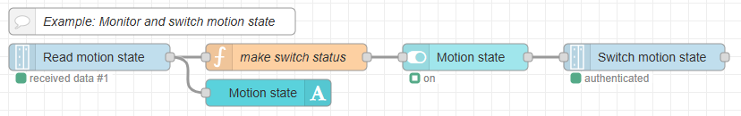
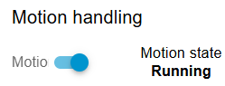

Dashboard 1.0
```JSON
[{"id":"ffc99584.58bbd","type":"comment","z":"4ff80d56.dd60fc","name":"Example: Monitor and switch motion state","info":"","x":240,"y":780,"wires":[]},{"id":"cac2d7f4.22c55","type":"ctrlx-datalayer-request","z":"4ff80d56.dd60fc","device":"7b877229.678964","method":"CREATE","path":"motion/cmd/opstate","payloadFormat":"value_type","name":"Switch motion state","x":850,"y":820,"wires":[[]]},{"id":"60511613.ec7a08","type":"ui_switch","z":"4ff80d56.dd60fc","name":"","label":"Motion state","tooltip":"","group":"372098c9.3029b8","order":1,"width":"3","height":"1","passthru":false,"decouple":"true","topic":"","topicType":"str","style":"","onvalue":"{\"value\":\"Booting\",\"type\":\"string\"}","onvalueType":"json","onicon":"","oncolor":"","offvalue":"{\"value\":\"Configuration\",\"type\":\"string\"}","offvalueType":"json","officon":"","offcolor":"","animate":false,"x":650,"y":820,"wires":[["cac2d7f4.22c55"]]},{"id":"3f74d73d.b1514","type":"ctrlx-datalayer-subscribe","z":"4ff80d56.dd60fc","subscription":"632bcc2.eddf134","path":"motion/state/opstate","name":"Read motion state","x":190,"y":820,"wires":[["9c708078.0c74f","ecb0f768.8af99"]]},{"id":"9c708078.0c74f","type":"ui_text","z":"4ff80d56.dd60fc","group":"372098c9.3029b8","order":2,"width":"3","height":"1","name":"","label":"Motion state","format":"{{msg.payload}}","layout":"col-center","x":410,"y":860,"wires":[]},{"id":"ecb0f768.8af99","type":"function","z":"4ff80d56.dd60fc","name":"make switch status","func":"var newMsg = {};\nif(msg.payload == \"Running\"){\n newMsg.payload = {\"value\":\"Booting\",\"type\":\"string\"}\n}\nelse {\n newMsg.payload = {\"value\":\"Configuration\",\"type\":\"string\"} \n}\nreturn newMsg;","outputs":1,"noerr":0,"initialize":"","finalize":"","x":440,"y":820,"wires":[["60511613.ec7a08"]]},{"id":"7b877229.678964","type":"ctrlx-config","name":"localhost","hostname":"localhost","debug":false},{"id":"372098c9.3029b8","type":"ui_group","name":"Motion handling","tab":"9cba2148.8c9148","order":2,"disp":true,"width":"6","collapse":false},{"id":"632bcc2.eddf134","type":"ctrlx-config-subscription","device":"7b877229.678964","name":"Sub_Default","publishIntervalMs":""},{"id":"9cba2148.8c9148","type":"ui_tab","name":"Examples","icon":"dashboard","order":7,"disabled":false,"hidden":false}]
```

Dashboard 2.0
```JSON
[{"id":"ffc99584.58bbd","type":"comment","z":"af28b7f20c662b36","name":"Example: Monitor and switch motion state","info":"","x":220,"y":1380,"wires":[]},{"id":"cac2d7f4.22c55","type":"ctrlx-datalayer-request","z":"af28b7f20c662b36","device":"7b877229.678964","method":"CREATE","path":"motion/cmd/opstate","payloadFormat":"value_type","name":"Switch motion state","pendingWarnLevel":"","pendingErrorLevel":"","x":770,"y":1420,"wires":[[]]},{"id":"3f74d73d.b1514","type":"ctrlx-datalayer-subscribe","z":"af28b7f20c662b36","subscription":"632bcc2.eddf134","path":"motion/state/opstate","name":"Read motion state","inputs":0,"x":150,"y":1420,"wires":[["ecb0f768.8af99","04bf0bc91a085d4c"]]},{"id":"ecb0f768.8af99","type":"function","z":"af28b7f20c662b36","name":"make switch status","func":"var newMsg = {};\nif(msg.payload == \"Running\"){\n    newMsg.payload = {\"type\": \"string\", \"value\":\"Booting\"}\n}\nelse {\n    newMsg.payload = {\"type\": \"string\", \"value\":\"Configuration\"} \n}\nreturn newMsg;","outputs":1,"timeout":"","noerr":0,"initialize":"","finalize":"","libs":[],"x":370,"y":1420,"wires":[["011ebcd65aa96edf"]]},{"id":"04bf0bc91a085d4c","type":"ui-text","z":"af28b7f20c662b36","group":"22a025b93b630564","order":2,"width":"2","height":"1","name":"","label":"Motion state","format":"{{msg.payload}}","layout":"col-center","style":false,"font":"","fontSize":16,"color":"#717171","wrapText":false,"className":"","value":"payload","valueType":"msg","x":350,"y":1460,"wires":[]},{"id":"011ebcd65aa96edf","type":"ui-switch","z":"af28b7f20c662b36","name":"","label":"Motion state","group":"22a025b93b630564","order":1,"width":"1","height":"1","passthru":false,"decouple":true,"topic":"topic","topicType":"msg","style":"","className":"","layout":"row-spread","clickableArea":"switch","onvalue":"{\"type\": \"string\", \"value\":\"Booting\"}","onvalueType":"json","onicon":"","oncolor":"","offvalue":"{\"type\": \"string\", \"value\":\"Configuration\"}","offvalueType":"json","officon":"","offcolor":"","x":570,"y":1420,"wires":[["cac2d7f4.22c55"]]},{"id":"7b877229.678964","type":"ctrlx-config","name":"localhost","hostname":"localhost","debug":false},{"id":"632bcc2.eddf134","type":"ctrlx-config-subscription","device":"7b877229.678964","name":"Sub_Default","publishIntervalMs":"","samplingInterval":"","errorInterval":"","keepaliveInterval":"","queueSize":"","deadbandValue":""},{"id":"22a025b93b630564","type":"ui-group","name":"Motion handling","page":"30e3bb10109e324b","width":6,"height":1,"order":1,"showTitle":true,"className":"","visible":"true","disabled":"false","groupType":"default"},{"id":"30e3bb10109e324b","type":"ui-page","name":"Page 1","ui":"ae50776f3a63db0e","path":"/page1","icon":"home","layout":"grid","theme":"a204995a5a44f2b2","breakpoints":[{"name":"Default","px":0,"cols":3},{"name":"Tablet","px":576,"cols":6},{"name":"Small Desktop","px":768,"cols":9},{"name":"Desktop","px":1024,"cols":12}],"order":1,"className":"","visible":true,"disabled":false},{"id":"ae50776f3a63db0e","type":"ui-base","name":"My Dashboard","path":"/dashboard","appIcon":"","includeClientData":true,"acceptsClientConfig":["ui-notification","ui-control"],"showPathInSidebar":false,"headerContent":"page","navigationStyle":"default","titleBarStyle":"default","showReconnectNotification":true,"notificationDisplayTime":1,"showDisconnectNotification":true,"allowInstall":false},{"id":"a204995a5a44f2b2","type":"ui-theme","name":"Default Theme","colors":{"surface":"#ffffff","primary":"#0094CE","bgPage":"#eeeeee","groupBg":"#ffffff","groupOutline":"#cccccc"},"sizes":{"density":"default","pagePadding":"12px","groupGap":"12px","groupBorderRadius":"4px","widgetGap":"12px"}},{"id":"3e2606a20b7860f4","type":"global-config","env":[],"modules":{"node-red-contrib-ctrlx-automation":"1.9.8","@flowfuse/node-red-dashboard":"1.30.2"}}]
```

### Browse and show all available axes

The following example shows how to browse and show all available axes of the ctrlX MOTION.

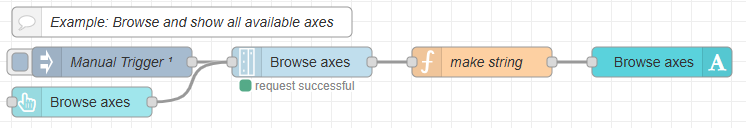
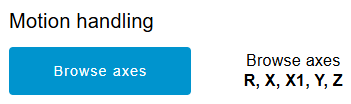

Dashboard 1.0
```JSON
[{"id":"a264954e.592108","type":"ctrlx-datalayer-request","z":"4ff80d56.dd60fc","device":"7b877229.678964","method":"BROWSE","path":"motion/axs","payloadFormat":"value_type","name":"Browse axes","x":390,"y":980,"wires":[["1500c19c.aef4ce"]]},{"id":"c426d34b.1596e8","type":"ui_button","z":"4ff80d56.dd60fc","name":"","group":"372098c9.3029b8","order":3,"width":"3","height":"1","passthru":false,"label":"Browse axes","tooltip":"","color":"","bgcolor":"","icon":"","payload":"","payloadType":"str","topic":"topic","topicType":"msg","x":200,"y":1020,"wires":[["a264954e.592108"]]},{"id":"916c8ea.af493f","type":"inject","z":"4ff80d56.dd60fc","name":"Manual Trigger","props":[{"p":"payload"},{"p":"topic","vt":"str"}],"repeat":"","crontab":"","once":true,"onceDelay":0.1,"topic":"","payload":"","payloadType":"date","x":210,"y":980,"wires":[["a264954e.592108"]]},{"id":"1500c19c.aef4ce","type":"function","z":"4ff80d56.dd60fc","name":"make string","func":"var newMsg = {};\nnewMsg.payload = \"\";\nif (msg.payload.value == null){\n    newMsg.payload = \"could not read\";\n}\nelse if(msg.payload.value.length > 0){\n    for (var i = 0; i < msg.payload.value.length; i++) {\n        if(i==0){\n            newMsg.payload += msg.payload.value[i];\n        }\n        else{\n            newMsg.payload += \", \" + msg.payload.value[i];\n        }\n    }\n}\nelse{\n    newMsg.payload = \"no axes found\"\n}\nreturn newMsg;\n","outputs":1,"noerr":0,"initialize":"","finalize":"","libs":[],"x":580,"y":980,"wires":[["737187dc.883be8"]]},{"id":"737187dc.883be8","type":"ui_text","z":"4ff80d56.dd60fc","group":"372098c9.3029b8","order":5,"width":"0","height":"0","name":"","label":"Axes","format":"{{msg.payload}}","layout":"col-center","x":730,"y":980,"wires":[]},{"id":"3c4502dc.7928ce","type":"comment","z":"4ff80d56.dd60fc","name":"Example: Browse and show all available axes","info":"","x":250,"y":940,"wires":[]},{"id":"7b877229.678964","type":"ctrlx-config","name":"localhost","hostname":"localhost","debug":false},{"id":"372098c9.3029b8","type":"ui_group","name":"Motion handling","tab":"9cba2148.8c9148","order":2,"disp":true,"width":"6","collapse":false},{"id":"9cba2148.8c9148","type":"ui_tab","name":"Examples","icon":"dashboard","order":7,"disabled":false,"hidden":false}]
```

Dashboard 2.0
```JSON
[{"id":"a264954e.592108","type":"ctrlx-datalayer-request","z":"af28b7f20c662b36","device":"7b877229.678964","method":"BROWSE","path":"motion/axs","payloadFormat":"value_type","name":"Browse axes","pendingWarnLevel":"","pendingErrorLevel":"","x":350,"y":1560,"wires":[["1500c19c.aef4ce"]]},{"id":"916c8ea.af493f","type":"inject","z":"af28b7f20c662b36","name":"Manual Trigger","props":[{"p":"payload"},{"p":"topic","vt":"str"}],"repeat":"","crontab":"","once":true,"onceDelay":0.1,"topic":"","payload":"","payloadType":"date","x":160,"y":1560,"wires":[["a264954e.592108"]]},{"id":"1500c19c.aef4ce","type":"function","z":"af28b7f20c662b36","name":"make string","func":"var newMsg = {};\nnewMsg.payload = \"\";\nif (msg.payload.value == null){\n    newMsg.payload = \"could not read\";\n}\nelse if(msg.payload.value.length > 0){\n    for (var i = 0; i < msg.payload.value.length; i++) {\n        if(i==0){\n            newMsg.payload += msg.payload.value[i];\n        }\n        else{\n            newMsg.payload += \", \" + msg.payload.value[i];\n        }\n    }\n}\nelse{\n    newMsg.payload = \"no axes found\"\n}\nreturn newMsg;\n","outputs":1,"noerr":0,"initialize":"","finalize":"","libs":[],"x":530,"y":1560,"wires":[["cd89931af2f1e914"]]},{"id":"3c4502dc.7928ce","type":"comment","z":"af28b7f20c662b36","name":"Example: Browse and show all available axes","info":"","x":230,"y":1520,"wires":[]},{"id":"cd89931af2f1e914","type":"ui-text","z":"af28b7f20c662b36","group":"22a025b93b630564","order":4,"width":"2","height":"1","name":"","label":"Browse axes","format":"{{msg.payload}}","layout":"col-center","style":false,"font":"","fontSize":16,"color":"#717171","wrapText":false,"className":"","value":"payload","valueType":"msg","x":710,"y":1560,"wires":[]},{"id":"f88ce9c634822ece","type":"ui-button","z":"af28b7f20c662b36","group":"22a025b93b630564","name":"","label":"Browse axes","order":1,"width":"2","height":"1","emulateClick":false,"tooltip":"","color":"","bgcolor":"","className":"","icon":"","iconPosition":"left","payload":"","payloadType":"str","topic":"topic","topicType":"msg","buttonColor":"","textColor":"","iconColor":"","enableClick":true,"enablePointerdown":false,"pointerdownPayload":"","pointerdownPayloadType":"str","enablePointerup":false,"pointerupPayload":"","pointerupPayloadType":"str","x":130,"y":1600,"wires":[["a264954e.592108"]]},{"id":"7b877229.678964","type":"ctrlx-config","name":"localhost","hostname":"localhost","debug":false},{"id":"22a025b93b630564","type":"ui-group","name":"Motion handling","page":"30e3bb10109e324b","width":6,"height":1,"order":1,"showTitle":true,"className":"","visible":"true","disabled":"false","groupType":"default"},{"id":"30e3bb10109e324b","type":"ui-page","name":"Page 1","ui":"ae50776f3a63db0e","path":"/page1","icon":"home","layout":"grid","theme":"a204995a5a44f2b2","breakpoints":[{"name":"Default","px":0,"cols":3},{"name":"Tablet","px":576,"cols":6},{"name":"Small Desktop","px":768,"cols":9},{"name":"Desktop","px":1024,"cols":12}],"order":1,"className":"","visible":true,"disabled":false},{"id":"ae50776f3a63db0e","type":"ui-base","name":"My Dashboard","path":"/dashboard","appIcon":"","includeClientData":true,"acceptsClientConfig":["ui-notification","ui-control"],"showPathInSidebar":false,"headerContent":"page","navigationStyle":"default","titleBarStyle":"default","showReconnectNotification":true,"notificationDisplayTime":1,"showDisconnectNotification":true,"allowInstall":false},{"id":"a204995a5a44f2b2","type":"ui-theme","name":"Default Theme","colors":{"surface":"#ffffff","primary":"#0094CE","bgPage":"#eeeeee","groupBg":"#ffffff","groupOutline":"#cccccc"},"sizes":{"density":"default","pagePadding":"12px","groupGap":"12px","groupBorderRadius":"4px","widgetGap":"12px"}},{"id":"531267281a930136","type":"global-config","env":[],"modules":{"node-red-contrib-ctrlx-automation":"1.9.8","@flowfuse/node-red-dashboard":"1.30.2"}}]
```

### Create an axis `AxisX`

The following example shows how to create a motion object of the type axis with the name `AxisX` in the ctrlX MOTION. The state of the ctrlX MOTION has to be `Configuration`.

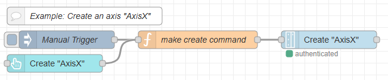
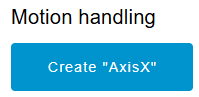

Dashboard 1.0
```JSON
[{"id":"359e6180.4b2b4e","type":"function","z":"4ff80d56.dd60fc","name":"make create command","func":"var newMsg = {};\nnewMsg.payload = {\"type\":\"string\",\"value\":\"AxisX\"}\nreturn newMsg;","outputs":1,"noerr":0,"initialize":"","finalize":"","x":450,"y":1140,"wires":[["166a0be8.1525fc"]]},{"id":"166a0be8.1525fc","type":"ctrlx-datalayer-request","z":"4ff80d56.dd60fc","device":"7b877229.678964","method":"CREATE","path":"motion/axs","payloadFormat":"value_type","name":"Create \"AxisX\"","x":680,"y":1140,"wires":[[]]},{"id":"2228f62a.ade41a","type":"comment","z":"4ff80d56.dd60fc","name":"Example: Create an axis \"AxisX\"","info":"","x":210,"y":1100,"wires":[]},{"id":"586a2197.7b6c98","type":"ui_button","z":"4ff80d56.dd60fc","name":"","group":"372098c9.3029b8","order":4,"width":"3","height":"1","passthru":false,"label":"Create \"AxisX\"","tooltip":"","color":"","bgcolor":"","icon":"","payload":"","payloadType":"str","topic":"topic","topicType":"msg","x":220,"y":1180,"wires":[["359e6180.4b2b4e"]]},{"id":"34651a40.a492fe","type":"inject","z":"4ff80d56.dd60fc","name":"Manual Trigger","props":[{"p":"payload"},{"p":"topic","vt":"str"}],"repeat":"","crontab":"","once":false,"onceDelay":0.1,"topic":"","payload":"","payloadType":"date","x":210,"y":1140,"wires":[["359e6180.4b2b4e"]]},{"id":"7b877229.678964","type":"ctrlx-config","name":"localhost","hostname":"localhost","debug":false},{"id":"372098c9.3029b8","type":"ui_group","name":"Motion handling","tab":"9cba2148.8c9148","order":2,"disp":true,"width":"6","collapse":false},{"id":"9cba2148.8c9148","type":"ui_tab","name":"Examples","icon":"dashboard","order":7,"disabled":false,"hidden":false}]
```

Dashboard 2.0
```JSON
[{"id":"359e6180.4b2b4e","type":"function","z":"af28b7f20c662b36","name":"make create command","func":"var newMsg = {};\nnewMsg.payload = {\"type\":\"string\",\"value\":\"AxisX\"}\nreturn newMsg;","outputs":1,"noerr":0,"initialize":"","finalize":"","x":380,"y":1700,"wires":[["166a0be8.1525fc"]]},{"id":"166a0be8.1525fc","type":"ctrlx-datalayer-request","z":"af28b7f20c662b36","device":"7b877229.678964","method":"CREATE","path":"motion/axs","payloadFormat":"value_type","name":"Create \"AxisX\"","pendingWarnLevel":"","pendingErrorLevel":"","x":600,"y":1700,"wires":[[]]},{"id":"2228f62a.ade41a","type":"comment","z":"af28b7f20c662b36","name":"Example: Create an axis \"AxisX\"","info":"","x":190,"y":1660,"wires":[]},{"id":"34651a40.a492fe","type":"inject","z":"af28b7f20c662b36","name":"Manual Trigger","props":[{"p":"payload"},{"p":"topic","vt":"str"}],"repeat":"","crontab":"","once":false,"onceDelay":0.1,"topic":"","payload":"","payloadType":"date","x":160,"y":1700,"wires":[["359e6180.4b2b4e"]]},{"id":"ba4e3b83675dec9f","type":"ui-button","z":"af28b7f20c662b36","group":"22a025b93b630564","name":"","label":"Create \"AxisX\"","order":2,"width":"2","height":"1","emulateClick":false,"tooltip":"","color":"","bgcolor":"","className":"","icon":"","iconPosition":"left","payload":"","payloadType":"str","topic":"topic","topicType":"msg","buttonColor":"","textColor":"","iconColor":"","enableClick":true,"enablePointerdown":false,"pointerdownPayload":"","pointerdownPayloadType":"str","enablePointerup":false,"pointerupPayload":"","pointerupPayloadType":"str","x":140,"y":1740,"wires":[["359e6180.4b2b4e"]]},{"id":"7b877229.678964","type":"ctrlx-config","name":"localhost","hostname":"localhost","debug":false},{"id":"22a025b93b630564","type":"ui-group","name":"Motion handling","page":"30e3bb10109e324b","width":6,"height":1,"order":1,"showTitle":true,"className":"","visible":"true","disabled":"false","groupType":"default"},{"id":"30e3bb10109e324b","type":"ui-page","name":"Page 1","ui":"ae50776f3a63db0e","path":"/page1","icon":"home","layout":"grid","theme":"a204995a5a44f2b2","breakpoints":[{"name":"Default","px":0,"cols":3},{"name":"Tablet","px":576,"cols":6},{"name":"Small Desktop","px":768,"cols":9},{"name":"Desktop","px":1024,"cols":12}],"order":1,"className":"","visible":true,"disabled":false},{"id":"ae50776f3a63db0e","type":"ui-base","name":"My Dashboard","path":"/dashboard","appIcon":"","includeClientData":true,"acceptsClientConfig":["ui-notification","ui-control"],"showPathInSidebar":false,"headerContent":"page","navigationStyle":"default","titleBarStyle":"default","showReconnectNotification":true,"notificationDisplayTime":1,"showDisconnectNotification":true,"allowInstall":false},{"id":"a204995a5a44f2b2","type":"ui-theme","name":"Default Theme","colors":{"surface":"#ffffff","primary":"#0094CE","bgPage":"#eeeeee","groupBg":"#ffffff","groupOutline":"#cccccc"},"sizes":{"density":"default","pagePadding":"12px","groupGap":"12px","groupBorderRadius":"4px","widgetGap":"12px"}},{"id":"6a3459913d4edcc2","type":"global-config","env":[],"modules":{"node-red-contrib-ctrlx-automation":"1.9.8","@flowfuse/node-red-dashboard":"1.30.2"}}]
```

### Switch and monitor power of an axis `AxisX`

The following example shows how to switch and monitor the power state of a motion axis `AxisX` in the ctrlX MOTION. The corresponding motion object has to be present and the state of the ctrlX MOTION has to be `Running`.

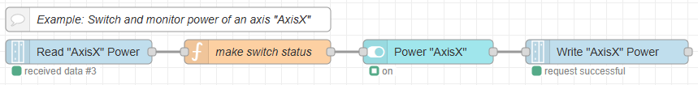
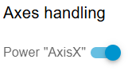

Dashboard 1.0
```JSON
[{"id":"7598c8e9.423f28","type":"comment","z":"4ff80d56.dd60fc","name":"Example: Switch and monitor power of an axis \"AxisX\"","info":"","x":280,"y":1380,"wires":[]},{"id":"f3001db9.f1ac5","type":"ctrlx-datalayer-request","z":"4ff80d56.dd60fc","device":"7b877229.678964","method":"CREATE","path":"motion/axs/AxisX/cmd/power","payloadFormat":"value_type","name":"Write \"AxisX\" Power","x":1080,"y":1420,"wires":[["ec10e282.671738"]]},{"id":"f790e337.3bfc98","type":"ui_switch","z":"4ff80d56.dd60fc","name":"","label":"Power \"AxisX\"","tooltip":"","group":"eb7620ae.6f5d","order":1,"width":"4","height":"1","passthru":false,"decouple":"true","topic":"","topicType":"str","style":"","onvalue":"{\"value\":true,\"type\":\"bool8\"}","onvalueType":"json","onicon":"","oncolor":"","offvalue":"{\"value\":false,\"type\":\"bool8\"}","offvalueType":"json","officon":"","offcolor":"","animate":false,"x":880,"y":1420,"wires":[["f3001db9.f1ac5"]]},{"id":"ec10e282.671738","type":"ctrlx-datalayer-request","z":"4ff80d56.dd60fc","device":"7b877229.678964","method":"READ","path":"motion/axs/AxisX/state/opstate/plcopen","payloadFormat":"value_type","name":"Read \"AxisX\" Power","x":440,"y":1420,"wires":[["be2d941e.9651c8"]]},{"id":"be2d941e.9651c8","type":"function","z":"4ff80d56.dd60fc","name":"make switch status","func":"var newMsg = {};\nif(msg.payload.value == \"OUTDATED\"){\n newMsg.payload = {\"type\":\"bool8\",\"value\":false} \n}\nelse if(msg.payload.value == \"DISABLED\") {\n newMsg.payload = {\"type\":\"bool8\",\"value\":false}\n} \nelse if(msg.payload.value == \"COORDINATED_MOTION_DISABLED\") {\n newMsg.payload = {\"type\":\"bool8\",\"value\":false} \n}\nelse if(msg.payload.value == \"ERRORSTOP\") {\n newMsg.payload = {\"type\":\"bool8\",\"value\":false} \n}\nelse {\n newMsg.payload = {\"type\":\"bool8\",\"value\":true} \n}\nreturn newMsg;","outputs":1,"noerr":0,"initialize":"","finalize":"","x":670,"y":1420,"wires":[["f790e337.3bfc98"]]},{"id":"bb714120.4807d","type":"inject","z":"4ff80d56.dd60fc","name":"Manual Trigger","props":[{"p":"payload"},{"p":"topic","vt":"str"}],"repeat":"","crontab":"","once":true,"onceDelay":0.1,"topic":"","payload":"","payloadType":"date","x":200,"y":1420,"wires":[["ec10e282.671738"]]},{"id":"7b877229.678964","type":"ctrlx-config","name":"localhost","hostname":"localhost","debug":false},{"id":"eb7620ae.6f5d","type":"ui_group","name":"Axes handling","tab":"9cba2148.8c9148","order":3,"disp":true,"width":"5","collapse":false},{"id":"9cba2148.8c9148","type":"ui_tab","name":"Examples","icon":"dashboard","order":7,"disabled":false,"hidden":false}]
```

Dashboard 2.0
```JSON
[{"id":"7598c8e9.423f28","type":"comment","z":"af28b7f20c662b36","name":"Example: Switch and monitor power of an axis \"AxisX\"","info":"","x":260,"y":1800,"wires":[]},{"id":"f3001db9.f1ac5","type":"ctrlx-datalayer-request","z":"af28b7f20c662b36","device":"7b877229.678964","method":"CREATE","path":"motion/axs/AxisX/cmd/power","payloadFormat":"value_type","name":"Write \"AxisX\" Power","pendingWarnLevel":"","pendingErrorLevel":"","x":800,"y":1840,"wires":[[]]},{"id":"be2d941e.9651c8","type":"function","z":"af28b7f20c662b36","name":"make switch status","func":"var newMsg = {};\nif(msg.payload == \"OUTDATED\"){\n newMsg.payload = {\"type\":\"bool8\",\"value\":false} \n}\nelse if(msg.payload == \"DISABLED\") {\n newMsg.payload = {\"type\":\"bool8\",\"value\":false}\n} \nelse if(msg.payload == \"COORDINATED_MOTION_DISABLED\") {\n newMsg.payload = {\"type\":\"bool8\",\"value\":false} \n}\nelse if(msg.payload == \"ERRORSTOP\") {\n newMsg.payload = {\"type\":\"bool8\",\"value\":false} \n}\nelse {\n newMsg.payload = {\"type\":\"bool8\",\"value\":true} \n}\nreturn newMsg;","outputs":1,"timeout":"","noerr":0,"initialize":"","finalize":"","libs":[],"x":370,"y":1840,"wires":[["cba3cefa3f93963a"]]},{"id":"90a3834d597e13d4","type":"ctrlx-datalayer-subscribe","z":"af28b7f20c662b36","subscription":"632bcc2.eddf134","path":"motion/axs/AxisX/state/opstate/plcopen","name":"Read \"AxisX\" Power","inputs":0,"x":150,"y":1840,"wires":[["be2d941e.9651c8"]]},{"id":"cba3cefa3f93963a","type":"ui-switch","z":"af28b7f20c662b36","name":"","label":"Power \"AxisX\"","group":"3a3c05d390239fbd","order":2,"width":"2","height":"1","passthru":false,"decouple":true,"topic":"topic","topicType":"msg","style":"","className":"","layout":"row-left","clickableArea":"switch","onvalue":"{\"type\":\"bool8\",\"value\":true} ","onvalueType":"json","onicon":"","oncolor":"","offvalue":"{\"type\":\"bool8\",\"value\":false} ","offvalueType":"json","officon":"","offcolor":"","x":580,"y":1840,"wires":[["f3001db9.f1ac5"]]},{"id":"7b877229.678964","type":"ctrlx-config","name":"localhost","hostname":"localhost","debug":false},{"id":"632bcc2.eddf134","type":"ctrlx-config-subscription","device":"7b877229.678964","name":"Sub_Default","publishIntervalMs":"","samplingInterval":"","errorInterval":"","keepaliveInterval":"","queueSize":"","deadbandValue":""},{"id":"3a3c05d390239fbd","type":"ui-group","name":"Axes handling","page":"30e3bb10109e324b","width":6,"height":1,"order":1,"showTitle":true,"className":"","visible":"true","disabled":"false","groupType":"default"},{"id":"30e3bb10109e324b","type":"ui-page","name":"Page 1","ui":"ae50776f3a63db0e","path":"/page1","icon":"home","layout":"grid","theme":"a204995a5a44f2b2","breakpoints":[{"name":"Default","px":0,"cols":3},{"name":"Tablet","px":576,"cols":6},{"name":"Small Desktop","px":768,"cols":9},{"name":"Desktop","px":1024,"cols":12}],"order":1,"className":"","visible":true,"disabled":false},{"id":"ae50776f3a63db0e","type":"ui-base","name":"My Dashboard","path":"/dashboard","appIcon":"","includeClientData":true,"acceptsClientConfig":["ui-notification","ui-control"],"showPathInSidebar":false,"headerContent":"page","navigationStyle":"default","titleBarStyle":"default","showReconnectNotification":true,"notificationDisplayTime":1,"showDisconnectNotification":true,"allowInstall":false},{"id":"a204995a5a44f2b2","type":"ui-theme","name":"Default Theme","colors":{"surface":"#ffffff","primary":"#0094CE","bgPage":"#eeeeee","groupBg":"#ffffff","groupOutline":"#cccccc"},"sizes":{"density":"default","pagePadding":"12px","groupGap":"12px","groupBorderRadius":"4px","widgetGap":"12px"}},{"id":"e4bd266a6dff1d21","type":"global-config","env":[],"modules":{"node-red-contrib-ctrlx-automation":"1.9.8","@flowfuse/node-red-dashboard":"1.30.2"}}]
```

### Monitor position of an axis `AxisX`

The following example shows how to monitor the interpolated position of a motion axis `AxisX` in the ctrlX MOTION. The corresponding motion object has to be present and the state of the ctrlX MOTION has to be `Running`.

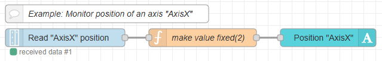
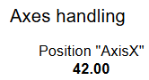

Dashboard 1.0 
```JSON
[{"id":"657f7c1a.cf6cec","type":"ctrlx-datalayer-subscribe","z":"4ff80d56.dd60fc","subscription":"632bcc2.eddf134","path":"motion/axs/AxisX/state/values/ipo/pos/mm","name":"Read \"AxisX\" pos","x":160,"y":1560,"wires":[["1cfdc1d6.d4e5de"]]},{"id":"85fa0533.8ab3d8","type":"comment","z":"4ff80d56.dd60fc","name":"Example: Monitor position of an axis \"AxisX\"","info":"","x":240,"y":1520,"wires":[]},{"id":"122d92a4.f6a56d","type":"ui_text","z":"4ff80d56.dd60fc","group":"eb7620ae.6f5d","order":2,"width":"3","height":"1","name":"","label":"Position \"AxisX\"","format":"{{msg.payload}}","layout":"col-center","x":620,"y":1560,"wires":[]},{"id":"1cfdc1d6.d4e5de","type":"function","z":"4ff80d56.dd60fc","name":"make value fixed(2)","func":"var newMsg = {};\nnewMsg.payload = msg.payload.toFixed(2);\nreturn newMsg;","outputs":1,"noerr":0,"initialize":"","finalize":"","x":390,"y":1560,"wires":[["122d92a4.f6a56d"]]},{"id":"632bcc2.eddf134","type":"ctrlx-config-subscription","device":"7b877229.678964","name":"Sub_Default","publishIntervalMs":""},{"id":"eb7620ae.6f5d","type":"ui_group","name":"Axes handling","tab":"9cba2148.8c9148","order":3,"disp":true,"width":"5","collapse":false},{"id":"7b877229.678964","type":"ctrlx-config","name":"localhost","hostname":"localhost","debug":false},{"id":"9cba2148.8c9148","type":"ui_tab","name":"Examples","icon":"dashboard","order":7,"disabled":false,"hidden":false}]
```

Dashboard 2.0 
```JSON
[{"id":"657f7c1a.cf6cec","type":"ctrlx-datalayer-subscribe","z":"af28b7f20c662b36","subscription":"632bcc2.eddf134","path":"motion/axs/AxisX/state/values/ipo/pos/mm","name":"Read \"AxisX\" position","inputs":0,"x":160,"y":1940,"wires":[["1cfdc1d6.d4e5de"]]},{"id":"85fa0533.8ab3d8","type":"comment","z":"af28b7f20c662b36","name":"Example: Monitor position of an axis \"AxisX\"","info":"","x":230,"y":1900,"wires":[]},{"id":"1cfdc1d6.d4e5de","type":"function","z":"af28b7f20c662b36","name":"make value fixed(2)","func":"var newMsg = {};\nnewMsg.payload = msg.payload.toFixed(2);\nreturn newMsg;","outputs":1,"noerr":0,"initialize":"","finalize":"","x":390,"y":1940,"wires":[["acc09c4e09ab2306"]]},{"id":"acc09c4e09ab2306","type":"ui-text","z":"af28b7f20c662b36","group":"3a3c05d390239fbd","order":5,"width":"2","height":"1","name":"","label":"Position \"AxisX\"","format":"{{msg.payload}}","layout":"col-center","style":false,"font":"","fontSize":16,"color":"#717171","wrapText":false,"className":"","value":"payload","valueType":"msg","x":600,"y":1940,"wires":[]},{"id":"632bcc2.eddf134","type":"ctrlx-config-subscription","device":"7b877229.678964","name":"Sub_Default","publishIntervalMs":"","samplingInterval":"","errorInterval":"","keepaliveInterval":"","queueSize":"","deadbandValue":""},{"id":"3a3c05d390239fbd","type":"ui-group","name":"Axes handling","page":"30e3bb10109e324b","width":6,"height":1,"order":1,"showTitle":true,"className":"","visible":"true","disabled":"false","groupType":"default"},{"id":"7b877229.678964","type":"ctrlx-config","name":"localhost","hostname":"localhost","debug":false},{"id":"30e3bb10109e324b","type":"ui-page","name":"Page 1","ui":"ae50776f3a63db0e","path":"/page1","icon":"home","layout":"grid","theme":"a204995a5a44f2b2","breakpoints":[{"name":"Default","px":0,"cols":3},{"name":"Tablet","px":576,"cols":6},{"name":"Small Desktop","px":768,"cols":9},{"name":"Desktop","px":1024,"cols":12}],"order":1,"className":"","visible":true,"disabled":false},{"id":"ae50776f3a63db0e","type":"ui-base","name":"My Dashboard","path":"/dashboard","appIcon":"","includeClientData":true,"acceptsClientConfig":["ui-notification","ui-control"],"showPathInSidebar":false,"headerContent":"page","navigationStyle":"default","titleBarStyle":"default","showReconnectNotification":true,"notificationDisplayTime":1,"showDisconnectNotification":true,"allowInstall":false},{"id":"a204995a5a44f2b2","type":"ui-theme","name":"Default Theme","colors":{"surface":"#ffffff","primary":"#0094CE","bgPage":"#eeeeee","groupBg":"#ffffff","groupOutline":"#cccccc"},"sizes":{"density":"default","pagePadding":"12px","groupGap":"12px","groupBorderRadius":"4px","widgetGap":"12px"}},{"id":"b1c718d9dc5138d2","type":"global-config","env":[],"modules":{"node-red-contrib-ctrlx-automation":"1.9.8","@flowfuse/node-red-dashboard":"1.30.2"}}]
```

### Absolute positioning of an axis `AxisX`

The following example shows how to  position absolute a motion axis `AxisX` in the ctrlX MOTION to position = 10 with velocity, acceleration, deceleration = 10 and jerk = 0. The state of the ctrlX MOTION has to be `Running`. The corresponding motion object has to be present and its state has to be `STANDSTILL` (powered on, [see axis state machine documentation](https://docs.automation.boschrexroth.com/doc/359516816/axis-objects/latest/en/)).

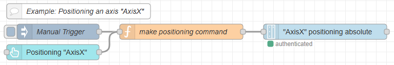
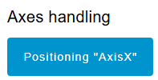

Dashboard 1.0
```JSON
[{"id":"ef2f6f42.26f6b8","type":"function","z":"4ff80d56.dd60fc","name":"make pos command","func":"var newMsg = {};\nnewMsg.payload = {\n      \"type\":\"object\",\n      \"value\":{\n\t    \"axsPos\":\"10\",\"buffered\":false,\"lim\":{\"vel\":\"10\",\"acc\":\"10\",\"dec\":\"10\",\"jrkAcc\":\"0\",\"jrkDec\":\"0\"}\n\t    }\n     }\nreturn newMsg;","outputs":1,"noerr":0,"initialize":"","finalize":"","x":440,"y":1680,"wires":[["c27d8d3a.aba638"]]},{"id":"c27d8d3a.aba638","type":"ctrlx-datalayer-request","z":"4ff80d56.dd60fc","device":"7b877229.678964","method":"CREATE","path":"motion/axs/AxisX/cmd/pos-abs","payloadFormat":"value_type","name":"\"AxisX\" pos abs","x":670,"y":1680,"wires":[[]]},{"id":"569584de.0946e4","type":"comment","z":"4ff80d56.dd60fc","name":"Example: Move an axis \"AxisX\"","info":"","x":200,"y":1640,"wires":[]},{"id":"fcc3bed0.080f48","type":"ui_button","z":"4ff80d56.dd60fc","name":"","group":"eb7620ae.6f5d","order":3,"width":"2","height":"1","passthru":false,"label":"Move \"AxisX\"","tooltip":"","color":"","bgcolor":"","icon":"","payload":"","payloadType":"str","topic":"topic","topicType":"msg","x":220,"y":1720,"wires":[["ef2f6f42.26f6b8"]]},{"id":"14a61d63.0cf1ab","type":"inject","z":"4ff80d56.dd60fc","name":"Manual Trigger","props":[{"p":"payload"},{"p":"topic","vt":"str"}],"repeat":"","crontab":"","once":false,"onceDelay":0.1,"topic":"","payload":"","payloadType":"date","x":200,"y":1680,"wires":[["ef2f6f42.26f6b8"]]},{"id":"7b877229.678964","type":"ctrlx-config","name":"localhost","hostname":"localhost","debug":false},{"id":"eb7620ae.6f5d","type":"ui_group","name":"Axes handling","tab":"9cba2148.8c9148","order":3,"disp":true,"width":"5","collapse":false},{"id":"9cba2148.8c9148","type":"ui_tab","name":"Examples","icon":"dashboard","order":7,"disabled":false,"hidden":false}]
```

Dashboard 2.0
```JSON
[{"id":"ef2f6f42.26f6b8","type":"function","z":"af28b7f20c662b36","name":"make positioning command","func":"var newMsg = {};\nnewMsg.payload = {      \n    \"type\":\"object\",      \n    \"value\":{\t    \n        \"axsPos\":\"10\",\"buffered\":false,\"lim\":{\"vel\":\"10\",\"acc\":\"10\",\"dec\":\"10\",\"jrkAcc\":\"0\",\"jrkDec\":\"0\"}\n        } \n    }\nreturn newMsg;","outputs":1,"timeout":"","noerr":0,"initialize":"","finalize":"","libs":[],"x":400,"y":2040,"wires":[["c27d8d3a.aba638"]]},{"id":"c27d8d3a.aba638","type":"ctrlx-datalayer-request","z":"af28b7f20c662b36","device":"7b877229.678964","method":"CREATE","path":"motion/axs/AxisX/cmd/pos-abs","payloadFormat":"value_type","name":"\"AxisX\" positioning absolute","pendingWarnLevel":"","pendingErrorLevel":"","x":680,"y":2040,"wires":[[]]},{"id":"569584de.0946e4","type":"comment","z":"af28b7f20c662b36","name":"Example: Absolute positioning of an axis \"AxisX\"","info":"","x":240,"y":2000,"wires":[]},{"id":"14a61d63.0cf1ab","type":"inject","z":"af28b7f20c662b36","name":"Manual Trigger","props":[{"p":"payload"},{"p":"topic","vt":"str"}],"repeat":"","crontab":"","once":false,"onceDelay":0.1,"topic":"","payload":"","payloadType":"date","x":160,"y":2040,"wires":[["ef2f6f42.26f6b8"]]},{"id":"62c2a7a79791b991","type":"ui-button","z":"af28b7f20c662b36","group":"3a3c05d390239fbd","name":"","label":"Positioning \"AxisX\"","order":4,"width":"2","height":"1","emulateClick":false,"tooltip":"","color":"","bgcolor":"","className":"","icon":"","iconPosition":"left","payload":"","payloadType":"str","topic":"topic","topicType":"msg","buttonColor":"","textColor":"","iconColor":"","enableClick":true,"enablePointerdown":false,"pointerdownPayload":"","pointerdownPayloadType":"str","enablePointerup":false,"pointerupPayload":"","pointerupPayloadType":"str","x":150,"y":2080,"wires":[["ef2f6f42.26f6b8"]]},{"id":"7b877229.678964","type":"ctrlx-config","name":"localhost","hostname":"localhost","debug":false},{"id":"3a3c05d390239fbd","type":"ui-group","name":"Axes handling","page":"30e3bb10109e324b","width":6,"height":1,"order":1,"showTitle":true,"className":"","visible":"true","disabled":"false","groupType":"default"},{"id":"30e3bb10109e324b","type":"ui-page","name":"Page 1","ui":"ae50776f3a63db0e","path":"/page1","icon":"home","layout":"grid","theme":"a204995a5a44f2b2","breakpoints":[{"name":"Default","px":0,"cols":3},{"name":"Tablet","px":576,"cols":6},{"name":"Small Desktop","px":768,"cols":9},{"name":"Desktop","px":1024,"cols":12}],"order":1,"className":"","visible":true,"disabled":false},{"id":"ae50776f3a63db0e","type":"ui-base","name":"My Dashboard","path":"/dashboard","appIcon":"","includeClientData":true,"acceptsClientConfig":["ui-notification","ui-control"],"showPathInSidebar":false,"headerContent":"page","navigationStyle":"default","titleBarStyle":"default","showReconnectNotification":true,"notificationDisplayTime":1,"showDisconnectNotification":true,"allowInstall":false},{"id":"a204995a5a44f2b2","type":"ui-theme","name":"Default Theme","colors":{"surface":"#ffffff","primary":"#0094CE","bgPage":"#eeeeee","groupBg":"#ffffff","groupOutline":"#cccccc"},"sizes":{"density":"default","pagePadding":"12px","groupGap":"12px","groupBorderRadius":"4px","widgetGap":"12px"}},{"id":"81b0506a5927c905","type":"global-config","env":[],"modules":{"node-red-contrib-ctrlx-automation":"1.9.8","@flowfuse/node-red-dashboard":"1.30.2"}}]
```

### Abort movement of an axis `AxisX`

The following example shows how to abort an movement of a motion axis `AxisX` in the ctrlX MOTION with deceleration = 10 and jerk = 0. The state of the ctrlX MOTION has to be `Running`. The corresponding motion object has to be present and its state has to be `DISCRETE_MOTION` ([see axis state machine documentation](https://docs.automation.boschrexroth.com/doc/359516816/axis-objects/latest/en/)).

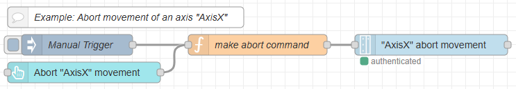
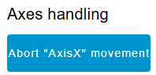

Dashboard 1.0
```JSON
[{"id":"79e751dd.c8402","type":"function","z":"4ff80d56.dd60fc","name":"make abort command","func":"var newMsg = {};\nnewMsg.payload = {\n      \"type\":\"object\",\n      \"value\":{\"dec\":\"10\",\"jrkDec\":\"0\"}\n     }\nreturn newMsg;","outputs":1,"noerr":0,"initialize":"","finalize":"","libs":[],"x":440,"y":1840,"wires":[["7cb11da0.1916bc"]]},{"id":"7cb11da0.1916bc","type":"ctrlx-datalayer-request","z":"4ff80d56.dd60fc","device":"7b877229.678964","method":"CREATE","path":"motion/axs/AxisX/cmd/abort","payloadFormat":"value_type","name":"\"AxisX\" abort","x":660,"y":1840,"wires":[[]]},{"id":"dc3e7b2.6ab9388","type":"comment","z":"4ff80d56.dd60fc","name":"Example: Abort an axis movement of \"AxisX\"","info":"","x":240,"y":1800,"wires":[]},{"id":"a11e7b1a.b3a8d","type":"ui_button","z":"4ff80d56.dd60fc","name":"","group":"eb7620ae.6f5d","order":3,"width":"2","height":"1","passthru":false,"label":"Stop \"AxisX\"","tooltip":"","color":"","bgcolor":"","icon":"","payload":"","payloadType":"str","topic":"topic","topicType":"msg","x":210,"y":1880,"wires":[["79e751dd.c8402"]]},{"id":"690b0e68.ffc46","type":"inject","z":"4ff80d56.dd60fc","name":"Manual Trigger","props":[{"p":"payload"},{"p":"topic","vt":"str"}],"repeat":"","crontab":"","once":false,"onceDelay":0.1,"topic":"","payload":"","payloadType":"date","x":200,"y":1840,"wires":[["79e751dd.c8402"]]},{"id":"7b877229.678964","type":"ctrlx-config","name":"localhost","hostname":"localhost","debug":false},{"id":"eb7620ae.6f5d","type":"ui_group","name":"Axes handling","tab":"9cba2148.8c9148","order":3,"disp":true,"width":"5","collapse":false},{"id":"9cba2148.8c9148","type":"ui_tab","name":"Examples","icon":"dashboard","order":7,"disabled":false,"hidden":false}]
```

Dashboard 2.0
```JSON
[{"id":"79e751dd.c8402","type":"function","z":"af28b7f20c662b36","name":"make abort command","func":"var newMsg = {};\nnewMsg.payload = {\n      \"type\":\"object\",\n      \"value\":{\"dec\":\"10\",\"jrkDec\":\"0\"}\n     }\nreturn newMsg;","outputs":1,"noerr":0,"initialize":"","finalize":"","libs":[],"x":420,"y":2180,"wires":[["7cb11da0.1916bc"]]},{"id":"7cb11da0.1916bc","type":"ctrlx-datalayer-request","z":"af28b7f20c662b36","device":"7b877229.678964","method":"CREATE","path":"motion/axs/AxisX/cmd/abort","payloadFormat":"value_type","name":"\"AxisX\" abort movement","pendingWarnLevel":"","pendingErrorLevel":"","x":670,"y":2180,"wires":[[]]},{"id":"57ca5d046e83f239","type":"comment","z":"af28b7f20c662b36","name":"Example: Abort movement of an axis \"AxisX\"","info":"","x":230,"y":2140,"wires":[]},{"id":"690b0e68.ffc46","type":"inject","z":"af28b7f20c662b36","name":"Manual Trigger","props":[{"p":"payload"},{"p":"topic","vt":"str"}],"repeat":"","crontab":"","once":false,"onceDelay":0.1,"topic":"","payload":"","payloadType":"date","x":160,"y":2180,"wires":[["79e751dd.c8402"]]},{"id":"8202249c2f69a0c6","type":"ui-button","z":"af28b7f20c662b36","group":"3a3c05d390239fbd","name":"","label":"Abort \"AxisX\" movement","order":3,"width":"2","height":"1","emulateClick":false,"tooltip":"","color":"","bgcolor":"","className":"","icon":"","iconPosition":"left","payload":"","payloadType":"str","topic":"topic","topicType":"msg","buttonColor":"","textColor":"","iconColor":"","enableClick":true,"enablePointerdown":false,"pointerdownPayload":"","pointerdownPayloadType":"str","enablePointerup":false,"pointerupPayload":"","pointerupPayloadType":"str","x":170,"y":2220,"wires":[["79e751dd.c8402"]]},{"id":"7b877229.678964","type":"ctrlx-config","name":"localhost","hostname":"localhost","debug":false},{"id":"3a3c05d390239fbd","type":"ui-group","name":"Axes handling","page":"30e3bb10109e324b","width":6,"height":1,"order":1,"showTitle":true,"className":"","visible":"true","disabled":"false","groupType":"default"},{"id":"30e3bb10109e324b","type":"ui-page","name":"Page 1","ui":"ae50776f3a63db0e","path":"/page1","icon":"home","layout":"grid","theme":"a204995a5a44f2b2","breakpoints":[{"name":"Default","px":0,"cols":3},{"name":"Tablet","px":576,"cols":6},{"name":"Small Desktop","px":768,"cols":9},{"name":"Desktop","px":1024,"cols":12}],"order":1,"className":"","visible":true,"disabled":false},{"id":"ae50776f3a63db0e","type":"ui-base","name":"My Dashboard","path":"/dashboard","appIcon":"","includeClientData":true,"acceptsClientConfig":["ui-notification","ui-control"],"showPathInSidebar":false,"headerContent":"page","navigationStyle":"default","titleBarStyle":"default","showReconnectNotification":true,"notificationDisplayTime":1,"showDisconnectNotification":true,"allowInstall":false},{"id":"a204995a5a44f2b2","type":"ui-theme","name":"Default Theme","colors":{"surface":"#ffffff","primary":"#0094CE","bgPage":"#eeeeee","groupBg":"#ffffff","groupOutline":"#cccccc"},"sizes":{"density":"default","pagePadding":"12px","groupGap":"12px","groupBorderRadius":"4px","widgetGap":"12px"}},{"id":"3570b1cea1b15850","type":"global-config","env":[],"modules":{"node-red-contrib-ctrlx-automation":"1.9.8","@flowfuse/node-red-dashboard":"1.30.2"}}]
```

### Reset an error of an axis `AxisX`

The following example shows how to reset an error of a motion axis `AxisX` in the ctrlX MOTION. The state of the ctrlX MOTION has to be `Running`. The corresponding motion object has to be present and its state has to be `ERRORSTOP` ([see axis state machine documentation](https://docs.automation.boschrexroth.com/doc/359516816/axis-objects/latest/en/)).

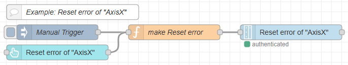
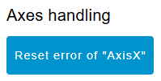

Dashboard 1.0
```JSON
[{"id":"d134226bd80e1be5","type":"function","z":"ec52577b3db3c043","name":"make Reset error","func":"msg.payload = null;\nreturn msg;","outputs":1,"noerr":0,"initialize":"","finalize":"","libs":[],"x":590,"y":280,"wires":[["c654bbe59916dcd8"]]},{"id":"c654bbe59916dcd8","type":"ctrlx-datalayer-request","z":"ec52577b3db3c043","device":"7b877229.678964","method":"CREATE","path":"motion/axs/AxisX/cmd/reset","payloadFormat":"value_type","name":"Reset error of \"AxisX\"","x":820,"y":280,"wires":[[]]},{"id":"ee10a5d37883f0b2","type":"comment","z":"ec52577b3db3c043","name":"Example: Reset error of \"AxisX\"","info":"","x":350,"y":240,"wires":[]},{"id":"7e4f970aeb1a9af7","type":"ui_button","z":"ec52577b3db3c043","name":"","group":"eb7620ae.6f5d","order":4,"width":"3","height":"1","passthru":false,"label":"Reset error of \"AxisX\"","tooltip":"","color":"","bgcolor":"","className":"","icon":"","payload":"","payloadType":"str","topic":"topic","topicType":"msg","x":340,"y":320,"wires":[["d134226bd80e1be5"]]},{"id":"a68723ea4473153d","type":"inject","z":"ec52577b3db3c043","name":"Manual Trigger","props":[{"p":"payload"},{"p":"topic","vt":"str"}],"repeat":"","crontab":"","once":false,"onceDelay":0.1,"topic":"","payload":"","payloadType":"date","x":340,"y":280,"wires":[["d134226bd80e1be5"]]},{"id":"7b877229.678964","type":"ctrlx-config","name":"localhost","hostname":"localhost","debug":false},{"id":"eb7620ae.6f5d","type":"ui_group","name":"Axes handling","tab":"9cba2148.8c9148","order":3,"disp":true,"width":"5","collapse":false},{"id":"9cba2148.8c9148","type":"ui_tab","name":"Examples","icon":"dashboard","order":7,"disabled":false,"hidden":false}]
```

Dashboard 2.0
```JSON
[{"id":"d134226bd80e1be5","type":"function","z":"af28b7f20c662b36","name":"make Reset error","func":"msg.payload = null;\nreturn msg;","outputs":1,"noerr":0,"initialize":"","finalize":"","libs":[],"x":370,"y":2320,"wires":[["c654bbe59916dcd8"]]},{"id":"c654bbe59916dcd8","type":"ctrlx-datalayer-request","z":"af28b7f20c662b36","device":"7b877229.678964","method":"CREATE","path":"motion/axs/AxisX/cmd/reset","payloadFormat":"value_type","name":"Reset error of \"AxisX\"","pendingWarnLevel":"","pendingErrorLevel":"","x":600,"y":2320,"wires":[[]]},{"id":"ee10a5d37883f0b2","type":"comment","z":"af28b7f20c662b36","name":"Example: Reset error of \"AxisX\"","info":"","x":190,"y":2280,"wires":[]},{"id":"a68723ea4473153d","type":"inject","z":"af28b7f20c662b36","name":"Manual Trigger","props":[{"p":"payload"},{"p":"topic","vt":"str"}],"repeat":"","crontab":"","once":false,"onceDelay":0.1,"topic":"","payload":"","payloadType":"date","x":160,"y":2320,"wires":[["d134226bd80e1be5"]]},{"id":"b6ce21aaefb38b56","type":"ui-button","z":"af28b7f20c662b36","group":"3a3c05d390239fbd","name":"","label":"Reset error of \"AxisX\"","order":5,"width":"2","height":"1","emulateClick":false,"tooltip":"","color":"","bgcolor":"","className":"","icon":"","iconPosition":"left","payload":"","payloadType":"str","topic":"topic","topicType":"msg","buttonColor":"","textColor":"","iconColor":"","enableClick":true,"enablePointerdown":false,"pointerdownPayload":"","pointerdownPayloadType":"str","enablePointerup":false,"pointerupPayload":"","pointerupPayloadType":"str","x":160,"y":2360,"wires":[["d134226bd80e1be5"]]},{"id":"7b877229.678964","type":"ctrlx-config","name":"localhost","hostname":"localhost","debug":false},{"id":"3a3c05d390239fbd","type":"ui-group","name":"Axes handling","page":"30e3bb10109e324b","width":6,"height":1,"order":1,"showTitle":true,"className":"","visible":"true","disabled":"false","groupType":"default"},{"id":"30e3bb10109e324b","type":"ui-page","name":"Page 1","ui":"ae50776f3a63db0e","path":"/page1","icon":"home","layout":"grid","theme":"a204995a5a44f2b2","breakpoints":[{"name":"Default","px":0,"cols":3},{"name":"Tablet","px":576,"cols":6},{"name":"Small Desktop","px":768,"cols":9},{"name":"Desktop","px":1024,"cols":12}],"order":1,"className":"","visible":true,"disabled":false},{"id":"ae50776f3a63db0e","type":"ui-base","name":"My Dashboard","path":"/dashboard","appIcon":"","includeClientData":true,"acceptsClientConfig":["ui-notification","ui-control"],"showPathInSidebar":false,"headerContent":"page","navigationStyle":"default","titleBarStyle":"default","showReconnectNotification":true,"notificationDisplayTime":1,"showDisconnectNotification":true,"allowInstall":false},{"id":"a204995a5a44f2b2","type":"ui-theme","name":"Default Theme","colors":{"surface":"#ffffff","primary":"#0094CE","bgPage":"#eeeeee","groupBg":"#ffffff","groupOutline":"#cccccc"},"sizes":{"density":"default","pagePadding":"12px","groupGap":"12px","groupBorderRadius":"4px","widgetGap":"12px"}},{"id":"bbbad2206b96fc4a","type":"global-config","env":[],"modules":{"node-red-contrib-ctrlx-automation":"1.9.8","@flowfuse/node-red-dashboard":"1.30.2"}}]
```

### Group axes to a kinematic `Robot`

The following example shows how to add the axes (`X`,`Y`,`Z`) to a kinematic `Robot`. Each axis must be defined as a kinematic axes. Axis states must be `STANDSTILL`. This command will transition the grouped axes into state `COORDINATED_MOTION`. Axes must be grouped and the kinematic must be enabled prior to physical motion ([see axis state machine documentation](https://docs.automation.boschrexroth.com/doc/359516816/axis-objects/latest/en/)).

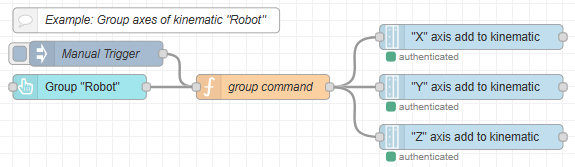
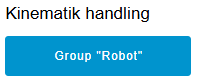

Dashboard 1.0
```JSON
[{"id":"57f25cb632d4c907","type":"function","z":"3f1e15ba92536e91","name":"group command","func":"var newMsg = {};\nnewMsg.payload = {\n    \"type\": \"object\",\n    \"value\": {\n        \"kinName\": \"Robot\",\n        \"buffered\": false\n    }\n}\nreturn newMsg;","outputs":1,"noerr":0,"initialize":"","finalize":"","libs":[],"x":380,"y":200,"wires":[["6a752590b2876ba5","49122ab1c98b446b","c0da08a13cfeda35"]]},{"id":"6a752590b2876ba5","type":"ctrlx-datalayer-request","z":"3f1e15ba92536e91","device":"7b877229.678964","method":"CREATE","path":"motion/axs/X/cmd/add-to-kin","payloadFormat":"value_type","name":"\"X\" axis add to kinematic","x":650,"y":140,"wires":[[]]},{"id":"a42e5536c1a2763e","type":"ui_button","z":"3f1e15ba92536e91","name":"","group":"85755e14b124f041","order":3,"width":"3","height":"1","passthru":false,"label":"Group \"Robot\"","tooltip":"","color":"","bgcolor":"","className":"","icon":"","payload":"","payloadType":"str","topic":"topic","topicType":"msg","x":180,"y":200,"wires":[["57f25cb632d4c907"]]},{"id":"b5d6748b8bc10a6a","type":"inject","z":"3f1e15ba92536e91","name":"Manual Trigger","props":[{"p":"payload"},{"p":"topic","vt":"str"}],"repeat":"","crontab":"","once":false,"onceDelay":0.1,"topic":"","payload":"","payloadType":"date","x":180,"y":160,"wires":[["57f25cb632d4c907"]]},{"id":"aa78fd51fee8f256","type":"comment","z":"3f1e15ba92536e91","name":"Example: Group axes of kinematic \"Robot\"","info":"","x":220,"y":120,"wires":[]},{"id":"49122ab1c98b446b","type":"ctrlx-datalayer-request","z":"3f1e15ba92536e91","device":"7b877229.678964","method":"CREATE","path":"motion/axs/Y/cmd/add-to-kin","payloadFormat":"value_type","name":"\"Y\" axis add to kinematic","x":650,"y":200,"wires":[[]]},{"id":"c0da08a13cfeda35","type":"ctrlx-datalayer-request","z":"3f1e15ba92536e91","device":"7b877229.678964","method":"CREATE","path":"motion/axs/Z/cmd/add-to-kin","payloadFormat":"value_type","name":"\"Z\" axis add to kinematic","x":650,"y":260,"wires":[[]]},{"id":"7b877229.678964","type":"ctrlx-config","name":"localhost","hostname":"localhost","debug":false},{"id":"85755e14b124f041","type":"ui_group","name":"Kinematic Handling","tab":"9cba2148.8c9148","order":3,"disp":true,"width":"6","collapse":false,"className":""},{"id":"9cba2148.8c9148","type":"ui_tab","name":"Examples","icon":"dashboard","order":7,"disabled":false,"hidden":false}]
```

Dashboard 2.0
```JSON
[{"id":"57f25cb632d4c907","type":"function","z":"af28b7f20c662b36","name":"group command","func":"var newMsg = {};\nnewMsg.payload = {\n    \"type\": \"object\",\n    \"value\": {\n        \"kinName\": \"Robot\",\n        \"buffered\": false\n    }\n}\nreturn newMsg;","outputs":1,"noerr":0,"initialize":"","finalize":"","libs":[],"x":360,"y":2580,"wires":[["6a752590b2876ba5","49122ab1c98b446b","c0da08a13cfeda35"]]},{"id":"6a752590b2876ba5","type":"ctrlx-datalayer-request","z":"af28b7f20c662b36","device":"7b877229.678964","method":"CREATE","path":"motion/axs/X/cmd/add-to-kin","payloadFormat":"value_type","name":"\"X\" axis add to kinematic","pendingWarnLevel":"","pendingErrorLevel":"","x":610,"y":2520,"wires":[[]]},{"id":"b5d6748b8bc10a6a","type":"inject","z":"af28b7f20c662b36","name":"Manual Trigger","props":[{"p":"payload"},{"p":"topic","vt":"str"}],"repeat":"","crontab":"","once":false,"onceDelay":0.1,"topic":"","payload":"","payloadType":"date","x":160,"y":2540,"wires":[["57f25cb632d4c907"]]},{"id":"aa78fd51fee8f256","type":"comment","z":"af28b7f20c662b36","name":"Example: Group axes of kinematic \"Robot\"","info":"","x":220,"y":2500,"wires":[]},{"id":"49122ab1c98b446b","type":"ctrlx-datalayer-request","z":"af28b7f20c662b36","device":"7b877229.678964","method":"CREATE","path":"motion/axs/Y/cmd/add-to-kin","payloadFormat":"value_type","name":"\"Y\" axis add to kinematic","pendingWarnLevel":"","pendingErrorLevel":"","x":610,"y":2580,"wires":[[]]},{"id":"c0da08a13cfeda35","type":"ctrlx-datalayer-request","z":"af28b7f20c662b36","device":"7b877229.678964","method":"CREATE","path":"motion/axs/Z/cmd/add-to-kin","payloadFormat":"value_type","name":"\"Z\" axis add to kinematic","pendingWarnLevel":"","pendingErrorLevel":"","x":610,"y":2640,"wires":[[]]},{"id":"4c696b04b40f0c67","type":"ui-button","z":"af28b7f20c662b36","group":"79318a125619cb7d","name":"","label":"Group \"Robot\"","order":5,"width":"2","height":"1","emulateClick":false,"tooltip":"","color":"","bgcolor":"","className":"","icon":"","iconPosition":"left","payload":"","payloadType":"str","topic":"topic","topicType":"msg","buttonColor":"","textColor":"","iconColor":"","enableClick":true,"enablePointerdown":false,"pointerdownPayload":"","pointerdownPayloadType":"str","enablePointerup":false,"pointerupPayload":"","pointerupPayloadType":"str","x":140,"y":2580,"wires":[["57f25cb632d4c907"]]},{"id":"7b877229.678964","type":"ctrlx-config","name":"localhost","hostname":"localhost","debug":false},{"id":"79318a125619cb7d","type":"ui-group","name":"Kinematik handling","page":"30e3bb10109e324b","width":6,"height":1,"order":-1,"showTitle":true,"className":"","visible":"true","disabled":"false","groupType":"default"},{"id":"30e3bb10109e324b","type":"ui-page","name":"Page 1","ui":"ae50776f3a63db0e","path":"/page1","icon":"home","layout":"grid","theme":"a204995a5a44f2b2","breakpoints":[{"name":"Default","px":0,"cols":3},{"name":"Tablet","px":576,"cols":6},{"name":"Small Desktop","px":768,"cols":9},{"name":"Desktop","px":1024,"cols":12}],"order":1,"className":"","visible":true,"disabled":false},{"id":"ae50776f3a63db0e","type":"ui-base","name":"My Dashboard","path":"/dashboard","appIcon":"","includeClientData":true,"acceptsClientConfig":["ui-notification","ui-control"],"showPathInSidebar":false,"headerContent":"page","navigationStyle":"default","titleBarStyle":"default","showReconnectNotification":true,"notificationDisplayTime":1,"showDisconnectNotification":true,"allowInstall":false},{"id":"a204995a5a44f2b2","type":"ui-theme","name":"Default Theme","colors":{"surface":"#ffffff","primary":"#0094CE","bgPage":"#eeeeee","groupBg":"#ffffff","groupOutline":"#cccccc"},"sizes":{"density":"default","pagePadding":"12px","groupGap":"12px","groupBorderRadius":"4px","widgetGap":"12px"}},{"id":"37810904cae826e5","type":"global-config","env":[],"modules":{"node-red-contrib-ctrlx-automation":"1.9.8","@flowfuse/node-red-dashboard":"1.30.2"}}]
```

### Monitor and switch enable state of a kinematic `Robot`

The following example shows how to monitor, enable and disable the kinematic `Robot`. Axis states can be `STANDSTILL` or `COORDINATED_MOTION` after grouping. Axes must be grouped and the kinematic must be enabled prior to axis motion ([see kinematic state machine documentation](https://docs.automation.boschrexroth.com/doc/3130592849/kinematic-objects/latest/en/)).

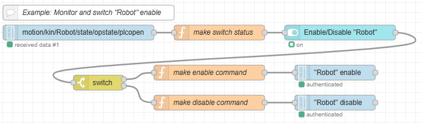
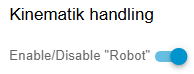

Dashboard 1.0
```JSON
[{"id":"b209226589a79621","type":"comment","z":"b12a2b51700402e0","name":"Example: Monitor and switch \"Robot\" enable","info":"","x":570,"y":480,"wires":[]},{"id":"a4bd2b7f770627be","type":"ui_switch","z":"b12a2b51700402e0","name":"","label":"Enable/disable \"Robot\"","tooltip":"","group":"85755e14b124f041","order":1,"width":"4","height":"1","passthru":false,"decouple":"true","topic":"","topicType":"str","style":"","onvalue":"{\"type\":\"bool8\",\"value\":true}","onvalueType":"json","onicon":"","oncolor":"","offvalue":"{\"type\":\"bool8\",\"value\":false}","offvalueType":"json","officon":"","offcolor":"","animate":false,"className":"","x":1100,"y":520,"wires":[["cae8298f2e8feaea"]]},{"id":"9f0584db0ec9dd17","type":"ctrlx-datalayer-request","z":"b12a2b51700402e0","device":"7b877229.678964","method":"CREATE","path":"motion/kin/Robot/cmd/group-ena","payloadFormat":"value_type","name":"\"Robot\" enable","pendingWarnLevel":"","pendingErrorLevel":"","x":1080,"y":600,"wires":[[]]},{"id":"d826f25e19cc2b25","type":"ctrlx-datalayer-request","z":"b12a2b51700402e0","device":"7b877229.678964","method":"CREATE","path":"motion/kin/Robot/cmd/group-dis","payloadFormat":"value_type","name":"\"Robot\" disable","pendingWarnLevel":"","pendingErrorLevel":"","x":1080,"y":660,"wires":[[]]},{"id":"cae8298f2e8feaea","type":"switch","z":"b12a2b51700402e0","name":"","property":"payload.value","propertyType":"msg","rules":[{"t":"true"},{"t":"false"}],"checkall":"false","repair":false,"outputs":2,"x":590,"y":620,"wires":[["9c1c14a3e7aa2864"],["e4f3efe23e81ddc6"]]},{"id":"9c1c14a3e7aa2864","type":"function","z":"b12a2b51700402e0","name":"make enable command","func":"var newMsg = {};\nnewMsg.payload = \"\";\nreturn newMsg;","outputs":1,"timeout":"","noerr":0,"initialize":"","finalize":"","libs":[],"x":830,"y":600,"wires":[["9f0584db0ec9dd17"]]},{"id":"e4f3efe23e81ddc6","type":"function","z":"b12a2b51700402e0","name":"make disable command","func":"var newMsg = {};\nnewMsg.payload = \"\";\nreturn newMsg;","outputs":1,"timeout":"","noerr":0,"initialize":"","finalize":"","libs":[],"x":830,"y":660,"wires":[["d826f25e19cc2b25"]]},{"id":"9938499b3b6e685e","type":"function","z":"b12a2b51700402e0","name":"make switch status","func":"var newMsg = {};\nif (msg.payload == \"DISABLED\") {\n newMsg.payload = {\"type\":\"bool8\",\"value\":false}\n} \nelse {\n newMsg.payload = {\"type\":\"bool8\",\"value\":true} \n}\nreturn newMsg;","outputs":1,"timeout":"","noerr":0,"initialize":"","finalize":"","libs":[],"x":850,"y":520,"wires":[["a4bd2b7f770627be"]]},{"id":"59f1383ada1f4db6","type":"ctrlx-datalayer-subscribe","z":"b12a2b51700402e0","subscription":"632bcc2.eddf134","path":"motion/kin/Robot/state/opstate/plcopen","name":"","inputs":0,"x":550,"y":520,"wires":[["9938499b3b6e685e"]]},{"id":"85755e14b124f041","type":"ui_group","name":"Kinematic Handling","tab":"9cba2148.8c9148","order":3,"disp":true,"width":"6","collapse":false,"className":""},{"id":"7b877229.678964","type":"ctrlx-config","name":"localhost","hostname":"localhost","debug":false},{"id":"632bcc2.eddf134","type":"ctrlx-config-subscription","device":"7b877229.678964","name":"Sub_Default","publishIntervalMs":"1","publishIntervalUnits":"seconds","samplingInterval":"100","samplingIntervalUnits":"milliseconds","errorInterval":"60","errorIntervalUnits":"seconds","keepaliveInterval":"60","keepaliveIntervalUnits":"seconds","queueSize":"1","queueBehaviour":"DiscardOldest","deadbandValue":""},{"id":"9cba2148.8c9148","type":"ui_tab","name":"Examples","icon":"dashboard","order":7,"disabled":false,"hidden":false}]
```

Dashboard 2.0
```JSON
[{"id":"b209226589a79621","type":"comment","z":"af28b7f20c662b36","name":"Example: Monitor and switch \"Robot\" enable","info":"","x":230,"y":2700,"wires":[]},{"id":"9f0584db0ec9dd17","type":"ctrlx-datalayer-request","z":"af28b7f20c662b36","device":"7b877229.678964","method":"CREATE","path":"motion/kin/Robot/cmd/group-ena","payloadFormat":"value_type","name":"\"Robot\" enable","pendingWarnLevel":"","pendingErrorLevel":"","x":720,"y":2820,"wires":[[]]},{"id":"d826f25e19cc2b25","type":"ctrlx-datalayer-request","z":"af28b7f20c662b36","device":"7b877229.678964","method":"CREATE","path":"motion/kin/Robot/cmd/group-dis","payloadFormat":"value_type","name":"\"Robot\" disable","pendingWarnLevel":"","pendingErrorLevel":"","x":720,"y":2880,"wires":[[]]},{"id":"cae8298f2e8feaea","type":"switch","z":"af28b7f20c662b36","name":"","property":"payload.value","propertyType":"msg","rules":[{"t":"true"},{"t":"false"}],"checkall":"false","repair":false,"outputs":2,"x":250,"y":2840,"wires":[["9c1c14a3e7aa2864"],["e4f3efe23e81ddc6"]]},{"id":"9c1c14a3e7aa2864","type":"function","z":"af28b7f20c662b36","name":"make enable command","func":"var newMsg = {};\nnewMsg.payload = \"\";\nreturn newMsg;","outputs":1,"timeout":"","noerr":0,"initialize":"","finalize":"","libs":[],"x":470,"y":2820,"wires":[["9f0584db0ec9dd17"]]},{"id":"e4f3efe23e81ddc6","type":"function","z":"af28b7f20c662b36","name":"make disable command","func":"var newMsg = {};\nnewMsg.payload = \"\";\nreturn newMsg;","outputs":1,"timeout":"","noerr":0,"initialize":"","finalize":"","libs":[],"x":470,"y":2880,"wires":[["d826f25e19cc2b25"]]},{"id":"9938499b3b6e685e","type":"function","z":"af28b7f20c662b36","name":"make switch status","func":"var newMsg = {};\nif (msg.payload == \"DISABLED\") {\n newMsg.payload = {\"type\":\"bool8\",\"value\":false}\n} \nelse {\n newMsg.payload = {\"type\":\"bool8\",\"value\":true} \n}\nreturn newMsg;","outputs":1,"timeout":"","noerr":0,"initialize":"","finalize":"","libs":[],"x":490,"y":2740,"wires":[["e8e7a5c5a0807c32"]]},{"id":"59f1383ada1f4db6","type":"ctrlx-datalayer-subscribe","z":"af28b7f20c662b36","subscription":"632bcc2.eddf134","path":"motion/kin/Robot/state/opstate/plcopen","name":"","inputs":0,"x":210,"y":2740,"wires":[["9938499b3b6e685e"]]},{"id":"e8e7a5c5a0807c32","type":"ui-switch","z":"af28b7f20c662b36","name":"","label":"Enable/Disable \"Robot\"","group":"79318a125619cb7d","order":1,"width":"2","height":"1","passthru":false,"decouple":true,"topic":"topic","topicType":"msg","style":"","className":"","layout":"row-left","clickableArea":"switch","onvalue":"{\"type\":\"bool8\",\"value\":true} ","onvalueType":"json","onicon":"","oncolor":"","offvalue":"{\"type\":\"bool8\",\"value\":false} ","offvalueType":"json","officon":"","offcolor":"","x":730,"y":2740,"wires":[["cae8298f2e8feaea"]]},{"id":"7b877229.678964","type":"ctrlx-config","name":"localhost","hostname":"localhost","debug":false},{"id":"632bcc2.eddf134","type":"ctrlx-config-subscription","device":"7b877229.678964","name":"Sub_Default","publishIntervalMs":"","samplingInterval":"","errorInterval":"","keepaliveInterval":"","queueSize":"","deadbandValue":""},{"id":"79318a125619cb7d","type":"ui-group","name":"Kinematik handling","page":"30e3bb10109e324b","width":6,"height":1,"order":-1,"showTitle":true,"className":"","visible":"true","disabled":"false","groupType":"default"},{"id":"30e3bb10109e324b","type":"ui-page","name":"Page 1","ui":"ae50776f3a63db0e","path":"/page1","icon":"home","layout":"grid","theme":"a204995a5a44f2b2","breakpoints":[{"name":"Default","px":0,"cols":3},{"name":"Tablet","px":576,"cols":6},{"name":"Small Desktop","px":768,"cols":9},{"name":"Desktop","px":1024,"cols":12}],"order":1,"className":"","visible":true,"disabled":false},{"id":"ae50776f3a63db0e","type":"ui-base","name":"My Dashboard","path":"/dashboard","appIcon":"","includeClientData":true,"acceptsClientConfig":["ui-notification","ui-control"],"showPathInSidebar":false,"headerContent":"page","navigationStyle":"default","titleBarStyle":"default","showReconnectNotification":true,"notificationDisplayTime":1,"showDisconnectNotification":true,"allowInstall":false},{"id":"a204995a5a44f2b2","type":"ui-theme","name":"Default Theme","colors":{"surface":"#ffffff","primary":"#0094CE","bgPage":"#eeeeee","groupBg":"#ffffff","groupOutline":"#cccccc"},"sizes":{"density":"default","pagePadding":"12px","groupGap":"12px","groupBorderRadius":"4px","widgetGap":"12px"}},{"id":"4ecfe844793739f3","type":"global-config","env":[],"modules":{"node-red-contrib-ctrlx-automation":"1.9.8","@flowfuse/node-red-dashboard":"1.30.2"}}]
```

### Move linear absolute of a kinematic `Robot`

The following example shows how to request a linear absolute positioning movement of a kinematic `Robot`. If the command is initiated with axis states `STANDSTILL`, this will produce only a virtual movement of the kinematic. To move the grouped axes along, their states must be `COORDINATED_MOTION`. An example startup sequence is then: power on, group axes to kinematic, enable kinematic, request movement ([see kinematic state machine documentation](https://docs.automation.boschrexroth.com/doc/3130592849/kinematic-objects/latest/en/)).

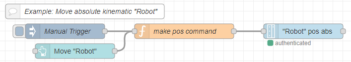
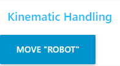

Dashboard 1.0
```JSON
[{"id":"a4b5f4ddf588ea6a","type":"function","z":"49a0fa857f86c38c","name":"make pos command","func":"var newMsg = {};\nnewMsg.payload = {\n    \"type\": \"object\",\n    \"value\": {\n        \"kinPos\": [15.5, 12.0, 3.0, 0.0, 0.0, 0.0, 0.0, 0.0, 0.0, 0.0, 0.0, 0.0, 0.0, 0.0, 0.0, 0.0],\n        \"coordSys\": \"WCS\",\n        \"lim\": {\n            \"vel\": 800,\n            \"acc\": 3,\n            \"dec\": 3,\n            \"jrkAcc\": 0,\n            \"jrkDec\": 0\n        }\n    }\n}\nreturn newMsg;","outputs":1,"noerr":0,"initialize":"","finalize":"","libs":[],"x":420,"y":120,"wires":[["5071eee48d45d006"]]},{"id":"5071eee48d45d006","type":"ctrlx-datalayer-request","z":"49a0fa857f86c38c","device":"7b877229.678964","method":"CREATE","path":"motion/kin/Robot/cmd/move-abs","payloadFormat":"value_type","name":"\"Robot\" pos abs","x":660,"y":120,"wires":[[]]},{"id":"ed595e644b52bb5c","type":"ui_button","z":"49a0fa857f86c38c","name":"","group":"85755e14b124f041","order":3,"width":"3","height":"1","passthru":false,"label":"Move \"Robot\"","tooltip":"","color":"","bgcolor":"","className":"","icon":"","payload":"","payloadType":"str","topic":"topic","topicType":"msg","x":200,"y":160,"wires":[["a4b5f4ddf588ea6a"]]},{"id":"04d0b8522adbe49e","type":"inject","z":"49a0fa857f86c38c","name":"Manual Trigger","props":[{"p":"payload"},{"p":"topic","vt":"str"}],"repeat":"","crontab":"","once":false,"onceDelay":0.1,"topic":"","payload":"","payloadType":"date","x":180,"y":120,"wires":[["a4b5f4ddf588ea6a"]]},{"id":"6ab024b45f88f622","type":"comment","z":"49a0fa857f86c38c","name":"Example: Move absolute kinematic \"Robot\"","info":"","x":220,"y":80,"wires":[]},{"id":"7b877229.678964","type":"ctrlx-config","name":"localhost","hostname":"localhost","debug":false},{"id":"85755e14b124f041","type":"ui_group","name":"Kinematic Handling","tab":"9cba2148.8c9148","order":3,"disp":true,"width":"6","collapse":false,"className":""},{"id":"9cba2148.8c9148","type":"ui_tab","name":"Examples","icon":"dashboard","order":7,"disabled":false,"hidden":false}]
```

Dashboard 2.0
```JSON
[{"id":"a4b5f4ddf588ea6a","type":"function","z":"af28b7f20c662b36","name":"make movement command","func":"var newMsg = {};\nnewMsg.payload = {\n    \"type\": \"object\",\n    \"value\": {\n        \"kinPos\": [42.1, 42.2, 42.3, 0.0, 0.0, 0.0, 0.0, 0.0, 0.0, 0.0, 0.0, 0.0, 0.0, 0.0, 0.0, 0.0],\n        \"coordSys\": \"WCS\",\n        \"lim\": {\n            \"vel\": 8,\n            \"acc\": 3,\n            \"dec\": 3,\n            \"jrkAcc\": 0,\n            \"jrkDec\": 0\n        }\n    }\n}\nreturn newMsg;","outputs":1,"timeout":"","noerr":0,"initialize":"","finalize":"","libs":[],"x":460,"y":2980,"wires":[["5071eee48d45d006"]]},{"id":"5071eee48d45d006","type":"ctrlx-datalayer-request","z":"af28b7f20c662b36","device":"7b877229.678964","method":"CREATE","path":"motion/kin/Robot/cmd/move-abs","payloadFormat":"value_type","name":"Move linear absolute \"Robot\"","pendingWarnLevel":"","pendingErrorLevel":"","x":740,"y":2980,"wires":[[]]},{"id":"04d0b8522adbe49e","type":"inject","z":"af28b7f20c662b36","name":"Manual Trigger","props":[{"p":"payload"},{"p":"topic","vt":"str"}],"repeat":"","crontab":"","once":false,"onceDelay":0.1,"topic":"","payload":"","payloadType":"date","x":160,"y":2980,"wires":[["a4b5f4ddf588ea6a"]]},{"id":"6ab024b45f88f622","type":"comment","z":"af28b7f20c662b36","name":"Example: Linear absolute movement of kinematic \"Robot\"","info":"","x":270,"y":2940,"wires":[]},{"id":"35ca3c1275f0d4b4","type":"ui-button","z":"af28b7f20c662b36","group":"79318a125619cb7d","name":"","label":" Move linear absolute \"Robot\"","order":1,"width":"2","height":"1","emulateClick":false,"tooltip":"","color":"","bgcolor":"","className":"","icon":"","iconPosition":"left","payload":"","payloadType":"str","topic":"topic","topicType":"msg","buttonColor":"","textColor":"","iconColor":"","enableClick":true,"enablePointerdown":false,"pointerdownPayload":"","pointerdownPayloadType":"str","enablePointerup":false,"pointerupPayload":"","pointerupPayloadType":"str","x":180,"y":3020,"wires":[["a4b5f4ddf588ea6a"]]},{"id":"7b877229.678964","type":"ctrlx-config","name":"localhost","hostname":"localhost","debug":false},{"id":"79318a125619cb7d","type":"ui-group","name":"Kinematik handling","page":"30e3bb10109e324b","width":6,"height":1,"order":1,"showTitle":true,"className":"","visible":"true","disabled":"false","groupType":"default"},{"id":"30e3bb10109e324b","type":"ui-page","name":"Page 1","ui":"ae50776f3a63db0e","path":"/page1","icon":"home","layout":"grid","theme":"a204995a5a44f2b2","breakpoints":[{"name":"Default","px":0,"cols":3},{"name":"Tablet","px":576,"cols":6},{"name":"Small Desktop","px":768,"cols":9},{"name":"Desktop","px":1024,"cols":12}],"order":1,"className":"","visible":true,"disabled":false},{"id":"ae50776f3a63db0e","type":"ui-base","name":"My Dashboard","path":"/dashboard","appIcon":"","includeClientData":true,"acceptsClientConfig":["ui-notification","ui-control"],"showPathInSidebar":false,"headerContent":"page","navigationStyle":"default","titleBarStyle":"default","showReconnectNotification":true,"notificationDisplayTime":1,"showDisconnectNotification":true,"allowInstall":false},{"id":"a204995a5a44f2b2","type":"ui-theme","name":"Default Theme","colors":{"surface":"#ffffff","primary":"#0094CE","bgPage":"#eeeeee","groupBg":"#ffffff","groupOutline":"#cccccc"},"sizes":{"density":"default","pagePadding":"12px","groupGap":"12px","groupBorderRadius":"4px","widgetGap":"12px"}},{"id":"468279b4bbec35a3","type":"global-config","env":[],"modules":{"node-red-contrib-ctrlx-automation":"1.9.8","@flowfuse/node-red-dashboard":"1.30.2"}}]
```

### Abort movement of a kinematic `Robot`

The following example shows how to abort the movement of a kinematic `Robot`. This command can be issued in state `MOVING` or `STANDBY`. It will transition the kinematic into state `ABORTING`. Once the kinematic has stopped completely, the kinematic transitions to state `STANDBY` and all buffered commands are removed ([see kinematic state machine documentation](https://docs.automation.boschrexroth.com/doc/3130592849/kinematic-objects/latest/en/)).

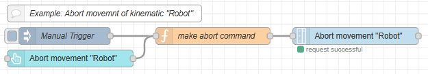
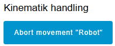

Dashboard 1.0
```JSON
[{"id":"563e15c2db30bf28","type":"ctrlx-datalayer-request","z":"201ba7c7148a7cc2","device":"7b877229.678964","method":"CREATE","path":"motion/kin/Robot/cmd/abort","payloadFormat":"value_type","name":"\"Robot\" abort","x":670,"y":120,"wires":[[]]},{"id":"ac7a8b1446a1e812","type":"ui_button","z":"201ba7c7148a7cc2","name":"","group":"85755e14b124f041","order":3,"width":"3","height":"1","passthru":false,"label":"Abort \"Robot\"","tooltip":"","color":"","bgcolor":"","className":"","icon":"","payload":"","payloadType":"str","topic":"topic","topicType":"msg","x":220,"y":160,"wires":[["558c61d4c8d9c1ac"]]},{"id":"4175c5684253f0db","type":"inject","z":"201ba7c7148a7cc2","name":"Manual Trigger","props":[{"p":"payload"},{"p":"topic","vt":"str"}],"repeat":"","crontab":"","once":false,"onceDelay":0.1,"topic":"","payload":"","payloadType":"date","x":200,"y":120,"wires":[["558c61d4c8d9c1ac"]]},{"id":"64da5a64be4f7a30","type":"comment","z":"201ba7c7148a7cc2","name":"Example: Abort command kinematic \"Robot\"","info":"","x":250,"y":80,"wires":[]},{"id":"558c61d4c8d9c1ac","type":"function","z":"201ba7c7148a7cc2","name":"make abort command","func":"msg.payload = null;\nreturn msg;","outputs":1,"noerr":0,"initialize":"","finalize":"","libs":[],"x":440,"y":120,"wires":[["563e15c2db30bf28"]]},{"id":"7b877229.678964","type":"ctrlx-config","name":"localhost","hostname":"localhost","debug":false},{"id":"85755e14b124f041","type":"ui_group","name":"Kinematic Handling","tab":"9cba2148.8c9148","order":3,"disp":true,"width":"6","collapse":false,"className":""},{"id":"9cba2148.8c9148","type":"ui_tab","name":"Examples","icon":"dashboard","order":7,"disabled":false,"hidden":false}]
```

Dashboard 2.0
```JSON
[{"id":"563e15c2db30bf28","type":"ctrlx-datalayer-request","z":"af28b7f20c662b36","device":"7b877229.678964","method":"CREATE","path":"motion/kin/Robot/cmd/abort","payloadFormat":"value_type","name":"Abort movement \"Robot\" ","pendingWarnLevel":"","pendingErrorLevel":"","x":670,"y":3120,"wires":[[]]},{"id":"4175c5684253f0db","type":"inject","z":"af28b7f20c662b36","name":"Manual Trigger","props":[{"p":"payload"},{"p":"topic","vt":"str"}],"repeat":"","crontab":"","once":false,"onceDelay":0.1,"topic":"","payload":"","payloadType":"date","x":160,"y":3120,"wires":[["558c61d4c8d9c1ac"]]},{"id":"64da5a64be4f7a30","type":"comment","z":"af28b7f20c662b36","name":"Example: Abort movemnt of kinematic \"Robot\"","info":"","x":230,"y":3080,"wires":[]},{"id":"558c61d4c8d9c1ac","type":"function","z":"af28b7f20c662b36","name":"make abort command","func":"msg.payload = null;\nreturn msg;","outputs":1,"noerr":0,"initialize":"","finalize":"","libs":[],"x":420,"y":3120,"wires":[["563e15c2db30bf28"]]},{"id":"d33673e21407ea0d","type":"ui-button","z":"af28b7f20c662b36","group":"79318a125619cb7d","name":"","label":"Abort movement \"Robot\"","order":1,"width":"2","height":"1","emulateClick":false,"tooltip":"","color":"","bgcolor":"","className":"","icon":"","iconPosition":"left","payload":"","payloadType":"str","topic":"topic","topicType":"msg","buttonColor":"","textColor":"","iconColor":"","enableClick":true,"enablePointerdown":false,"pointerdownPayload":"","pointerdownPayloadType":"str","enablePointerup":false,"pointerupPayload":"","pointerupPayloadType":"str","x":170,"y":3160,"wires":[["558c61d4c8d9c1ac"]]},{"id":"7b877229.678964","type":"ctrlx-config","name":"localhost","hostname":"localhost","debug":false},{"id":"79318a125619cb7d","type":"ui-group","name":"Kinematik handling","page":"30e3bb10109e324b","width":6,"height":1,"order":1,"showTitle":true,"className":"","visible":"true","disabled":"false","groupType":"default"},{"id":"30e3bb10109e324b","type":"ui-page","name":"Page 1","ui":"ae50776f3a63db0e","path":"/page1","icon":"home","layout":"grid","theme":"a204995a5a44f2b2","breakpoints":[{"name":"Default","px":0,"cols":3},{"name":"Tablet","px":576,"cols":6},{"name":"Small Desktop","px":768,"cols":9},{"name":"Desktop","px":1024,"cols":12}],"order":1,"className":"","visible":true,"disabled":false},{"id":"ae50776f3a63db0e","type":"ui-base","name":"My Dashboard","path":"/dashboard","appIcon":"","includeClientData":true,"acceptsClientConfig":["ui-notification","ui-control"],"showPathInSidebar":false,"headerContent":"page","navigationStyle":"default","titleBarStyle":"default","showReconnectNotification":true,"notificationDisplayTime":1,"showDisconnectNotification":true,"allowInstall":false},{"id":"a204995a5a44f2b2","type":"ui-theme","name":"Default Theme","colors":{"surface":"#ffffff","primary":"#0094CE","bgPage":"#eeeeee","groupBg":"#ffffff","groupOutline":"#cccccc"},"sizes":{"density":"default","pagePadding":"12px","groupGap":"12px","groupBorderRadius":"4px","widgetGap":"12px"}},{"id":"8938a0652525c8f0","type":"global-config","env":[],"modules":{"node-red-contrib-ctrlx-automation":"1.9.8","@flowfuse/node-red-dashboard":"1.30.2"}}]
```

### Reset error of a kinematic `Robot`

The following example shows how to reset errors of the kinematic `Robot`. If the errors are minor, subordinate axes are also reset and the kinematic transitions to state `STANDBY`. In the case of severe errors, subordinate axes are not reset and the kinematic transitions to state `DISABLED` ([see kinematic state machine documentation](https://docs.automation.boschrexroth.com/doc/3130592849/kinematic-objects/latest/en/))..

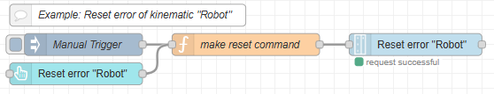
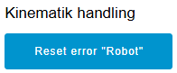

Dashboard 1.0
```JSON
[{"id":"295d31e596bb3952","type":"ctrlx-datalayer-request","z":"0c66745436523bb7","device":"7b877229.678964","method":"CREATE","path":"motion/kin/Robot/cmd/reset","payloadFormat":"value_type","name":"\"Robot\" reset","x":710,"y":100,"wires":[[]]},{"id":"aed8d5115b8cc229","type":"ui_button","z":"0c66745436523bb7","name":"","group":"85755e14b124f041","order":3,"width":"3","height":"1","passthru":false,"label":"Reset \"Robot\"","tooltip":"","color":"","bgcolor":"","className":"","icon":"","payload":"","payloadType":"str","topic":"topic","topicType":"msg","x":260,"y":140,"wires":[["b3a6dc57db58af3a"]]},{"id":"7638c60369720b4f","type":"inject","z":"0c66745436523bb7","name":"Manual Trigger","props":[{"p":"payload"},{"p":"topic","vt":"str"}],"repeat":"","crontab":"","once":false,"onceDelay":0.1,"topic":"","payload":"","payloadType":"date","x":240,"y":100,"wires":[["b3a6dc57db58af3a"]]},{"id":"0610da93a6d6a7f1","type":"comment","z":"0c66745436523bb7","name":"Example: Reset kinematic \"Robot\"","info":"","x":260,"y":60,"wires":[]},{"id":"b3a6dc57db58af3a","type":"function","z":"0c66745436523bb7","name":"make reset command","func":"msg.payload = null;\nreturn msg;","outputs":1,"noerr":0,"initialize":"","finalize":"","libs":[],"x":480,"y":100,"wires":[["295d31e596bb3952"]]},{"id":"7b877229.678964","type":"ctrlx-config","name":"localhost","hostname":"localhost","debug":false},{"id":"85755e14b124f041","type":"ui_group","name":"Kinematic Handling","tab":"9cba2148.8c9148","order":3,"disp":true,"width":"6","collapse":false,"className":""},{"id":"9cba2148.8c9148","type":"ui_tab","name":"Examples","icon":"dashboard","order":7,"disabled":false,"hidden":false}]
```

Dashboard 2.0
```JSON
[{"id":"295d31e596bb3952","type":"ctrlx-datalayer-request","z":"af28b7f20c662b36","device":"7b877229.678964","method":"CREATE","path":"motion/kin/Robot/cmd/reset","payloadFormat":"value_type","name":"Reset error \"Robot\"","pendingWarnLevel":"","pendingErrorLevel":"","x":610,"y":3260,"wires":[[]]},{"id":"7638c60369720b4f","type":"inject","z":"af28b7f20c662b36","name":"Manual Trigger","props":[{"p":"payload"},{"p":"topic","vt":"str"}],"repeat":"","crontab":"","once":false,"onceDelay":0.1,"topic":"","payload":"","payloadType":"date","x":160,"y":3260,"wires":[["b3a6dc57db58af3a"]]},{"id":"0610da93a6d6a7f1","type":"comment","z":"af28b7f20c662b36","name":"Example: Reset error of kinematic \"Robot\"","info":"","x":220,"y":3220,"wires":[]},{"id":"b3a6dc57db58af3a","type":"function","z":"af28b7f20c662b36","name":"make reset command","func":"msg.payload = null;\nreturn msg;","outputs":1,"noerr":0,"initialize":"","finalize":"","libs":[],"x":380,"y":3260,"wires":[["295d31e596bb3952"]]},{"id":"70a98ddbb9c131d1","type":"ui-button","z":"af28b7f20c662b36","group":"79318a125619cb7d","name":"","label":"Reset error \"Robot\"","order":1,"width":"2","height":"1","emulateClick":false,"tooltip":"","color":"","bgcolor":"","className":"","icon":"","iconPosition":"left","payload":"","payloadType":"str","topic":"topic","topicType":"msg","buttonColor":"","textColor":"","iconColor":"","enableClick":true,"enablePointerdown":false,"pointerdownPayload":"","pointerdownPayloadType":"str","enablePointerup":false,"pointerupPayload":"","pointerupPayloadType":"str","x":150,"y":3300,"wires":[["b3a6dc57db58af3a"]]},{"id":"7b877229.678964","type":"ctrlx-config","name":"localhost","hostname":"localhost","debug":false},{"id":"79318a125619cb7d","type":"ui-group","name":"Kinematik handling","page":"30e3bb10109e324b","width":6,"height":1,"order":1,"showTitle":true,"className":"","visible":"true","disabled":"false","groupType":"default"},{"id":"30e3bb10109e324b","type":"ui-page","name":"Page 1","ui":"ae50776f3a63db0e","path":"/page1","icon":"home","layout":"grid","theme":"a204995a5a44f2b2","breakpoints":[{"name":"Default","px":0,"cols":3},{"name":"Tablet","px":576,"cols":6},{"name":"Small Desktop","px":768,"cols":9},{"name":"Desktop","px":1024,"cols":12}],"order":1,"className":"","visible":true,"disabled":false},{"id":"ae50776f3a63db0e","type":"ui-base","name":"My Dashboard","path":"/dashboard","appIcon":"","includeClientData":true,"acceptsClientConfig":["ui-notification","ui-control"],"showPathInSidebar":false,"headerContent":"page","navigationStyle":"default","titleBarStyle":"default","showReconnectNotification":true,"notificationDisplayTime":1,"showDisconnectNotification":true,"allowInstall":false},{"id":"a204995a5a44f2b2","type":"ui-theme","name":"Default Theme","colors":{"surface":"#ffffff","primary":"#0094CE","bgPage":"#eeeeee","groupBg":"#ffffff","groupOutline":"#cccccc"},"sizes":{"density":"default","pagePadding":"12px","groupGap":"12px","groupBorderRadius":"4px","widgetGap":"12px"}},{"id":"e86288b17b4fdb12","type":"global-config","env":[],"modules":{"node-red-contrib-ctrlx-automation":"1.9.8","@flowfuse/node-red-dashboard":"1.30.2"}}]
```

## Script interpreter and ctrlX OS - Python Runtime App dashboard examples

Prerequisite: `ctrlX OS - Python Runtime App` is installed. See [our ctrlX OS Store](https://community.boschrexroth.com/ctrlx-os-store-apps-oc2pqqwn/post/ctrlx-automation---python-runtime-c69P85oL8ytuz8A) and the corresponding [documentation of the "Script parser/interpreter (Python)"](https://docs.automation.boschrexroth.com/iirds/cdp-metadata.boschrexroth.de~iiDC~Product-ctrlX-Python-Runtime-App/).

### Create an interpreter instance `MyInstance` for python

The following example shows how to create an interpreter instance `MyInstance` for executing python code/scripts.

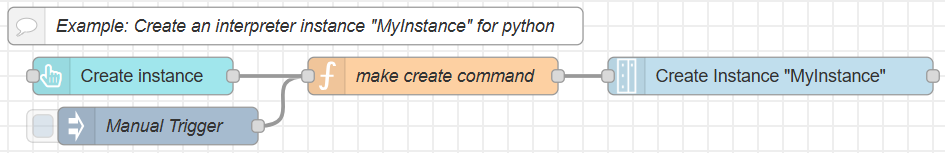
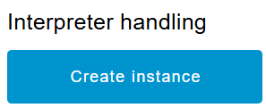

Dashboard 1.0
```JSON
[{"id":"41a67c09.9532e4","type":"comment","z":"4ff80d56.dd60fc","name":"Example: Create an interpreter instance \"MyInstance\" for python","info":"","x":310,"y":1960,"wires":[]},{"id":"32d49076.f8923","type":"function","z":"4ff80d56.dd60fc","name":"make create command","func":"var newMsg = {};\nnewMsg.payload = {\n      \"type\":\"object\",\n      \"value\":{\n\t    \"name\":\"MyInstance\",\"language\":\"python\"\n        }\n     }\nreturn newMsg;","outputs":1,"noerr":0,"initialize":"","finalize":"","libs":[],"x":420,"y":2000,"wires":[["b3d753e.4376c3"]]},{"id":"b3d753e.4376c3","type":"ctrlx-datalayer-request","z":"4ff80d56.dd60fc","device":"7b877229.678964","method":"CREATE","path":"script/instances","payloadFormat":"value_type","name":"Create Instance \"MyInstance\"","x":690,"y":2000,"wires":[[]]},{"id":"3cf2344c.df7184","type":"inject","z":"4ff80d56.dd60fc","name":"Manual Trigger","props":[{"p":"payload"},{"p":"topic","vt":"str"}],"repeat":"","crontab":"","once":false,"onceDelay":0.1,"topic":"","payload":"","payloadType":"date","x":180,"y":2040,"wires":[["32d49076.f8923"]]},{"id":"18c49496.2cf273","type":"ui_button","z":"4ff80d56.dd60fc","name":"","group":"f675e9d2.c9935","order":1,"width":"3","height":"1","passthru":false,"label":"Create Instance","tooltip":"","color":"","bgcolor":"","icon":"","payload":"","payloadType":"str","topic":"topic","topicType":"msg","x":180,"y":2000,"wires":[["32d49076.f8923"]]},{"id":"7b877229.678964","type":"ctrlx-config","name":"localhost","hostname":"localhost","debug":false},{"id":"f675e9d2.c9935","type":"ui_group","name":"Interpreter handling","tab":"9cba2148.8c9148","order":4,"disp":true,"width":"4","collapse":false},{"id":"9cba2148.8c9148","type":"ui_tab","name":"Examples","icon":"dashboard","order":7,"disabled":false,"hidden":false}]
```

Dashboard 2.0
```JSON
[{"id":"41a67c09.9532e4","type":"comment","z":"af28b7f20c662b36","name":"Example: Create an interpreter instance \"MyInstance\" for python","info":"","x":290,"y":3400,"wires":[]},{"id":"32d49076.f8923","type":"function","z":"af28b7f20c662b36","name":"make create command","func":"var newMsg = {};\nnewMsg.payload = {\n      \"type\":\"object\",\n      \"value\": {\n            \"name\":\"MyInstance\",\"language\":\"python\"\n            }\n}\nreturn newMsg;","outputs":1,"timeout":"","noerr":0,"initialize":"","finalize":"","libs":[],"x":400,"y":3440,"wires":[["b3d753e.4376c3"]]},{"id":"b3d753e.4376c3","type":"ctrlx-datalayer-request","z":"af28b7f20c662b36","device":"7b877229.678964","method":"CREATE","path":"script/instances","payloadFormat":"value_type","name":"Create Instance \"MyInstance\"","pendingWarnLevel":"","pendingErrorLevel":"","x":670,"y":3440,"wires":[[]]},{"id":"3cf2344c.df7184","type":"inject","z":"af28b7f20c662b36","name":"Manual Trigger","props":[{"p":"payload"},{"p":"topic","vt":"str"}],"repeat":"","crontab":"","once":false,"onceDelay":0.1,"topic":"","payload":"","payloadType":"date","x":180,"y":3480,"wires":[["32d49076.f8923"]]},{"id":"8a05a9d05f63181f","type":"ui-button","z":"af28b7f20c662b36","group":"2c5e5615cd872ada","name":"","label":"Create instance","order":1,"width":"2","height":"1","emulateClick":false,"tooltip":"","color":"","bgcolor":"","className":"","icon":"","iconPosition":"left","payload":"","payloadType":"str","topic":"topic","topicType":"msg","buttonColor":"","textColor":"","iconColor":"","enableClick":true,"enablePointerdown":false,"pointerdownPayload":"","pointerdownPayloadType":"str","enablePointerup":false,"pointerupPayload":"","pointerupPayloadType":"str","x":160,"y":3440,"wires":[["32d49076.f8923"]]},{"id":"7b877229.678964","type":"ctrlx-config","name":"localhost","hostname":"localhost","debug":false},{"id":"2c5e5615cd872ada","type":"ui-group","name":"Interpreter handling","page":"30e3bb10109e324b","width":6,"height":1,"order":-1,"showTitle":true,"className":"","visible":"true","disabled":"false","groupType":"default"},{"id":"30e3bb10109e324b","type":"ui-page","name":"Page 1","ui":"ae50776f3a63db0e","path":"/page1","icon":"home","layout":"grid","theme":"a204995a5a44f2b2","breakpoints":[{"name":"Default","px":0,"cols":3},{"name":"Tablet","px":576,"cols":6},{"name":"Small Desktop","px":768,"cols":9},{"name":"Desktop","px":1024,"cols":12}],"order":1,"className":"","visible":true,"disabled":false},{"id":"ae50776f3a63db0e","type":"ui-base","name":"My Dashboard","path":"/dashboard","appIcon":"","includeClientData":true,"acceptsClientConfig":["ui-notification","ui-control"],"showPathInSidebar":false,"headerContent":"page","navigationStyle":"default","titleBarStyle":"default","showReconnectNotification":true,"notificationDisplayTime":1,"showDisconnectNotification":true,"allowInstall":false},{"id":"a204995a5a44f2b2","type":"ui-theme","name":"Default Theme","colors":{"surface":"#ffffff","primary":"#0094CE","bgPage":"#eeeeee","groupBg":"#ffffff","groupOutline":"#cccccc"},"sizes":{"density":"default","pagePadding":"12px","groupGap":"12px","groupBorderRadius":"4px","widgetGap":"12px"}},{"id":"00dac620f138fbea","type":"global-config","env":[],"modules":{"node-red-contrib-ctrlx-automation":"1.9.8","@flowfuse/node-red-dashboard":"1.30.2"}}]
```

### Browse and show all available interpreter instances

The following example shows how to browse and show all available instances of the ctrlX script manager.

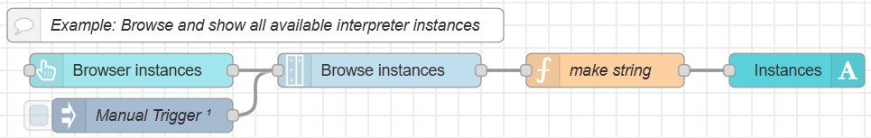
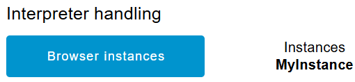

Dashboard 1.0
```JSON
[{"id":"54d27d.03212584","type":"ctrlx-datalayer-request","z":"4ff80d56.dd60fc","device":"7b877229.678964","method":"BROWSE","path":"script/instances","payloadFormat":"value_type","name":"Browse instances","x":430,"y":2160,"wires":[["474a1b6.70f72e4"]]},{"id":"5346646a.c4a73c","type":"ui_button","z":"4ff80d56.dd60fc","name":"","group":"f675e9d2.c9935","order":2,"width":"3","height":"1","passthru":false,"label":"Browse instances","tooltip":"","color":"","bgcolor":"","icon":"","payload":"","payloadType":"str","topic":"topic","topicType":"msg","x":200,"y":2200,"wires":[["54d27d.03212584"]]},{"id":"90a22cfc.a01b18","type":"inject","z":"4ff80d56.dd60fc","name":"Manual Trigger","props":[{"p":"payload"},{"p":"topic","vt":"str"}],"repeat":"","crontab":"","once":true,"onceDelay":0.1,"topic":"","payload":"","payloadType":"date","x":190,"y":2160,"wires":[["54d27d.03212584"]]},{"id":"474a1b6.70f72e4","type":"function","z":"4ff80d56.dd60fc","name":"make string","func":"var newMsg = {};\nnewMsg.payload = \"\";\nif (msg.payload.value == null){\n    newMsg.payload = \"could not read\";\n}\nelse if(msg.payload.value.length > 0){\n    for (var i = 0; i < msg.payload.value.length; i++) {\n        if(i==0){\n            newMsg.payload += msg.payload.value[i];\n        }\n        else{\n            newMsg.payload += \", \" + msg.payload.value[i];\n        }\n    }\n}\nelse{\n    newMsg.payload = \"no instances found\"\n}\nreturn newMsg;\n","outputs":1,"noerr":0,"initialize":"","finalize":"","libs":[],"x":630,"y":2160,"wires":[["f1db1731.1867c"]]},{"id":"f1db1731.1867c","type":"ui_text","z":"4ff80d56.dd60fc","group":"f675e9d2.c9935","order":3,"width":"0","height":"0","name":"","label":"Instances","format":"{{msg.payload}}","layout":"col-center","x":800,"y":2160,"wires":[]},{"id":"4881365b.cb4c1","type":"comment","z":"4ff80d56.dd60fc","name":"Example: Browse and show all available interpreter instances","info":"","x":250,"y":2120,"wires":[]},{"id":"7b877229.678964","type":"ctrlx-config","name":"localhost","hostname":"localhost","debug":false},{"id":"f675e9d2.c9935","type":"ui_group","name":"Interpreter handling","tab":"9cba2148.8c9148","order":4,"disp":true,"width":"4","collapse":false},{"id":"9cba2148.8c9148","type":"ui_tab","name":"Examples","icon":"dashboard","order":7,"disabled":false,"hidden":false}]
```

Dashboard 2.0
```JSON
[{"id":"54d27d.03212584","type":"ctrlx-datalayer-request","z":"af28b7f20c662b36","device":"7b877229.678964","method":"BROWSE","path":"script/instances","payloadFormat":"value_type","name":"Browse instances","pendingWarnLevel":"","pendingErrorLevel":"","x":390,"y":3580,"wires":[["474a1b6.70f72e4"]]},{"id":"90a22cfc.a01b18","type":"inject","z":"af28b7f20c662b36","name":"Manual Trigger","props":[{"p":"payload"},{"p":"topic","vt":"str"}],"repeat":"","crontab":"","once":true,"onceDelay":0.1,"topic":"","payload":"","payloadType":"date","x":180,"y":3620,"wires":[["54d27d.03212584"]]},{"id":"474a1b6.70f72e4","type":"function","z":"af28b7f20c662b36","name":"make string","func":"var newMsg = {};\nnewMsg.payload = \"\";\nif (msg.payload.value == null){\n    newMsg.payload = \"could not read\";\n}\nelse if(msg.payload.value.length > 0){\n    for (var i = 0; i < msg.payload.value.length; i++) {\n        if(i==0){\n            newMsg.payload += msg.payload.value[i];\n        }\n        else{\n            newMsg.payload += \", \" + msg.payload.value[i];\n        }\n    }\n}\nelse{\n    newMsg.payload = \"no instances found\"\n}\nreturn newMsg;\n","outputs":1,"timeout":"","noerr":0,"initialize":"","finalize":"","libs":[],"x":590,"y":3580,"wires":[["025bf4a1f05d06fc"]]},{"id":"4881365b.cb4c1","type":"comment","z":"af28b7f20c662b36","name":"Example: Browse and show all available interpreter instances","info":"","x":280,"y":3540,"wires":[]},{"id":"e8d4dc1d27b20350","type":"ui-button","z":"af28b7f20c662b36","group":"2c5e5615cd872ada","name":"","label":"Browser instances","order":1,"width":"2","height":"1","emulateClick":false,"tooltip":"","color":"","bgcolor":"","className":"","icon":"","iconPosition":"left","payload":"","payloadType":"str","topic":"topic","topicType":"msg","buttonColor":"","textColor":"","iconColor":"","enableClick":true,"enablePointerdown":false,"pointerdownPayload":"","pointerdownPayloadType":"str","enablePointerup":false,"pointerupPayload":"","pointerupPayloadType":"str","x":170,"y":3580,"wires":[["54d27d.03212584"]]},{"id":"025bf4a1f05d06fc","type":"ui-text","z":"af28b7f20c662b36","group":"2c5e5615cd872ada","order":2,"width":"2","height":"1","name":"","label":"Instances","format":"{{msg.payload}}","layout":"col-center","style":false,"font":"","fontSize":16,"color":"#717171","wrapText":false,"className":"","value":"payload","valueType":"msg","x":760,"y":3580,"wires":[]},{"id":"7b877229.678964","type":"ctrlx-config","name":"localhost","hostname":"localhost","debug":false},{"id":"2c5e5615cd872ada","type":"ui-group","name":"Interpreter handling","page":"30e3bb10109e324b","width":6,"height":1,"order":-1,"showTitle":true,"className":"","visible":"true","disabled":"false","groupType":"default"},{"id":"30e3bb10109e324b","type":"ui-page","name":"Page 1","ui":"ae50776f3a63db0e","path":"/page1","icon":"home","layout":"grid","theme":"a204995a5a44f2b2","breakpoints":[{"name":"Default","px":0,"cols":3},{"name":"Tablet","px":576,"cols":6},{"name":"Small Desktop","px":768,"cols":9},{"name":"Desktop","px":1024,"cols":12}],"order":1,"className":"","visible":true,"disabled":false},{"id":"ae50776f3a63db0e","type":"ui-base","name":"My Dashboard","path":"/dashboard","appIcon":"","includeClientData":true,"acceptsClientConfig":["ui-notification","ui-control"],"showPathInSidebar":false,"headerContent":"page","navigationStyle":"default","titleBarStyle":"default","showReconnectNotification":true,"notificationDisplayTime":1,"showDisconnectNotification":true,"allowInstall":false},{"id":"a204995a5a44f2b2","type":"ui-theme","name":"Default Theme","colors":{"surface":"#ffffff","primary":"#0094CE","bgPage":"#eeeeee","groupBg":"#ffffff","groupOutline":"#cccccc"},"sizes":{"density":"default","pagePadding":"12px","groupGap":"12px","groupBorderRadius":"4px","widgetGap":"12px"}},{"id":"f20ca204195ffa47","type":"global-config","env":[],"modules":{"node-red-contrib-ctrlx-automation":"1.9.8","@flowfuse/node-red-dashboard":"1.30.2"}}]
```

### Monitor state of an interpreter instance `MyInstance`

The following example shows how to monitor the state of an instances `MyInstance` of the ctrlX script manager ([see instance state machine](https://docs.automation.boschrexroth.com/doc/3669738026/script-parser-interpreter/latest/en/)).

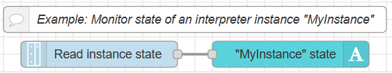
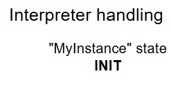

Dashboard 1.0
```JSON
[{"id":"9b9e6fbd.7416e8","type":"comment","z":"4ff80d56.dd60fc","name":"Example: Monitor state of an interpreter instance \"MyInstance\"","info":"","x":250,"y":2280,"wires":[]},{"id":"59b3f37.f33bf0c","type":"ctrlx-datalayer-subscribe","z":"4ff80d56.dd60fc","subscription":"632bcc2.eddf134","path":"script/instances/MyInstance/state/opstate","name":"Read instance state","x":170,"y":2320,"wires":[["4d250434.d9cf1c"]]},{"id":"4d250434.d9cf1c","type":"ui_text","z":"4ff80d56.dd60fc","group":"f675e9d2.c9935","order":4,"width":"4","height":"1","name":"","label":"\"MyInstance\" state","format":"{{msg.payload}}","layout":"col-center","x":410,"y":2320,"wires":[]},{"id":"632bcc2.eddf134","type":"ctrlx-config-subscription","device":"7b877229.678964","name":"Sub_Default","publishIntervalMs":""},{"id":"f675e9d2.c9935","type":"ui_group","name":"Interpreter handling","tab":"9cba2148.8c9148","order":4,"disp":true,"width":"4","collapse":false},{"id":"7b877229.678964","type":"ctrlx-config","name":"localhost","hostname":"localhost","debug":false},{"id":"9cba2148.8c9148","type":"ui_tab","name":"Examples","icon":"dashboard","order":7,"disabled":false,"hidden":false}]
```

Dashboard 2.0
```JSON
[{"id":"9b9e6fbd.7416e8","type":"comment","z":"af28b7f20c662b36","name":"Example: Monitor state of an interpreter instance \"MyInstance\"","info":"","x":280,"y":3680,"wires":[]},{"id":"59b3f37.f33bf0c","type":"ctrlx-datalayer-subscribe","z":"af28b7f20c662b36","subscription":"632bcc2.eddf134","path":"script/instances/MyInstance/state/opstate","name":"Read instance state","inputs":0,"x":170,"y":3720,"wires":[["3dcb655710ecb51f"]]},{"id":"3dcb655710ecb51f","type":"ui-text","z":"af28b7f20c662b36","group":"2c5e5615cd872ada","order":2,"width":"2","height":"1","name":"","label":"\"MyInstance\" state","format":"{{msg.payload}}","layout":"col-center","style":false,"font":"","fontSize":16,"color":"#717171","wrapText":false,"className":"","value":"payload","valueType":"msg","x":390,"y":3720,"wires":[]},{"id":"632bcc2.eddf134","type":"ctrlx-config-subscription","device":"7b877229.678964","name":"Sub_Default","publishIntervalMs":"","samplingInterval":"","errorInterval":"","keepaliveInterval":"","queueSize":"","deadbandValue":""},{"id":"2c5e5615cd872ada","type":"ui-group","name":"Interpreter handling","page":"30e3bb10109e324b","width":6,"height":1,"order":-1,"showTitle":true,"className":"","visible":"true","disabled":"false","groupType":"default"},{"id":"7b877229.678964","type":"ctrlx-config","name":"localhost","hostname":"localhost","debug":false},{"id":"30e3bb10109e324b","type":"ui-page","name":"Page 1","ui":"ae50776f3a63db0e","path":"/page1","icon":"home","layout":"grid","theme":"a204995a5a44f2b2","breakpoints":[{"name":"Default","px":0,"cols":3},{"name":"Tablet","px":576,"cols":6},{"name":"Small Desktop","px":768,"cols":9},{"name":"Desktop","px":1024,"cols":12}],"order":1,"className":"","visible":true,"disabled":false},{"id":"ae50776f3a63db0e","type":"ui-base","name":"My Dashboard","path":"/dashboard","appIcon":"","includeClientData":true,"acceptsClientConfig":["ui-notification","ui-control"],"showPathInSidebar":false,"headerContent":"page","navigationStyle":"default","titleBarStyle":"default","showReconnectNotification":true,"notificationDisplayTime":1,"showDisconnectNotification":true,"allowInstall":false},{"id":"a204995a5a44f2b2","type":"ui-theme","name":"Default Theme","colors":{"surface":"#ffffff","primary":"#0094CE","bgPage":"#eeeeee","groupBg":"#ffffff","groupOutline":"#cccccc"},"sizes":{"density":"default","pagePadding":"12px","groupGap":"12px","groupBorderRadius":"4px","widgetGap":"12px"}},{"id":"4f5bc791c8826984","type":"global-config","env":[],"modules":{"node-red-contrib-ctrlx-automation":"1.9.8","@flowfuse/node-red-dashboard":"1.30.2"}}]
```

### Reset interpreter instance `MyInstance`

The following example shows how to reset a script interpreter instance `MyInstance`. The corresponding instance has to be present and in state `ERROR` ([see instance state machine](https://docs.automation.boschrexroth.com/doc/3669738026/script-parser-interpreter/latest/en/)). 

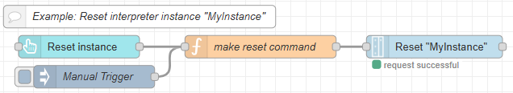
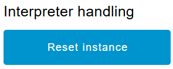

Dashboard 1.0
```JSON
[{"id":"79e751dd.c8402","type":"function","z":"5480b2f5a22f3525","name":"make reset command","func":"msg.payload = null;\nreturn msg;","outputs":1,"noerr":0,"initialize":"","finalize":"","libs":[],"x":660,"y":220,"wires":[["7cb11da0.1916bc"]]},{"id":"7cb11da0.1916bc","type":"ctrlx-datalayer-request","z":"5480b2f5a22f3525","device":"7b877229.678964","method":"CREATE","path":"script/instances/MyInstance/cmd/reset","payloadFormat":"value_type","name":"Reset \"MyInstance\"","x":900,"y":220,"wires":[[]]},{"id":"a11e7b1a.b3a8d","type":"ui_button","z":"5480b2f5a22f3525","name":"","group":"f675e9d2.c9935","order":3,"width":"3","height":"1","passthru":false,"label":"Reset instance","tooltip":"","color":"","bgcolor":"","className":"","icon":"","payload":"","payloadType":"str","topic":"topic","topicType":"msg","x":420,"y":220,"wires":[["79e751dd.c8402"]]},{"id":"690b0e68.ffc46","type":"inject","z":"5480b2f5a22f3525","name":"Manual Trigger","props":[{"p":"payload"},{"p":"topic","vt":"str"}],"repeat":"","crontab":"","once":false,"onceDelay":0.1,"topic":"","payload":"","payloadType":"date","x":420,"y":260,"wires":[["79e751dd.c8402"]]},{"id":"dc3e7b2.6ab9388","type":"comment","z":"5480b2f5a22f3525","name":"Example: Reset interpreter instance \"MyInstance\"","info":"","x":500,"y":180,"wires":[]},{"id":"7b877229.678964","type":"ctrlx-config","name":"localhost","hostname":"localhost","debug":false},{"id":"f675e9d2.c9935","type":"ui_group","name":"Interpreter handling","tab":"9cba2148.8c9148","order":4,"disp":true,"width":"4","collapse":false},{"id":"9cba2148.8c9148","type":"ui_tab","name":"Examples","icon":"dashboard","order":7,"disabled":false,"hidden":false}]
```

Dashboard 2.0
```JSON
[{"id":"46c564ba3f0cf98e","type":"function","z":"af28b7f20c662b36","name":"make reset command","func":"msg.payload = null;\nreturn msg;","outputs":1,"noerr":0,"initialize":"","finalize":"","libs":[],"x":400,"y":3720,"wires":[["1c584236b826eef6"]]},{"id":"1c584236b826eef6","type":"ctrlx-datalayer-request","z":"af28b7f20c662b36","device":"7b877229.678964","method":"CREATE","path":"script/instances/MyInstance/cmd/reset","payloadFormat":"value_type","name":"Reset \"MyInstance\"","pendingWarnLevel":"","pendingErrorLevel":"","x":630,"y":3720,"wires":[[]]},{"id":"307791e55525ab60","type":"inject","z":"af28b7f20c662b36","name":"Manual Trigger","props":[{"p":"payload"},{"p":"topic","vt":"str"}],"repeat":"","crontab":"","once":false,"onceDelay":0.1,"topic":"","payload":"","payloadType":"date","x":180,"y":3760,"wires":[["46c564ba3f0cf98e"]]},{"id":"c5698dda714e252a","type":"comment","z":"af28b7f20c662b36","name":"Example: Reset interpreter instance \"MyInstance\"","info":"","x":240,"y":3680,"wires":[]},{"id":"8caa2f1a7855644b","type":"ui-button","z":"af28b7f20c662b36","group":"2c5e5615cd872ada","name":"","label":"Reset instance","order":1,"width":"2","height":"1","emulateClick":false,"tooltip":"","color":"","bgcolor":"","className":"","icon":"","iconPosition":"left","payload":"","payloadType":"str","topic":"topic","topicType":"msg","buttonColor":"","textColor":"","iconColor":"","enableClick":true,"enablePointerdown":false,"pointerdownPayload":"","pointerdownPayloadType":"str","enablePointerup":false,"pointerupPayload":"","pointerupPayloadType":"str","x":160,"y":3720,"wires":[["46c564ba3f0cf98e"]]},{"id":"7b877229.678964","type":"ctrlx-config","name":"localhost","hostname":"localhost","debug":false},{"id":"2c5e5615cd872ada","type":"ui-group","name":"Interpreter handling","page":"30e3bb10109e324b","width":6,"height":1,"order":-1,"showTitle":true,"className":"","visible":"true","disabled":"false","groupType":"default"},{"id":"30e3bb10109e324b","type":"ui-page","name":"Page 1","ui":"ae50776f3a63db0e","path":"/page1","icon":"home","layout":"grid","theme":"a204995a5a44f2b2","breakpoints":[{"name":"Default","px":0,"cols":3},{"name":"Tablet","px":576,"cols":6},{"name":"Small Desktop","px":768,"cols":9},{"name":"Desktop","px":1024,"cols":12}],"order":1,"className":"","visible":true,"disabled":false},{"id":"ae50776f3a63db0e","type":"ui-base","name":"My Dashboard","path":"/dashboard","appIcon":"","includeClientData":true,"acceptsClientConfig":["ui-notification","ui-control"],"showPathInSidebar":false,"headerContent":"page","navigationStyle":"default","titleBarStyle":"default","showReconnectNotification":true,"notificationDisplayTime":1,"showDisconnectNotification":true,"allowInstall":false},{"id":"a204995a5a44f2b2","type":"ui-theme","name":"Default Theme","colors":{"surface":"#ffffff","primary":"#0094CE","bgPage":"#eeeeee","groupBg":"#ffffff","groupOutline":"#cccccc"},"sizes":{"density":"default","pagePadding":"12px","groupGap":"12px","groupBorderRadius":"4px","widgetGap":"12px"}},{"id":"da5099832a664b72","type":"global-config","env":[],"modules":{"node-red-contrib-ctrlx-automation":"1.9.8","@flowfuse/node-red-dashboard":"1.30.2"}}]
```

### Execute a python command in an interpreter instance `MyInstance`

The following example shows how to execute a python command script in a script interpreter instance `MyInstance`. The corresponding instance has to be present and in state `INIT` or `READY` ([see instance state machine](https://docs.automation.boschrexroth.com/doc/3669738026/script-parser-interpreter/latest/en/)).

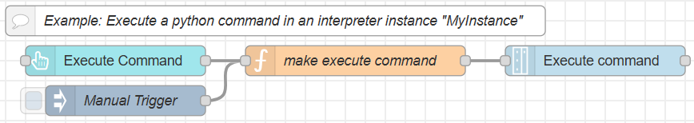
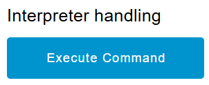

Dashboard 1.0
```JSON
[{"id":"e414e92c.da574","type":"function","z":"4ff80d56.dd60fc","name":"make execute command","func":"var newMsg = {};\nnewMsg.payload = {\n  \"type\":\"object\",\n  \"value\":{\n    \"name\": \"import time; time.sleep(25)\",\n    \"param\": []\n  }\n}\nreturn newMsg;","outputs":1,"noerr":0,"initialize":"","finalize":"","libs":[],"x":450,"y":2160,"wires":[["e0470a61.af156"]]},{"id":"1ca4bac8.ef2ea5","type":"inject","z":"4ff80d56.dd60fc","name":"Manual Trigger","props":[{"p":"payload"},{"p":"topic","vt":"str"}],"repeat":"","crontab":"","once":false,"onceDelay":0.1,"topic":"","payload":"","payloadType":"date","x":200,"y":2200,"wires":[["e414e92c.da574"]]},{"id":"e0470a61.af156","type":"ctrlx-datalayer-request","z":"4ff80d56.dd60fc","device":"7b877229.678964","method":"CREATE","path":"script/instances/MyInstance/cmd/string","payloadFormat":"value_type","name":"Execute Command","x":690,"y":2160,"wires":[[]]},{"id":"4f058c35.13bd84","type":"comment","z":"4ff80d56.dd60fc","name":"Example: Execute a python command in an interpreter instance \"MyInstance\"","info":"","x":320,"y":2120,"wires":[]},{"id":"a4823a8f.8706a8","type":"ui_button","z":"4ff80d56.dd60fc","name":"","group":"f675e9d2.c9935","order":1,"width":"3","height":"1","passthru":false,"label":"Execute command","tooltip":"","color":"","bgcolor":"","icon":"","payload":"","payloadType":"str","topic":"topic","topicType":"msg","x":190,"y":2160,"wires":[["e414e92c.da574"]]},{"id":"7b877229.678964","type":"ctrlx-config","name":"localhost","hostname":"localhost","debug":false},{"id":"f675e9d2.c9935","type":"ui_group","name":"Interpreter handling","tab":"9cba2148.8c9148","order":4,"disp":true,"width":"4","collapse":false},{"id":"9cba2148.8c9148","type":"ui_tab","name":"Examples","icon":"dashboard","order":7,"disabled":false,"hidden":false}]
```

Dashboard 2.0
```JSON
[{"id":"e414e92c.da574","type":"function","z":"af28b7f20c662b36","name":"make execute command","func":"var newMsg = {};\nnewMsg.payload = {\n  \"type\":\"object\",\n  \"value\":{\n    \"name\": \"import time; time.sleep(25)\",\n    \"param\": []\n  }\n}\nreturn newMsg;","outputs":1,"noerr":0,"initialize":"","finalize":"","libs":[],"x":410,"y":3960,"wires":[["e0470a61.af156"]]},{"id":"1ca4bac8.ef2ea5","type":"inject","z":"af28b7f20c662b36","name":"Manual Trigger","props":[{"p":"payload"},{"p":"topic","vt":"str"}],"repeat":"","crontab":"","once":false,"onceDelay":0.1,"topic":"","payload":"","payloadType":"date","x":180,"y":4000,"wires":[["e414e92c.da574"]]},{"id":"e0470a61.af156","type":"ctrlx-datalayer-request","z":"af28b7f20c662b36","device":"7b877229.678964","method":"CREATE","path":"script/instances/MyInstance/cmd/string","payloadFormat":"value_type","name":"Execute command","pendingWarnLevel":"","pendingErrorLevel":"","x":650,"y":3960,"wires":[[]]},{"id":"4f058c35.13bd84","type":"comment","z":"af28b7f20c662b36","name":"Example: Execute a python command in an interpreter instance \"MyInstance\"","info":"","x":330,"y":3920,"wires":[]},{"id":"76eb2bcd6fd2c292","type":"ui-button","z":"af28b7f20c662b36","group":"2c5e5615cd872ada","name":"","label":"Execute Command","order":1,"width":"2","height":"1","emulateClick":false,"tooltip":"","color":"","bgcolor":"","className":"","icon":"","iconPosition":"left","payload":"","payloadType":"str","topic":"topic","topicType":"msg","buttonColor":"","textColor":"","iconColor":"","enableClick":true,"enablePointerdown":false,"pointerdownPayload":"","pointerdownPayloadType":"str","enablePointerup":false,"pointerupPayload":"","pointerupPayloadType":"str","x":170,"y":3960,"wires":[["e414e92c.da574"]]},{"id":"7b877229.678964","type":"ctrlx-config","name":"localhost","hostname":"localhost","debug":false},{"id":"2c5e5615cd872ada","type":"ui-group","name":"Interpreter handling","page":"30e3bb10109e324b","width":6,"height":1,"order":-1,"showTitle":true,"className":"","visible":"true","disabled":"false","groupType":"default"},{"id":"30e3bb10109e324b","type":"ui-page","name":"Page 1","ui":"ae50776f3a63db0e","path":"/page1","icon":"home","layout":"grid","theme":"a204995a5a44f2b2","breakpoints":[{"name":"Default","px":0,"cols":3},{"name":"Tablet","px":576,"cols":6},{"name":"Small Desktop","px":768,"cols":9},{"name":"Desktop","px":1024,"cols":12}],"order":1,"className":"","visible":true,"disabled":false},{"id":"ae50776f3a63db0e","type":"ui-base","name":"My Dashboard","path":"/dashboard","appIcon":"","includeClientData":true,"acceptsClientConfig":["ui-notification","ui-control"],"showPathInSidebar":false,"headerContent":"page","navigationStyle":"default","titleBarStyle":"default","showReconnectNotification":true,"notificationDisplayTime":1,"showDisconnectNotification":true,"allowInstall":false},{"id":"a204995a5a44f2b2","type":"ui-theme","name":"Default Theme","colors":{"surface":"#ffffff","primary":"#0094CE","bgPage":"#eeeeee","groupBg":"#ffffff","groupOutline":"#cccccc"},"sizes":{"density":"default","pagePadding":"12px","groupGap":"12px","groupBorderRadius":"4px","widgetGap":"12px"}},{"id":"963cb7ce32a8d7f6","type":"global-config","env":[],"modules":{"node-red-contrib-ctrlx-automation":"1.9.8","@flowfuse/node-red-dashboard":"1.30.2"}}]
```

### Execute a python file `test.py` in an interpreter instance `MyInstance`

The following example shows how to execute a python script file in a script interpreter instance `MyInstance`. The corresponding instance has to be present and in state `INIT` or `READY` ([see instance state machine](https://docs.automation.boschrexroth.com/doc/3669738026/script-parser-interpreter/latest/en/)). The file `test.py` has to be present in the root folder of the active configuration.

Content of `test.py`:

```python
import time
while True:
    time.sleep(1)
    pass
```

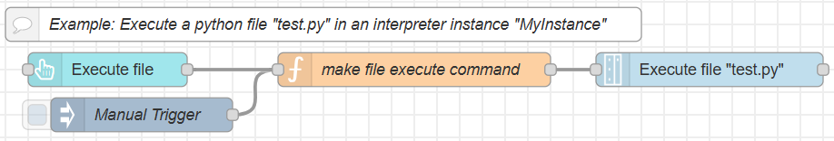
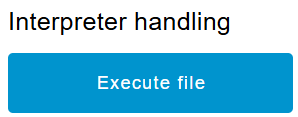

Dashboard 1.0
```JSON
[{"id":"9df4d3fd.3d9218","type":"function","z":"4ff80d56.dd60fc","name":"make file execute command","func":"var newMsg = {};\nnewMsg.payload = {\n    \"type\":\"object\",\n    \"value\":{\n        \"name\":\"activeConfiguration/test.py\" //File test.py expected at root of the active configuration\n        }\n    }\nreturn newMsg;","outputs":1,"noerr":0,"initialize":"","finalize":"","libs":[],"x":440,"y":2320,"wires":[["374d357d.cb126a"]]},{"id":"d4d2cc18.9e9c1","type":"inject","z":"4ff80d56.dd60fc","name":"Manual Trigger","props":[{"p":"payload"},{"p":"topic","vt":"str"}],"repeat":"","crontab":"","once":false,"onceDelay":0.1,"topic":"","payload":"","payloadType":"date","x":180,"y":2360,"wires":[["9df4d3fd.3d9218"]]},{"id":"374d357d.cb126a","type":"ctrlx-datalayer-request","z":"4ff80d56.dd60fc","device":"7b877229.678964","method":"CREATE","path":"script/instances/MyInstance/cmd/file","payloadFormat":"value_type","name":"Execute File \"test.py\"","x":700,"y":2320,"wires":[[]]},{"id":"c0963556.392e7","type":"comment","z":"4ff80d56.dd60fc","name":"Example: Execute a python file \"test.py\" in an interpreter instance \"MyInstance\"","info":"","x":320,"y":2280,"wires":[]},{"id":"9df3a70d.0d6f68","type":"ui_button","z":"4ff80d56.dd60fc","name":"","group":"f675e9d2.c9935","order":1,"width":"3","height":"1","passthru":false,"label":"Execute file","tooltip":"","color":"","bgcolor":"","icon":"","payload":"","payloadType":"str","topic":"topic","topicType":"msg","x":190,"y":2320,"wires":[["9df4d3fd.3d9218"]]},{"id":"7b877229.678964","type":"ctrlx-config","name":"localhost","hostname":"localhost","debug":false},{"id":"f675e9d2.c9935","type":"ui_group","name":"Interpreter handling","tab":"9cba2148.8c9148","order":4,"disp":true,"width":"4","collapse":false},{"id":"9cba2148.8c9148","type":"ui_tab","name":"Examples","icon":"dashboard","order":7,"disabled":false,"hidden":false}]
```

Dashboard 2.0
```JSON
[{"id":"9df4d3fd.3d9218","type":"function","z":"af28b7f20c662b36","name":"make file execute command","func":"var newMsg = {};\nnewMsg.payload = {\n    \"type\":\"object\",\n    \"value\":{\n        \"name\":\"activeConfiguration/test.py\" //File test.py expected at root of the active configuration\n        }\n    }\nreturn newMsg;","outputs":1,"noerr":0,"initialize":"","finalize":"","libs":[],"x":420,"y":4100,"wires":[["374d357d.cb126a"]]},{"id":"d4d2cc18.9e9c1","type":"inject","z":"af28b7f20c662b36","name":"Manual Trigger","props":[{"p":"payload"},{"p":"topic","vt":"str"}],"repeat":"","crontab":"","once":false,"onceDelay":0.1,"topic":"","payload":"","payloadType":"date","x":180,"y":4140,"wires":[["9df4d3fd.3d9218"]]},{"id":"374d357d.cb126a","type":"ctrlx-datalayer-request","z":"af28b7f20c662b36","device":"7b877229.678964","method":"CREATE","path":"script/instances/MyInstance/cmd/file","payloadFormat":"value_type","name":"Execute file \"test.py\"","pendingWarnLevel":"","pendingErrorLevel":"","x":680,"y":4100,"wires":[[]]},{"id":"c0963556.392e7","type":"comment","z":"af28b7f20c662b36","name":"Example: Execute a python file \"test.py\" in an interpreter instance \"MyInstance\"","info":"","x":340,"y":4060,"wires":[]},{"id":"b5435d916f436956","type":"ui-button","z":"af28b7f20c662b36","group":"2c5e5615cd872ada","name":"","label":"Execute file","order":1,"width":"2","height":"1","emulateClick":false,"tooltip":"","color":"","bgcolor":"","className":"","icon":"","iconPosition":"left","payload":"","payloadType":"str","topic":"topic","topicType":"msg","buttonColor":"","textColor":"","iconColor":"","enableClick":true,"enablePointerdown":false,"pointerdownPayload":"","pointerdownPayloadType":"str","enablePointerup":false,"pointerupPayload":"","pointerupPayloadType":"str","x":150,"y":4100,"wires":[["9df4d3fd.3d9218"]]},{"id":"7b877229.678964","type":"ctrlx-config","name":"localhost","hostname":"localhost","debug":false},{"id":"2c5e5615cd872ada","type":"ui-group","name":"Interpreter handling","page":"30e3bb10109e324b","width":6,"height":1,"order":-1,"showTitle":true,"className":"","visible":"true","disabled":"false","groupType":"default"},{"id":"30e3bb10109e324b","type":"ui-page","name":"Page 1","ui":"ae50776f3a63db0e","path":"/page1","icon":"home","layout":"grid","theme":"a204995a5a44f2b2","breakpoints":[{"name":"Default","px":0,"cols":3},{"name":"Tablet","px":576,"cols":6},{"name":"Small Desktop","px":768,"cols":9},{"name":"Desktop","px":1024,"cols":12}],"order":1,"className":"","visible":true,"disabled":false},{"id":"ae50776f3a63db0e","type":"ui-base","name":"My Dashboard","path":"/dashboard","appIcon":"","includeClientData":true,"acceptsClientConfig":["ui-notification","ui-control"],"showPathInSidebar":false,"headerContent":"page","navigationStyle":"default","titleBarStyle":"default","showReconnectNotification":true,"notificationDisplayTime":1,"showDisconnectNotification":true,"allowInstall":false},{"id":"a204995a5a44f2b2","type":"ui-theme","name":"Default Theme","colors":{"surface":"#ffffff","primary":"#0094CE","bgPage":"#eeeeee","groupBg":"#ffffff","groupOutline":"#cccccc"},"sizes":{"density":"default","pagePadding":"12px","groupGap":"12px","groupBorderRadius":"4px","widgetGap":"12px"}},{"id":"46f60cc925a6b931","type":"global-config","env":[],"modules":{"node-red-contrib-ctrlx-automation":"1.9.8","@flowfuse/node-red-dashboard":"1.30.2"}}]
```

### Abort an interpreter instance "MyInstance"

The following example shows how to abort a running script or command in a script interpreter instance `MyInstance`. The corresponding instance has to be present and in state `BUSY` ([see instance state machine](https://docs.automation.boschrexroth.com/doc/3669738026/script-parser-interpreter/latest/en/)).

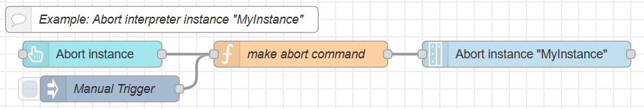
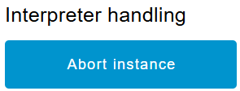

Dashboard 1.0
```JSON
[{"id":"0f30727715f9f47e","type":"function","z":"244b5a539daa7df9","name":"make abort command","func":"msg.payload = null;\nreturn msg;","outputs":1,"noerr":0,"initialize":"","finalize":"","libs":[],"x":360,"y":1220,"wires":[["73c8c291c5af4037"]]},{"id":"73c8c291c5af4037","type":"ctrlx-datalayer-request","z":"244b5a539daa7df9","device":"7b877229.678964","method":"CREATE","path":"script/instances/MyInstance/cmd/abort","payloadFormat":"value_type","name":"Abort \"MyInstance\"","x":590,"y":1220,"wires":[[]]},{"id":"0ff7dae9e392de65","type":"ui_button","z":"244b5a539daa7df9","name":"","group":"f675e9d2.c9935","order":1,"width":"3","height":"1","passthru":false,"label":"Abort instance","tooltip":"","color":"","bgcolor":"","className":"","icon":"","payload":"","payloadType":"str","topic":"topic","topicType":"msg","x":120,"y":1220,"wires":[["0f30727715f9f47e"]]},{"id":"9b7ad38852b20c26","type":"inject","z":"244b5a539daa7df9","name":"Manual Trigger","props":[{"p":"payload"},{"p":"topic","vt":"str"}],"repeat":"","crontab":"","once":false,"onceDelay":0.1,"topic":"","payload":"","payloadType":"date","x":120,"y":1260,"wires":[["0f30727715f9f47e"]]},{"id":"5048f7d0ef2fe811","type":"comment","z":"244b5a539daa7df9","name":"Example: Abort interpreter instance \"MyInstance\"","info":"","x":200,"y":1180,"wires":[]},{"id":"7b877229.678964","type":"ctrlx-config","name":"localhost","hostname":"localhost","debug":false},{"id":"f675e9d2.c9935","type":"ui_group","name":"Interpreter handling","tab":"9cba2148.8c9148","order":4,"disp":true,"width":"4","collapse":false},{"id":"9cba2148.8c9148","type":"ui_tab","name":"Examples","icon":"dashboard","order":7,"disabled":false,"hidden":false}]
```

Dashboard 2.0
```JSON
[{"id":"0f30727715f9f47e","type":"function","z":"af28b7f20c662b36","name":"make abort command","func":"msg.payload = null;\nreturn msg;","outputs":1,"noerr":0,"initialize":"","finalize":"","libs":[],"x":400,"y":4240,"wires":[["73c8c291c5af4037"]]},{"id":"73c8c291c5af4037","type":"ctrlx-datalayer-request","z":"af28b7f20c662b36","device":"7b877229.678964","method":"CREATE","path":"script/instances/MyInstance/cmd/abort","payloadFormat":"value_type","name":"Abort instance \"MyInstance\"","pendingWarnLevel":"","pendingErrorLevel":"","x":660,"y":4240,"wires":[[]]},{"id":"9b7ad38852b20c26","type":"inject","z":"af28b7f20c662b36","name":"Manual Trigger","props":[{"p":"payload"},{"p":"topic","vt":"str"}],"repeat":"","crontab":"","once":false,"onceDelay":0.1,"topic":"","payload":"","payloadType":"date","x":180,"y":4280,"wires":[["0f30727715f9f47e"]]},{"id":"5048f7d0ef2fe811","type":"comment","z":"af28b7f20c662b36","name":"Example: Abort interpreter instance \"MyInstance\"","info":"","x":240,"y":4200,"wires":[]},{"id":"ec385af9b9b760f5","type":"ui-button","z":"af28b7f20c662b36","group":"2c5e5615cd872ada","name":"","label":"Abort instance","order":1,"width":"2","height":"1","emulateClick":false,"tooltip":"","color":"","bgcolor":"","className":"","icon":"","iconPosition":"left","payload":"","payloadType":"str","topic":"topic","topicType":"msg","buttonColor":"","textColor":"","iconColor":"","enableClick":true,"enablePointerdown":false,"pointerdownPayload":"","pointerdownPayloadType":"str","enablePointerup":false,"pointerupPayload":"","pointerupPayloadType":"str","x":160,"y":4240,"wires":[["0f30727715f9f47e"]]},{"id":"7b877229.678964","type":"ctrlx-config","name":"localhost","hostname":"localhost","debug":false},{"id":"2c5e5615cd872ada","type":"ui-group","name":"Interpreter handling","page":"30e3bb10109e324b","width":6,"height":1,"order":-1,"showTitle":true,"className":"","visible":"true","disabled":"false","groupType":"default"},{"id":"30e3bb10109e324b","type":"ui-page","name":"Page 1","ui":"ae50776f3a63db0e","path":"/page1","icon":"home","layout":"grid","theme":"a204995a5a44f2b2","breakpoints":[{"name":"Default","px":0,"cols":3},{"name":"Tablet","px":576,"cols":6},{"name":"Small Desktop","px":768,"cols":9},{"name":"Desktop","px":1024,"cols":12}],"order":1,"className":"","visible":true,"disabled":false},{"id":"ae50776f3a63db0e","type":"ui-base","name":"My Dashboard","path":"/dashboard","appIcon":"","includeClientData":true,"acceptsClientConfig":["ui-notification","ui-control"],"showPathInSidebar":false,"headerContent":"page","navigationStyle":"default","titleBarStyle":"default","showReconnectNotification":true,"notificationDisplayTime":1,"showDisconnectNotification":true,"allowInstall":false},{"id":"a204995a5a44f2b2","type":"ui-theme","name":"Default Theme","colors":{"surface":"#ffffff","primary":"#0094CE","bgPage":"#eeeeee","groupBg":"#ffffff","groupOutline":"#cccccc"},"sizes":{"density":"default","pagePadding":"12px","groupGap":"12px","groupBorderRadius":"4px","widgetGap":"12px"}},{"id":"fed410c20db1101f","type":"global-config","env":[],"modules":{"node-red-contrib-ctrlx-automation":"1.9.8","@flowfuse/node-red-dashboard":"1.30.2"}}]
```

## ctrlX OS - EtherCat Master App dashboard examples

Prerequisite: `ctrlX OS - EtherCat Master App` is installed. See [our ctrlX OS Store](https://community.boschrexroth.com/ctrlx-os-store-apps-oc2pqqwn/post/ctrlx-os---ethercat-master-RVDkUkDxigD17Gx) and the corresponding [documentation of the EtherCat Master App](https://docs.automation.boschrexroth.com/iirds/cdp-metadata.boschrexroth.de~iiDC~Product-ctrlX-EtherCAT-Master-App/).

### Monitor and switch state of an EtherCat master instance `ethercatmaster`

The following example shows how to monitor and switch the state of an EtherCat master instance `ethercatmaster` ([see EtherCat state machine](https://docs.automation.boschrexroth.com/doc/2260062686/state-machine/latest/en/)). The corresponding instance has to be present .

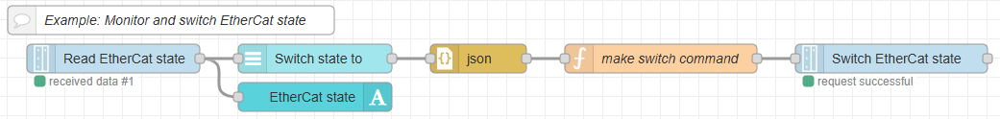
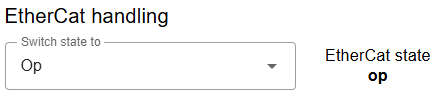

```JSON
[{"id":"ffc99584.58bbd","type":"comment","z":"244b5a539daa7df9","name":"Example: Monitor and switch EtherCat state","info":"","x":190,"y":380,"wires":[]},{"id":"cac2d7f4.22c55","type":"ctrlx-datalayer-request","z":"244b5a539daa7df9","device":"7b877229.678964","method":"WRITE","path":"fieldbuses/ethercat/master/instances/ethercatmaster/admin/fieldbus_status/master_state","payloadFormat":"value_type","name":"Switch EtherCat state","x":700,"y":440,"wires":[[]]},{"id":"3f74d73d.b1514","type":"ctrlx-datalayer-subscribe","z":"244b5a539daa7df9","subscription":"632bcc2.eddf134","path":"fieldbuses/ethercat/master/instances/ethercatmaster/admin/fieldbus_status/master_state","name":"Read EtherCat state","x":110,"y":440,"wires":[["9c708078.0c74f","f9f42567c8a7a1fa"]]},{"id":"9c708078.0c74f","type":"ui_text","z":"244b5a539daa7df9","group":"c686d3e8294c5a12","order":2,"width":"3","height":"1","name":"","label":"EtherCat state","format":"{{msg.payload.response.currentState}}","layout":"row-spread","className":"","x":340,"y":500,"wires":[]},{"id":"f9f42567c8a7a1fa","type":"ui_dropdown","z":"244b5a539daa7df9","name":"Switch state to","label":"","tooltip":"","place":"Switch state to","group":"c686d3e8294c5a12","order":1,"width":"3","height":"1","passthru":false,"multiple":false,"options":[{"label":"OP","value":"{\"type\": \"object\", \"value\": {\"request\": {\"newState\": \"op\"}}}","type":"str"},{"label":"Safe-OP","value":"{\"type\": \"object\", \"value\": {\"request\": {\"newState\": \"safeop\"}}}","type":"str"},{"label":"Pre-OP","value":"{\"type\": \"object\", \"value\": {\"request\": {\"newState\": \"preop\"}}}","type":"str"},{"label":"Init","value":"{\"type\": \"object\", \"value\": {\"request\": {\"newState\": \"init\"}}}","type":"str"}],"payload":"","topic":"topic","topicType":"msg","className":"","x":340,"y":440,"wires":[["65ab8f57b581cc7b"]]},{"id":"65ab8f57b581cc7b","type":"json","z":"244b5a539daa7df9","name":"","property":"payload","action":"obj","pretty":false,"x":510,"y":440,"wires":[["cac2d7f4.22c55"]]},{"id":"7b877229.678964","type":"ctrlx-config","name":"localhost","hostname":"localhost","debug":false},{"id":"632bcc2.eddf134","type":"ctrlx-config-subscription","device":"7b877229.678964","name":"Sub_Default","publishIntervalMs":""},{"id":"c686d3e8294c5a12","type":"ui_group","name":"EtherCat","tab":"9cba2148.8c9148","order":3,"disp":true,"width":"6","collapse":false,"className":""},{"id":"9cba2148.8c9148","type":"ui_tab","name":"Examples","icon":"dashboard","order":7,"disabled":false,"hidden":false}]
```
