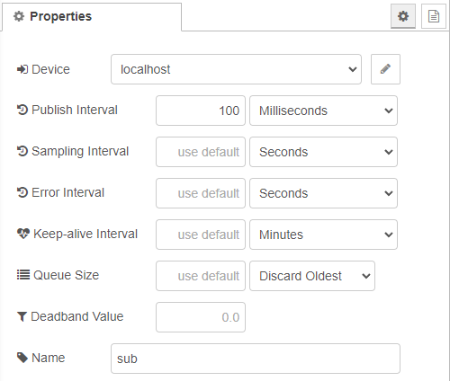
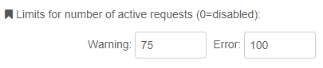

# Version 1.9.0

Version 1.9.0 includes a lot of new features and some changes which are listed below.

## New Subscription options

The subscription dialog features a lot of new options to set the behaviour of the subscription.



For example, the `Sampling Interval` allows to sample the value on the server side with a higher frequency.
A detailed explanation of all settings is available in the [Reference](REFERENCE.md).

## Limits for number of active requests

The request node has 2 new properties:



These limits can be used to prevent, that the flow gets unstable when the rate at which requests are sent from the flow
is constantly higher than the rate at which these can be processed on server side. To do so, all further request get dropped as long as the number of
active requests (i.e. pending responses) is higher than the `Error` limit. This case can also be catched by the `catch` node.
When the number of active requests reaches the `Warning` limit only a warning message will be logged.

## Dynamic subscriptions

The subscription node now has a "dynamic" mode which allows the path to be dynamically set and changed at runtime instead of being
fixed at the time of deployment of the flow.
After setting the node to `dynamic`, the node gets an input connector which accepts the following `msg` to subscribe to a data layer path:

```javascript
msg = {
    "action": "subscribe",
    "path": "<path to subscribe>"
}
```

Or to unsubscribe from the current data layer path:

```javascript
msg = {
    "action": "unsubscribe"
}
```

## Multiple paths per subscription node

Using the dynamic subscription features it is now also possible to subscribe to more than a single ctrlX Data Layer path with a single Node-RED subscription node.
This can be done by passing an array of addresses for the `path`.

```javascript
msg = {
    "action": "subscribe",
    "path": ["<path to subscribe>", "<path to subscribe>", "<path to subscribe>", "..."]
}
```

## Default payload format of Request-Node now 'value + type'

Up to this version, the default format for the payload of the Request-Node was `value only`. This is now changed to `value + type`, because the
payload format was not very intuitive. Especially for write-requests where most of the provider require the type of the value to be given explicitly.
The new default setting will only be applied for new nodes which are added to the flow. Nodes in existing flows keep the settings.
On this occassion, the deprecated payload format `v1` is removed and no longer available.
