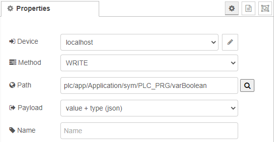

# Troubleshooting

This page contains solutions and hints to common known problems.

## Request fails with `CtrlxProblemError: [404] Not Found` after upgrade of nodes to version 1.8.x

Due to a major functional enhancement and the new subscription feature it is necessary to also update the `Automation Core` system to a version 1.8.x (XCR-V-0108, part of ReleaseMilestone 21.03) or newer.

## A `WRITE` request is resulting in a `DL_TYPE_MISMATCH`

This error occurs, if the node you want to write to has a different data type, than the `msg.payload` that you provide and the App which owns the Data Layer node can not automatically convert the value.

In this case it is also not possible to write the value with the payload setting of `value only`. The only chance is to set the payload setting to `value + type (json)` and to provide a json object with `value` and `type` attribute in `msg.payload`. In order to find out which type is expected by the node you can query the documentation of the specific Data Layer node or you may perform a `READ` request on the same node to find out what the returned data type is. Usually, the same data type is expected on a `WRITE` request.

Example for writing a DWORD variable of the PLC app:



Make sure, that `Payload` is set to `value + type (json)` and provide the payload in the following format:

```
msg.payload = {
  "type": "bool8", 
  "value": true
};
```

## Installing or updating nodes via `Manage palette` fails with error `CERT_NOT_YET_VALID`

This error indicates, that here is a deviation between the server time and the system time set on the device.
If Node-RED is running on a ctrlX CORE, then make sure that the system time of the ctrlX CORE is set correct. You can reach the time settings in the sidebar under "Settings" on the lower left side of the ctrlX landing page.

## Installing or updating nodes via `Manage palette` fails with error `ENOENT`

This error indicates, that the device running Node-RED (e.g. a ctrlX CORE) is not connected to the internet to download the selected package. Note, that the list of available packages is also shown if the device has no internet connection, because the list is cached in the app.
In order to connect your device to the internet you might want to check your DHCP settings or configure your network settings manually. If you are behind an enterprise http proxy, then you can enter the proxy settings in the settings of the ctrlX CORE. For the proxy settings to take effect you need to restart the Node-RED app or reboot the device.

## Subscription node emits an `Server closed connection` error every x hours

This happens, when the authorization token of the https session expires. A new connection with a new token will be established within a few seconds. If you do not want this to happen, then change the session timeout in the session policies.
You can find this in the ctrlX CORE settings under "Settings" -> "Users & Permissions" -> "Session policies".
